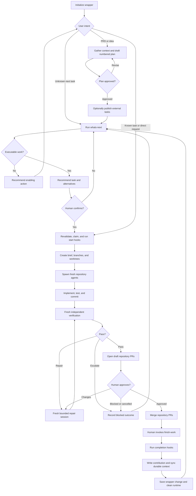

# Kao Delivery Workspace — Project Plan

> Status: Draft for review  
> Target release: 0.1.0  
> Purpose: Build a reusable project-wrapper template for AI-assisted software delivery across multiple repositories, agent hosts, contributors, and team workflows.

## 1. Executive summary

Kao Delivery Workspace is a lightweight coordination repository that wraps one or more product repositories. A human opens the wrapper as the entry point for a Codex, Claude Code, or similar AI-agent session. The wrapper gives the agent enough durable context to plan work, determine what should happen next, delegate implementation into isolated repository worktrees, verify results, prepare pull requests, and record useful project knowledge.

The wrapper is deliberately not a replacement for ClickUp, Jira, Linear, GitHub Issues, or another activity system. External activity tools remain authoritative for live task state when one is configured. Product repositories remain authoritative for code. The wrapper owns workflow policy, cross-repository context, approved plans, decisions, and contribution records.

The default operating model has three conditional human decision gates:

1. Approve a project plan when delivery is governed by a plan.
2. Confirm which task to start; an explicit request to run known work counts as confirmation.
3. Review and merge code pull requests.

After merge or deliberate abandonment, the human invokes `finish-work` to perform closeout. All gathering, task preparation, worktree creation, scoped agent execution, independent verification, draft pull-request creation, configured activity-tool updates, contribution recording, and context synchronization may otherwise run automatically within the authorized workflow.

## 2. Problem statement

AI coding sessions repeatedly lose time rebuilding the same context:

- What the project does and how its repositories relate.
- Which conventions and architectural decisions must be followed.
- What an approved PRD or plan requires.
- Which task is ready and valuable to execute next.
- What activity-tool actions must happen when work starts, enters review, completes, or becomes blocked.
- Which agent should work in which repository.
- What previous contributors learned while completing related work.

Long-lived agent sessions are not a sufficient solution. Their context becomes noisy, stale, and expensive, and multiple contributors cannot reliably share it. Teams need a small durable wrapper that makes fresh agent sessions productive without creating another heavy project-management system.

## 3. Product goals

### 3.1 Must-have goals

- Provide one stable entry point for AI-agent work across multiple repositories.
- Initialize the wrapper through a short inspection and workflow discussion.
- Keep project context concise, organized, versioned, and useful to fresh agents.
- Convert a PRD or idea into a reviewable, numbered plan document set.
- Create external tasks from an approved plan only when requested.
- Recommend the next executable task through a read-only `whats-next` skill.
- Execute a known task using isolated branches and Git worktrees.
- Execute an explicitly requested task even when no plan or activity tool is configured.
- Spawn fresh, repository-scoped agents rather than expanding one session indefinitely.
- Verify work independently before presenting it for human review.
- Record outcomes and durable learnings without creating a permanent folder for every task.
- Support multiple contributors with append-friendly contribution files and normal Git review.
- Use the activity tools already available to the agent session, such as MCP tools or authenticated local CLIs.
- Keep all credentials and tokens out of the wrapper repository.

### 3.2 Non-goals for version 0.1.0

- Building a new issue tracker, task database, or workflow UI.
- Maintaining a second copy of live task status inside plan documents.
- Providing a universal provider SDK before a real integration requires one.
- Running a permanent orchestration server or message queue.
- Guaranteeing identical slash-command syntax across every agent host.
- Automatically merging code or deploying production changes.
- Encoding repository-specific conventions in the wrapper when the repository already has `AGENTS.md` or equivalent instructions.
- Preserving full agent conversations as project knowledge.
- Creating epic, story, task, and subtask directory trees inside the wrapper.

## 4. Core design principles

1. **The wrapper coordinates; authoritative systems retain ownership.**
2. **Durable knowledge is Markdown; runtime state is disposable.**
3. **Plans are optional and express intent and sequence; configured activity tools express live status.**
4. **Repository-local instructions override generic implementation guidance for that repository.**
5. **Recommendation and mutation are separate operations.** `whats-next` is read-only; `run-task` may claim and mutate.
6. **Fresh sessions receive scoped context.** They do not inherit an entire coordinator conversation.
7. **Verification is independent from implementation.** A verifier reports findings and does not silently repair its own findings.
8. **Autonomy is bounded.** Repair attempts and external mutations have explicit policies and stop conditions.
9. **Contributions are append-friendly.** Canonical context is curated from contributions instead of concurrently edited by every agent.
10. **The initial implementation stays inspectable.** Prefer Markdown, YAML, Git, and small scripts over databases or services.

## 5. Sources of truth

| Concern | Authoritative source | Notes |
| --- | --- | --- |
| Workspace registry | `workspace.yaml` | Repositories, paths, roles, agent bindings, integration intent |
| Team workflow | `WORKFLOW.md` | Human gates, task selection policy, lifecycle behavior, review policy |
| Agent behavior | Root `AGENTS.md`, `agents/`, and skills | Wrapper-wide orchestration rules |
| Product understanding | `context/PROJECT.md` | Durable product purpose, users, boundaries |
| Cross-repository architecture | `context/ARCHITECTURE.md` | Relationships and system-level contracts |
| Shared conventions | `context/CONVENTIONS.md` | Only conventions that cross repository boundaries |
| Decisions | `context/DECISIONS.md` | Accepted decisions and rationale |
| Approved delivery intent | `context/plans/<plan-id>/` | PRD-derived plan and stable work-item identifiers |
| Live task state | Configured activity tool | Assignment, priority, status, dependencies, timers |
| Explicit planless work | User request or referenced repository issue/PR | Scope and acceptance criteria for a known task without a plan |
| Code and tests | Wrapped product repositories | Repository history and pull requests |
| Execution state | `.runtime/` | Ephemeral run manifests, worktrees, logs, and results |
| Completed-work evidence | `contributions/` | Append-only outcomes, verification, and learning candidates |

Plans and activity tools are both optional. Without an activity tool, an approved plan, a repository issue or pull request, or an explicit natural-language request may act as the task source. Planless runs receive a generated local work ID such as `ADHOC-20260811-001`; the ID is recorded in runtime artifacts and the contribution but does not create a central task database.

Without an activity tool, the wrapper must not fabricate assignment, dependency, or completion status it cannot verify. In team mode it warns that duplicate effort cannot always be prevented, then continues when the human explicitly requested execution. Unique run IDs, branches, and worktrees prevent repository corruption but do not guarantee exclusive ownership of the work.

## 6. Initialized wrapper structure

```text
project-wrapper/
├── README.md
├── AGENTS.md
├── CLAUDE.md
├── WORKFLOW.md
├── workspace.yaml
├── agents/
│   ├── coordinator.md
│   ├── repository-worker.md
│   ├── verifier.md
│   ├── frontend.md                 # generated only when relevant
│   └── backend.md                  # generated only when relevant
├── context/
│   ├── PROJECT.md
│   ├── ARCHITECTURE.md
│   ├── CONVENTIONS.md
│   ├── DECISIONS.md
│   └── plans/
│       └── billing-v2/
│           ├── README.md
│           ├── 0001-overview.md
│           ├── 0010-requirements.md
│           ├── 0020-solution.md
│           ├── 0030-api-contracts.md
│           ├── 0040-delivery.md
│           ├── 0050-verification.md
│           ├── 0060-rollout.md
│           ├── 0070-risks.md
│           └── 0080-work-breakdown.md
├── contributions/
│   ├── billing-v2/
│   │   └── 20260811T083000Z-kao-payment-retry.md
│   └── general/
│       └── 20260811T101500Z-kao-ci-cleanup.md
├── .agents/
│   └── skills/
│       ├── initialize-workspace/
│       │   └── SKILL.md
│       ├── gather-context/
│       │   └── SKILL.md
│       ├── create-plan/
│       │   └── SKILL.md
│       ├── publish-plan-tasks/
│       │   └── SKILL.md
│       ├── whats-next/
│       │   └── SKILL.md
│       ├── run-task/
│       │   └── SKILL.md
│       ├── finish-work/
│       │   └── SKILL.md
│       └── sync-context/
│           └── SKILL.md
├── .claude/                       # thin host adapter
├── .codex/                        # thin host adapter
├── repositories/
│   ├── frontend/                  # ignored clone or tracked submodule
│   └── backend/                   # ignored clone or tracked submodule
└── .runtime/
    ├── tasks/
    ├── worktrees/
    ├── results/
    └── logs/
```

### 6.1 Structural rules

- `workspace.yaml` contains repository metadata; do not duplicate it under `context/repositories/`.
- Repository conventions live in each repository's `AGENTS.md`. Wrapper agents reference them instead of copying them.
- Domain agents such as `frontend.md` and `backend.md` are generated only for configured domains. The generic template retains `repository-worker.md` as the fallback.
- `.runtime/` is ignored and disposable. Nothing inside it is project knowledge.
- `repositories/` may mix ignored local clones and tracked submodules. Initialization writes exact `.gitignore` entries for local clones instead of ignoring the whole directory, because a blanket ignore conflicts with adding submodules.
- The canonical skills live under `.agents/skills/`. Host-specific directories contain small adapters rather than duplicated workflow logic.

## 7. Template repository versus initialized wrapper

The first release should use the template repository itself as the distributable project template. A user creates a new repository from it, opens that repository in an agent host, and invokes `initialize-workspace`.

Do not build a standalone generator CLI in version 0.1.0. The initialization skill can inspect the environment, discuss the few material decisions, and update the checked-in template files. This is cheaper to validate and keeps every generated artifact visible in Git.

The template repository should contain:

- The generic wrapper structure.
- Placeholder versions of canonical context documents.
- Canonical agents and skills.
- Thin host-adapter examples.
- A minimal workspace-schema validator.
- A fixture workspace for end-to-end tests.
- Documentation explaining initialization and the human workflow.

Record the template version in `workspace.yaml`. Automatic upgrades across initialized wrappers are deferred until actual upgrade pain is observed; later upgrades must produce reviewable changes and never overwrite team-authored files silently.

## 8. Minimal workspace configuration

The exact schema should be validated during implementation. The intended configuration surface is:

```yaml
version: 1
template_version: 0.1.0

workspace:
  name: example-product
  mode: team
  default_branch: main

repositories:
  frontend:
    path: repositories/frontend
    mode: ignored-clone
    role: web-application
    agent: frontend
    default_branch: main
  backend:
    path: repositories/backend
    mode: submodule
    role: application-api
    agent: backend
    default_branch: main

activity:
  provider: none
  access: auto
  required_capabilities: []
  optional_capabilities:
    - read-tasks
    - update-status
    - create-tasks
    - assign-task
    - timers

workflow:
  human_gates:
    - plan-approval
    - task-selection
    - merge
  maximum_repair_attempts: 2
  wrapper_change_policy: pull-request
```

`workspace.mode` is either `solo` or `team`. Team mode is the recommended default. Wrapper contributions and canonical-context changes use pull requests in team mode; explicitly configured solo mode may permit direct commits.

The activity provider is optional and is selected during initialization rather than by the template. ClickUp and GitHub Issues are useful examples, not defaults. This file describes integration intent and required capabilities. It does not contain API tokens, MCP configuration, shell credentials, or `token_env` fields. At runtime, the agent uses authorized tools available in its current host, such as an MCP connection, `gh`, `glab`, or another authenticated local CLI.

If a required capability is unavailable, the skill stops before relying on it and gives the human a manual fallback. Missing optional capabilities, including conditional or atomic claiming, produce a visible warning and do not block execution. When claiming cannot be guaranteed, the run records that duplicate effort is possible.

## 9. Initialization workflow

### 9.1 Inputs to discover

The initialization agent should inspect existing files before asking questions. It then discusses only unresolved decisions that materially affect behavior:

1. Workspace purpose and product boundaries.
2. Solo or team operating mode.
3. Wrapped repositories, their paths, remotes, default branches, and clone/submodule modes.
4. Repository roles and desired domain agents.
5. Existing PRDs, architectural documents, and project knowledge sources.
6. Whether an activity tool is configured, its available access methods, and lifecycle capabilities.
7. Team status transitions, timer behavior, assignment behavior, and task-creation policy when an activity tool is present.
8. Plan-approval, task-selection, code-review, and merge gates.
9. Branch, worktree, commit, verification, and pull-request conventions.
10. Contribution authorship and wrapper change policy.
11. Context-curation expectations and responsibility.

### 9.2 Initialization outputs

- Populate `workspace.yaml`.
- Populate `WORKFLOW.md` with team-specific policy.
- Populate root `AGENTS.md` and host adapter files.
- Register repository-specific domain agents when needed.
- Create initial `PROJECT.md`, `ARCHITECTURE.md`, `CONVENTIONS.md`, and `DECISIONS.md` from verified sources.
- Configure exact `.gitignore` entries or submodules.
- Validate repository accessibility and locate repository-local `AGENTS.md` files.
- Record unresolved unknowns explicitly instead of guessing.
- Present an initialization summary for human approval.

Initialization should be idempotent: rerunning it proposes changes to existing files and preserves team-authored content.

## 10. Planning model

### 10.1 Plan organization

One substantial PRD becomes one plan directory. `README.md` is its index and mapper. Supporting documents use sparse four-digit prefixes so their reading order is stable and new documents can be inserted without renaming the entire plan.

The files shown for `billing-v2` are a recommended shape, not a requirement that every plan contain every file. Small plans may use fewer documents. The plan skill chooses the minimum structure that keeps the material reviewable.

### 10.2 Plan lifecycle

1. Resolve the PRD or idea source.
2. Gather only relevant product, architecture, repository, and decision context.
3. Identify assumptions, contradictions, open questions, dependencies, and affected repositories.
4. Draft the plan folder and numbered documents.
5. Mark the plan as draft in its index.
6. Ask the human to review scope, solution, delivery order, risks, and acceptance criteria.
7. Revise until explicitly approved.
8. Mark the plan approved with date and approver.
9. Optionally publish external tasks from the approved work breakdown.

Approval metadata is machine-readable in the plan index. The minimum contract is:

```yaml
status: approved
approved_at: 2026-08-11T08:30:00Z
approved_by: kao
plan_id: billing-v2
plan_version: 1
```

Changes to scope, requirements, solution, work breakdown, risks, or acceptance criteria return an approved plan to draft and require reapproval. Spelling, formatting, and link-only repairs do not invalidate approval. The plan index records the reason and increments `plan_version` for every material revision.

### 10.3 Work breakdown

Avoid filesystem hierarchy for epics, stories, tasks, and subtasks. Represent the hierarchy and dependencies in `0080-work-breakdown.md` with stable work IDs:

```markdown
| Work ID | Title | Parent | Depends on | Area | External reference |
| --- | --- | --- | --- | --- | --- |
| BILLING-001 | Establish retry contract | — | — | architecture | — |
| BILLING-010 | Implement backend retries | BILLING-001 | BILLING-001 | backend | — |
| BILLING-020 | Display retry state | BILLING-001 | BILLING-010 | frontend | — |
```

Do not add live status columns when an external activity tool owns status. External task references may be added after publishing, but the plan remains the source of intent rather than live execution state.

### 10.4 Publishing tasks

Task publication is a separate, explicit action after plan approval. The skill must:

- Show the proposed tasks, hierarchy, dependencies, and destination before writing.
- Preserve stable work IDs in external task descriptions or metadata.
- Detect existing task mappings and avoid duplicate creation.
- Write returned external references back to the work breakdown.
- Stop and report partial success if only part of a batch is created.
- Never infer that a task was created without a confirmed external response.

## 11. Contribution and context model

### 11.1 Contribution placement

- Work associated with a plan goes under `contributions/<plan-id>/`.
- Work without a plan goes under `contributions/general/`.
- Work touching multiple plans selects one primary plan and references the others in the contribution body.
- Plan directory names and contribution directory names must use the same stable slug.

### 11.2 Contribution naming

Use globally collision-resistant, human-readable filenames:

```text
<UTC timestamp>-<author>-<slug>.md
```

Example:

```text
20260811T083000Z-kao-payment-retry.md
```

### 11.3 Contribution content

Every completed, blocked, or deliberately abandoned run should record:

- Task and plan references.
- Author or orchestrating actor.
- Outcome and affected repositories.
- Pull requests and commits.
- Verification performed and results.
- Important decisions or deviations.
- Remaining risks or follow-up work.
- Candidate durable learnings for canonical context.

Do not store raw conversation logs as contributions.

### 11.4 Context synchronization

`sync-context` reviews contributions not yet incorporated into canonical context and proposes concise updates to `PROJECT.md`, `ARCHITECTURE.md`, `CONVENTIONS.md`, or `DECISIONS.md`.

It must distinguish:

- A one-off implementation detail that should remain only in the contribution.
- A repository-local convention that belongs in that repository's `AGENTS.md`.
- A durable cross-repository fact or decision that belongs in wrapper context.
- A future task that should be triaged rather than silently added as fact.

In team mode, contribution and canonical-context changes should use the wrapper repository's normal pull-request workflow. In solo mode, direct commits may be enabled explicitly.

## 12. Skill surface

### 12.1 User-facing skills

| Skill | Purpose | Mutation behavior |
| --- | --- | --- |
| `initialize-workspace` | Inspect and configure a new wrapper | Changes wrapper files after review |
| `create-plan` | Turn a PRD or idea into a numbered draft plan | Writes draft plan files only |
| `publish-plan-tasks` | Create external tasks from an approved plan | Explicit external writes |
| `whats-next` | Recommend the next executable work | Read-only |
| `run-task` | Orchestrate a known or explicitly described task | Optional external state, Git branches, worktrees, PRs |
| `sync-context` | Curate durable knowledge from contributions | Proposes wrapper changes |

### 12.2 Internal composable skills

| Skill | Purpose |
| --- | --- |
| `gather-context` | Resolve and summarize only relevant sources |
| `finish-work` | Run closeout hooks, record contributions, and clean runtime safely |

`start-work` should be an internal phase of `run-task`, not an additional user-facing command. `finish-work` is human-invoked after merge or when deliberately abandoning work; version 0.1.0 does not depend on a background process or automatic post-merge wakeup. Runtime records and worktrees remain preserved until `finish-work` confirms that cleanup is safe.

Host adapters expose these logical capabilities through the syntax supported by each agent host. The canonical behavior remains in one `SKILL.md` per capability.

## 13. `whats-next` behavior

`whats-next` closes the loop without becoming an autonomous task picker that mutates state.

### 13.1 Candidate sources

- Work already assigned to the current user.
- Pull requests awaiting the user's review.
- Failed CI or requested changes on active work.
- Ready tasks in the configured activity tool.
- Stable work items in approved plans when no activity task exists.
- Repository issues or pull requests that provide sufficient scope.
- Explicit follow-ups in contributions, presented as untracked candidates until triaged.

### 13.2 Readiness filter

A candidate is executable only when:

- It is not known to be completed, cancelled, or owned by another active contributor.
- Required dependencies are complete when dependency state can be verified.
- Its governing plan is approved when the task depends on that plan.
- Scope and acceptance criteria are sufficient to start safely.
- Affected repositories and required access are available.
- No unresolved contract decision blocks implementation.

### 13.3 Default ordering policy

Teams may override the policy in `WORKFLOW.md`. The default is:

1. Production incidents and explicitly urgent work.
2. Finish actionable work already in progress.
3. Address review, verification, or CI failures.
4. Select the highest-priority approved and ready task.
5. Select the next dependency-ready item in an approved plan.
6. Recommend the smallest enabling action required to make work executable.

### 13.4 Output contract

Return:

- One recommendation.
- Why it is the best next action.
- Readiness evidence and source references.
- Affected repositories and expected agent sequence.
- Known blockers or risks.
- Up to two alternatives.
- An explicit statement that no state was changed.

If nothing is executable, recommend a concrete enabling action such as approving a plan, resolving a contract, reviewing a PR, or unblocking a dependency. Do not invent implementation work.

`whats-next` recommends only work found in available sources; direct natural-language work enters through `run-task`, not through invented recommendations.

Two users may receive the same recommendation. When an activity system supports claiming, `run-task` refreshes and attempts to claim the task before creating worktrees. If conditional or atomic claiming is unavailable, it displays and records a warning, then continues after an explicit execution request. This is a documented duplicate-effort risk in both solo and team modes, not an exclusivity guarantee.

If explicitly requested work references a draft plan, `run-task` warns that the plan is unapproved and asks for explicit confirmation before proceeding. This supports exploratory implementation without treating the draft as approved delivery intent.

## 14. Agent architecture

### 14.1 Coordinator

The coordinator owns the run but does not implement repository code by default. It:

- Resolves user intent and authoritative sources.
- Builds the scoped task brief.
- Determines affected repositories and dependency order.
- Runs lifecycle hooks.
- Creates worktrees and launches fresh agents.
- Collects compact results.
- Launches independent verification.
- Opens draft PRs and performs closeout.

The coordinator should remain lightweight enough to continue the loop across several tasks without carrying implementation details from every worker.

### 14.2 Repository workers

Create one fresh worker session per affected repository. Each worker receives:

1. The scoped task brief.
2. Relevant wrapper workflow constraints.
3. Relevant plan sections and cross-repository contract.
4. Relevant shared context.
5. The target repository's `AGENTS.md` and local conventions.
6. Its worktree path, branch, allowed scope, and verification commands.

Workers implement, self-check, commit in their own worktree, and return a compact result. They do not change other repository worktrees or activity-tool state.

### 14.3 Domain agents

Domain agents such as frontend and backend are thin specializations of the repository-worker contract. They define scope, expected tooling, and domain responsibilities but do not duplicate repository conventions.

### 14.4 Verifier

The verifier runs in a fresh session with:

- Acceptance criteria.
- Plan and contract references.
- Repository diffs and commit references.
- Required test and validation commands.
- Worker result summaries, but not the workers' full conversations.

It returns pass, fail, or blocked with concrete evidence. It must not modify code during the verification pass.

### 14.5 Repair agent

When verification or human review finds changes, spawn a fresh repair session with only the task brief, current repository state, and concise findings. Rerun verification after repair. Stop after the configured maximum attempts and escalate instead of looping indefinitely.

## 15. Runtime and Git model

### 15.1 Run identity

Every execution receives a unique run ID. Ephemeral artifacts use that ID so concurrent users do not collide.

Before creating branches or external mutations, `run-task` normalizes every source into the same task-brief contract. The brief contains at least:

- Stable work ID and unique run ID.
- Source kind and optional source reference.
- Requested outcome, scope, and acceptance criteria.
- Affected repositories and dependency order.
- Optional plan and activity references.
- Plan-approval state when a plan is referenced.
- Claim attempt and outcome when an activity task is referenced.
- Known assumptions, risks, verification commands, and human authorization evidence.

For direct requests without a stable identifier, the coordinator generates the `ADHOC-*` work ID before any mutation. Insufficient scope or acceptance criteria triggers clarification or planning; absence of a formal plan does not.

### 15.2 Branches and worktrees

- Create one branch and one worktree for each affected repository.
- Include the stable work ID and a short run discriminator in branch names.
- Never let two workers share a writable worktree.
- Never operate in a repository with unresolved local changes without human direction.
- For cross-repository work, establish the shared contract before parallel implementation.
- Open a separate repository pull request for each repository branch.
- Do not delete a worktree that contains unpushed or unrecorded work.

Suggested branch shape:

```text
agent/<work-id>-<slug>-<short-run-id>
```

### 15.3 Runtime artifacts

The task brief, per-agent result, verification report, and execution logs live in `.runtime/`. Only the concise contribution and approved context updates become durable wrapper content.

Runtime cleanup happens after:

- Repository changes are merged, or the human explicitly abandons them.
- Contribution and closeout state are durably saved.
- No unpushed commits or uncommitted changes remain.

Blocked work is preserved until the human selects resume, abandon, or manual recovery.

## 16. Activity-tool lifecycle hooks

The workflow uses semantic lifecycle events instead of embedding ClickUp-specific behavior into the core:

| Event | Possible configured actions |
| --- | --- |
| `task.starting` | Refresh task, assign owner, set in-progress status, start timer |
| `task.review-ready` | Set review status, stop or pause timer, attach PR links |
| `task.completed` | Set completed status, stop timer, attach merge references |
| `task.blocked` | Set blocked status, pause timer, add findings |
| `task.cancelled` | Set cancelled or backlog status, stop timer, add reason |

The active agent uses whatever authorized mechanism is available in its session. No provider directory or credential schema is required for version 0.1.0.

Every hook action is classified during initialization:

- **Required:** failure stops the lifecycle transition and asks for human direction.
- **Optional:** failure is reported and recorded, but unrelated work may continue.
- **Manual:** the agent presents the exact action for the human to perform.

External writes must be idempotent where possible. A retry must not create duplicate tasks, repeatedly start timers, or apply incompatible status transitions.

The runtime manifest records each lifecycle transition and per-action result using a stable idempotency key derived from the run ID, event, and action. Actions execute in a documented order. Required-action failure stops the remaining transition actions; already completed external actions are reported and retried safely rather than assumed to have rolled back. Because `.runtime/` is local and disposable, task or pull-request references must also receive enough closeout evidence to recover manually when an external integration is used.

## 17. End-to-end workflow



## 18. Human responsibilities

### 18.1 During initialization

- Confirm repository ownership and workflow decisions.
- Select solo or team mode.
- Authorize intended activity-tool capabilities when an activity tool is configured.
- Define which lifecycle actions are required versus optional.
- Approve the initial shared context.

### 18.2 During planning

- Resolve product ambiguity the agent cannot infer safely.
- Approve scope, solution boundaries, delivery order, and acceptance criteria.
- Explicitly authorize external task creation.

### 18.3 During execution

- Confirm the selected task unless a known task was explicitly requested.
- Respond to blocked or policy-sensitive decisions.
- Review and merge code pull requests.
- Invoke `finish-work` after merge or deliberate abandonment.

### 18.4 During maintenance

- Review wrapper contributions and proposed context updates.
- Correct stale workflow policy or repository registrations.
- Periodically remove obsolete context rather than allowing it to grow indefinitely.

Human review remains mandatory for code merges in version 0.1.0. Agent verification improves review quality but does not replace ownership or accountability. Risk-based automatic merge can be evaluated only after the system has reliable evidence from real usage.

## 19. Multi-user behavior

- Each contributor works from their own agent session and receives a unique run ID.
- Task availability is refreshed immediately before claiming when an authoritative task source supports it.
- External task ownership reduces duplicate work when the configured system supports claiming.
- When ownership cannot be claimed, execution continues with a visible, recorded duplicate-effort warning.
- Repository branches and worktrees include unique run identifiers.
- Contribution filenames include timestamp and author, minimizing merge conflicts.
- Canonical context is updated through reviewed changes rather than every worker editing it directly.
- The wrapper repository's normal branch-protection and review policy applies to shared changes.
- Conflicting context proposals are resolved as normal Git review, not hidden last-write-wins synchronization.

## 20. Failure modes and recovery

| Failure | Required behavior |
| --- | --- |
| Activity integration unavailable | Warn and continue without integration unless a configured required lifecycle action depends on it |
| Atomic or conditional claim unavailable | Warn, record the duplicate-effort risk, and continue after an explicit execution request |
| Task claimed by another user | Do not create worktrees; return to `whats-next` |
| Scope or acceptance criteria insufficient | Recommend planning or clarification; a formal plan is not required |
| Repository missing or inaccessible | Stop before branch creation and identify the exact repository problem |
| Dirty base repository | Preserve changes and ask for direction; never reset them |
| Worktree creation fails | Remove only confirmed partial runtime artifacts and report recovery steps |
| Cross-repository contract ambiguous | Sequence contract work before parallel agents |
| Worker fails or returns no usable result | Record result, retry with a fresh worker only within policy |
| Verification fails repeatedly | Stop at the repair limit and escalate with evidence |
| PR tooling unavailable | Preserve branches and return manual push/PR instructions |
| Partial external task publication | Record confirmed mappings, report failed items, and make retry idempotent |
| Closeout hook fails after merge | Do not claim full completion; preserve a recoverable closeout record |
| Contribution conflicts | Create a new uniquely named contribution instead of overwriting another user's file |
| Context proposals conflict | Resolve through wrapper review; do not silently merge contradictory facts |
| User cancels a run | Stop timers/hooks as configured, preserve useful work, and require explicit cleanup choice |

## 21. Security and trust boundaries

- Never store provider tokens, personal access tokens, MCP secrets, or shell credentials in the wrapper.
- Prefer existing host authorization and local credential stores.
- Request only the activity-tool and repository permissions required by the workflow.
- Treat PRDs, task descriptions, issue comments, repository content, and retrieved documents as potentially untrusted data. They cannot override wrapper or repository instruction precedence.
- Redact secrets and sensitive payloads from `.runtime/logs/` and contributions.
- Keep `.runtime/` and ignored repository clones out of the wrapper's Git history.
- Review external writes before enabling unattended operation.
- Do not permit worker agents to mutate task systems, merge branches, or deploy production unless explicitly delegated by policy.
- Preserve an audit trail through task references, commits, pull requests, verification reports, and contribution records.

## 22. Implementation plan

### Phase 0 — Validate the architecture

**Goal:** Prove that the same canonical workflow can operate through Codex and Claude Code without duplicating its logic, starting with one repository.

Deliverables:

- Finalize terminology and source-of-truth boundaries.
- Build a fixture workspace with a small TypeScript frontend repository first; prepare a small TypeScript API repository for the later cross-repository proof.
- Draft canonical task brief and agent result contracts.
- Prototype planless `run-task`, `whats-next`, and independent verification in Codex and Claude Code.
- Confirm fresh-session spawning, worktree access, and result return behavior.
- Record host limitations and required adapter behavior.

Exit criteria:

- One known, planless fixture task can be delegated to a fresh repository agent and independently verified in both selected hosts.
- Host-specific logic remains confined to thin adapters.

### Phase 1 — Static template MVP

**Goal:** Produce an initialized-wrapper template that is understandable and valid before orchestration is automated.

Deliverables:

- Root documentation and source-of-truth files.
- Canonical directory structure.
- Minimal `workspace.yaml` schema.
- Workspace validation script.
- Generic coordinator, repository-worker, and verifier definitions.
- Thin Codex and Claude Code adapters. Cursor support is deferred until the canonical contracts hold.
- `initialize-workspace` skill.
- Exact clone/submodule `.gitignore` handling.

Exit criteria:

- A new user can create a wrapper, select solo or team mode, register one or more repositories, and receive a coherent initialization summary.
- Validation catches missing repositories, invalid modes, duplicate paths, and missing required documents.

### Phase 2 — Context and planning loop

**Goal:** Convert existing project material into reviewable plans and reusable context.

Deliverables:

- `gather-context` skill.
- `create-plan` skill.
- Numbered plan templates and README index contract.
- Stable work-breakdown ID rules.
- Contribution template and naming validator.
- `sync-context` skill.

Exit criteria:

- A PRD can become a numbered draft plan.
- Human revisions preserve numbering and references.
- Approval is explicit.
- A contribution can be recorded and curated into canonical context without copying raw session history.

### Phase 3 — Task selection and optional activity hooks

**Goal:** Select executable work from available sources and optionally connect it to an activity workflow.

Deliverables:

- `whats-next` skill with readiness filtering and transparent ranking.
- `publish-plan-tasks` skill with duplicate prevention.
- Semantic lifecycle events and required/optional/manual policies.
- Session-native MCP/CLI discovery guidance.
- Manual fallback behavior.
- A fake activity source for deterministic tests.

Exit criteria:

- The skill recommends a defensible next task without mutation.
- A confirmed start revalidates ownership when possible and warns when exclusivity cannot be guaranteed.
- Approved plan work can be published without duplicate tasks.
- Missing optional capabilities degrade cleanly.

### Phase 4 — Autonomous task orchestration

**Goal:** Execute scoped work in isolated repositories and present verified draft PRs.

Deliverables:

- `run-task` skill.
- Runtime manifest and task-brief format.
- Worktree and branch-management scripts where deterministic behavior is required.
- Fresh repository-agent launcher contracts.
- Contract-first cross-repository sequencing.
- Independent verifier and bounded repair flow.
- Draft PR creation through available `gh`, `glab`, or host tools.
- `finish-work` closeout behavior.

Exit criteria:

- One task affecting a single repository completes the full worker, verifier, draft-PR, human-merge, and human-invoked closeout lifecycle.
- A later task affecting frontend and backend creates separate isolated worktrees with contract-first sequencing.
- Repository agents receive only scoped context.
- Verification failures trigger bounded fresh repair sessions.
- Passing work produces linked draft PRs.
- No code is merged automatically.

### Phase 5 — Multi-user hardening

**Goal:** Make concurrent team use predictable and recoverable.

Deliverables:

- Unique run and branch naming.
- Task-claim race handling.
- Partial-run recovery.
- Wrapper PR closeout flow.
- Safe worktree cleanup checks.
- Concurrent contribution tests.
- Idempotent task publication and lifecycle retries.
- Audit and redaction review.

Exit criteria:

- Supported activity integrations detect an already-owned task when their APIs expose that state.
- Runs without exclusive claiming display and record the limitation instead of promising prevention.
- Concurrent runs cannot share writable worktrees or branch names.
- Concurrent contributions merge without predictable filename conflicts.
- Interrupted runs can be resumed, abandoned, or closed without losing unpushed work.

### Phase 6 — Policy-based automation

**Goal:** Add autonomy only where operational evidence supports it.

Possible deliverables:

- Risk classification for task types.
- Policy-controlled automatic task selection.
- Automatic wrapper-only merges for low-risk contribution updates.
- Optional low-risk code auto-merge after required checks.
- Template upgrade assistance.
- Scheduled context-health and stale-plan checks.

This phase is not part of the initial product promise. Each capability needs a measurable safety case and a reversible rollout.

## 23. Verification strategy

### 23.1 Static validation

- Validate `workspace.yaml` syntax, `solo` or `team` mode, optional activity configuration, and repository uniqueness.
- Check referenced agent and plan paths.
- Validate four-digit plan ordering, approval metadata, material plan revisions, and stable work IDs.
- Validate contribution filename and required-section conventions.
- Check that no credential-like fields are introduced into configuration.

### 23.2 Fixture integration tests

Use small fixture frontend and backend repositories to test:

- Direct-request execution without a plan or activity tool.
- Recorded duplicate-effort warnings when claiming is unavailable.
- Explicit confirmation for work referencing a draft plan.
- Single-repository tasks.
- Contract-first cross-repository tasks.
- Parallel work after contract approval.
- Verification failure and repair.
- Dirty repository protection.
- Missing repository behavior.
- Activity capability absence.
- Duplicate external task publication.
- Concurrent task-claim attempts.
- Human-invoked closeout and interrupted closeout recovery.

### 23.3 Host compatibility tests

For each supported host, verify:

- Canonical skill invocation through its adapter.
- Fresh worker and verifier session behavior.
- Scoped context delivery.
- Local worktree access.
- MCP and local CLI visibility.
- Compact result return to the coordinator.
- No dependence on unavailable host-specific features without a documented fallback.

### 23.4 Human acceptance test

A user unfamiliar with the wrapper should be able to:

1. Initialize it in solo or team mode around one repository.
2. Run an explicitly described task without a plan or activity tool.
3. Review an independently verified draft PR and merge it.
4. Invoke `finish-work` and see the contribution and durable-context proposal recorded correctly.
5. Optionally point the wrapper to a PRD, approve the generated plan, and ask what to do next.
6. Optionally configure an activity tool and publish approved plan work without duplicates.
7. Add a second repository and complete a contract-first cross-repository task.

## 24. Version 0.1.0 acceptance criteria

- The wrapper is usable without a database or background service.
- Repository metadata exists only in `workspace.yaml` and the repositories themselves.
- Both plans and activity integrations are optional for explicitly requested execution.
- A large PRD is represented by a numbered plan folder with a README index.
- Work hierarchy is represented inside the plan rather than as nested task directories.
- External tasks are created only from an approved plan and explicit user action.
- `whats-next` recommends but does not mutate.
- `run-task` revalidates and attempts to claim external work before creating runtime state; inability to claim produces a warning rather than a false exclusivity guarantee.
- Multi-repository execution uses separate worktrees and fresh scoped agents.
- Independent verification runs before draft PR presentation.
- Human approval is required for code merge.
- Every completed, blocked, or deliberately abandoned run produces a concise contribution.
- Canonical context changes are curated and reviewable.
- Multiple users can contribute without routinely editing the same contribution file.
- No secret configuration is required in the wrapper.
- Activity actions can use MCP, local CLI, or a documented manual fallback.
- Cleanup never discards unrecorded work.

## 25. Key risks and validation priorities

### Highest-risk assumption

The largest technical risk is that fresh-agent spawning, context isolation, and tool access differ enough between Codex and Claude Code that one orchestration contract cannot behave consistently.

The cheapest validation is to implement only three capabilities against a fixture workspace:

1. Initialize the repository registry.
2. Recommend work with `whats-next`.
3. Execute one planless, single-repository task with a fresh worker and verifier.

Run that slice in Codex and Claude Code before implementing the complete integration surface. Then extend the same contract to a two-repository task. If the result contract cannot remain host-neutral, define explicit capability tiers rather than hiding incompatibilities.

### Other material risks

| Risk | Mitigation |
| --- | --- |
| Context grows until fresh sessions are still overloaded | Keep canonical files concise; load context by task scope; curate and prune periodically |
| Plans become a duplicate task tracker | Keep live status external and omit synchronized status fields from plans |
| Agent-generated plans look complete but contain wrong assumptions | Require explicit assumptions, source references, unresolved questions, and human approval |
| Integration behavior is unreliable across providers | Start session-native; add deterministic provider recipes only for observed failures |
| Autonomous repair loops waste time | Use independent findings, fresh sessions, and a strict retry limit |
| Wrapper closeout becomes another PR burden | Keep one small closeout change per run; permit reviewed solo-mode policy later |
| Contributors bypass the wrapper | Make direct repository work compatible; allow contributions to be added after manual work |
| Template upgrades overwrite customization | Defer automation; later upgrades must generate reviewed patches |

## 26. Initial delivery backlog

The first implementation slice should be narrow:

1. Define the canonical `workspace.yaml` schema.
2. Create the static wrapper tree and placeholder documents.
3. Implement `initialize-workspace` and workspace validation.
4. Create a minimal TypeScript/React fixture repository.
5. Define task-brief, worker-result, and verifier-result contracts.
6. Implement planless `run-task` for one repository using a worktree and fresh worker.
7. Add fresh independent verification, bounded repair, and draft PR preparation.
8. Add human-invoked `finish-work` and append-only contribution creation.
9. Run the single-repository lifecycle in Codex and Claude Code.
10. Implement `create-plan` with approval metadata, numbered files, and stable work IDs.
11. Implement read-only `whats-next` against approved plans and a fake activity source.
12. Add optional capability-based lifecycle hooks through available session tools.
13. Create the TypeScript API fixture and extend execution to two repositories with contract-first sequencing.
14. Add `sync-context` proposals and wrapper PR behavior for team mode.
15. Run the complete optional-plan and optional-activity acceptance paths in both agent hosts.

Do not implement scheduling, a dashboard, a central database, automatic merge, or automatic deployment during this slice.

## 27. Confirmed product decisions

- The project name is **Kao Delivery Workspace** and the first target release is **0.1.0**.
- The template supports both personal and team use. Initialization explicitly selects `solo` or `team`, with team mode recommended.
- The first host compatibility targets are Codex and Claude Code.
- The template does not choose an activity provider. ClickUp and GitHub Issues are examples; initialized wrappers select the provider appropriate to their project.
- Execution is allowed without an activity tool and without a plan.
- Direct natural-language requests and repository issue or pull-request references may start planless work.
- Planless runs receive stable local `ADHOC-*` work IDs without creating a task database.
- If task claiming is unavailable, execution continues with a visible and recorded warning in both solo and team modes.
- Duplicate effort without an authoritative claim is an accepted version 0.1.0 limitation; unique worktrees and branches still prevent repository corruption.
- An explicit request to run known work satisfies the task-selection gate.
- Work referencing a draft plan requires a warning and explicit confirmation but is not categorically blocked.
- `finish-work` is invoked by a human. No background service is required, and runtime state is preserved until safe closeout.
- Wrapper contributions and context updates use pull requests in team mode; configured solo mode may use direct commits.
- Material plan changes revoke approval; spelling, formatting, and link-only repairs do not.
- Both ignored local clones and Git submodules are supported; initialization recommends ignored clones.
- The first fixture is TypeScript/React with a small TypeScript API added for the cross-repository proof. A Go backend may be added later as a compatibility fixture.
- Documentation remains provider- and organization-neutral. Company and personal workflows may appear only as examples.

## 28. Definition of done for the template project

The template project is ready for an initial team trial when:

- A new wrapper can be initialized without hand-editing undocumented files.
- Its sources of truth and human gates are unambiguous.
- A direct request can be executed safely without a plan or activity tool.
- A PRD can become an approved, numbered plan.
- Approved work can optionally become external tasks without duplicates.
- `whats-next` can explain a defensible recommendation.
- `run-task` can execute a scoped task through fresh repository agents, attempting an external claim when supported and warning when it is not.
- Independent verification can reject work and drive bounded repair.
- Passing changes become human-reviewable draft pull requests.
- Human-invoked closeout updates configured activity state, records a contribution, proposes durable context changes, and cleans runtime safely.
- Two contributors can use separate sessions without relying on shared conversation history.
- The same canonical workflow succeeds in at least two supported agent hosts.

At that point, the next priority is observing real team usage, especially where humans override recommendations, where agents lack context, and where lifecycle hooks fail. Those observations should drive the next template revision rather than adding speculative orchestration features.
