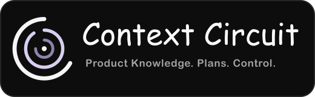

<p align="center">
  
</p>

<p align="center">
  <strong>Maintainer source for the Context Circuit workspace and CLI.</strong>
</p>

<p align="center">
  <a href="https://github.com/kaotypr/context-circuit-source/actions/workflows/check.yml"></a>
</p>

<p align="center">
  <a href="https://github.com/kaotypr/context-circuit">Product guide</a> ·
  <a href="WORKFLOW.md">Source workflow</a> ·
  <a href="CLI.md">CLI architecture</a> ·
  <a href="#development">Development</a> ·
  <a href="#release-assembly">Release assembly</a>
</p>

Context Circuit gives coding agents shared project context, a grounded plan,
and explicit human control points across one or more Git repositories.

This repository is the maintainer source checkout. It builds two separately
versioned products:

1. A **workspace template** containing the files, instructions, skills, and
   documentation an agent uses with a project.
2. A **native CLI** that handles workspace records, repository bindings,
   isolated working copies, ordering, diagnostics, and release-safe mechanics.

If you want to use Context Circuit, begin with the
[product guide](https://github.com/kaotypr/context-circuit). If you are changing how Context Circuit
works or ships, this is the repository to edit.

<p align="center">
  
</p>

## Product model

The coding agent and the executable have deliberately different jobs.

| Coding agent | Context Circuit CLI |
| --- | --- |
| Understands a request and retrieves relevant project context | Allocates stable IDs and edits structured workspace files |
| Writes goals and implementation plans | Records approvals, dependencies, completion, and local bindings |
| Inspects code, implements changes, and runs project checks | Prepares and tracks isolated Git working copies |
| Decides when bounded exploration or sub-agents are useful | Produces deterministic diagnostics and dispatch specifications |
| Reports real results and unresolved decisions | Refuses invalid state without making product judgments |

The executable owns mechanisms that should be deterministic. The agent owns
interpretation and work that depends on the actual project. Human authorization
remains outside both.

<p align="center">
  
</p>

## Repository layout

This is the maintainer-source layout. The repository structure users receive is
shown in the product guide under
[Workspace repository structure](product/README.md#workspace-repository-structure).

```text
context-circuit-source/
├── cmd/
│   └── context-circuit/       Native executable entry point
├── internal/
│   ├── cli/                   Commands and human/JSON output
│   ├── workspace/             Records, YAML edits, Git, and working copies
│   └── cow/                   Copy-on-write cloning with copy fallback
├── product/                   Everything shipped in a workspace
│   ├── assets/readme/         Product and README artwork
│   ├── docs/                  Workspace and command documentation
│   └── skills/                Agent procedures for each workflow stage
├── template/                  Blank workspace records and configuration
├── context/                   Maintainer product knowledge; never shipped
├── scripts/
│   ├── release-manifest.txt   Exact source-to-workspace mapping
│   └── …                      Build, validation, and publication tooling
├── assets.go                  Embedded product inventory
├── VERSION                    Workspace-template version
└── CLI_VERSION                Native CLI version
```

`sources/`, `publication/`, and release-request material are passive maintainer
history. They are not the current product specification and never ship.

## Development

Contributors need Go 1.25 or newer and Git.

Build the native CLI:

```sh
go build -o /tmp/context-circuit-cli ./cmd/context-circuit
/tmp/context-circuit-cli version
```

Run the normal validation:

```sh
gofmt -w path/to/changed.go
go test ./...
go vet ./...
sh scripts/check-release.sh
```

`scripts/check-release.sh` is the full product check. In fresh temporary
directories it tests the Go packages, builds the workspace archive, builds all
six CLI targets, verifies checksums, exercises installation and initialization,
and checks publication safeguards.

Cross-compilation proves that a binary builds for another platform; it does not
prove native behavior there. CI supplies native Linux, macOS, and Windows
coverage.

## Build outputs

Build both release inventories:

```sh
sh scripts/build-dist.sh
sh scripts/build-cli.sh
```

With no explicit destination, each script clean-rebuilds its own versioned
directory under `dist/`. The workspace and CLI builds do not remove one
another's output.

To keep a checked build in a specific location, provide a new directory:

```sh
sh scripts/build-dist.sh v2.0.0-dev /tmp/context-circuit-workspace
sh scripts/build-cli.sh 2.0.0-dev /tmp/context-circuit-cli
sh scripts/check-release.sh /tmp/context-circuit-release-check
```

Explicit output directories must not already exist. Release assembly never
overwrites a caller-selected directory.

## Release assembly

The products have separate version lines and package inventories:

| Product | Version source | Tag family | Output |
| --- | --- | --- | --- |
| Workspace template | `VERSION` | `v*` | Versioned workspace archive and checksum |
| Native CLI | `CLI_VERSION` | `context-circuit-cli-v*` | macOS, Linux, and Windows archives for amd64/arm64 |

The CLI embeds the blank workspace seed as a convenience for `init` and
`template export`. That seed does not make the two products one release: an
existing workspace pins its expected CLI version in
`.context-circuit/CLI_VERSION`, and installed CLI versions coexist side by side.

Publication is never an implicit part of validation. Commits, tags, pushes,
release publication, and deployment require an explicit maintainer request.

## Maintaining product behavior

- Edit source files under `product/` and `template/`; do not patch a generated
  workspace and copy it back by guesswork.
- Keep `scripts/release-manifest.txt` and `assets.go` consistent with every file
  that ships.
- Retrieve current product decisions through `context/INDEX.md` instead of
  scanning every knowledge note.
- Keep a context note and its catalog entry in the same change.
- Preserve unrelated working-tree changes and validate release behavior in
  fresh temporary directories.
- Do not revive retired v1 lifecycle machinery.

See [WORKFLOW.md](WORKFLOW.md) for source ownership and validation details,
[CLI.md](CLI.md) for the executable boundary and packaging behavior, and the
[product documentation](product/docs/) for the workspace contract.
