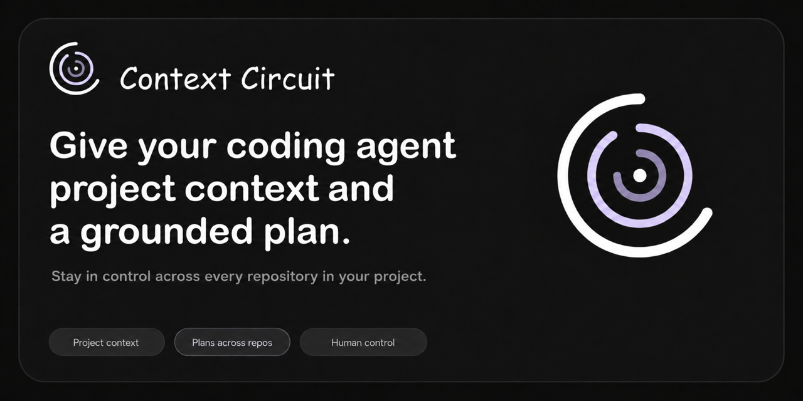

<p align="center">
  
</p>

<h1 align="center">Context Circuit Source</h1>

<p align="center">
  <strong>Maintainer source for the Context Circuit workspace and CLI.</strong>
</p>

<p align="center">
  <a href="https://github.com/kaotypr/context-circuit-source/actions/workflows/check.yml"></a>
  <a href="go.mod"></a>
  <a href="https://github.com/kaotypr/context-circuit-source/releases"></a>
  <a href="LICENSE"></a>
  <a href="https://context-circuit.kaotypr.com"></a>
</p>

<p align="center">
  <a href="https://github.com/kaotypr/context-circuit">Product guide</a> ·
  <a href="WORKFLOW.md">Source workflow</a> ·
  <a href="CLI.md">CLI architecture</a> ·
  <a href="#development">Development</a> ·
  <a href="#release-assembly">Release assembly</a> ·
  <a href="#licensing">Licensing</a>
</p>

Context Circuit gives coding agents shared project context, a grounded plan,
and explicit human control points across one or more Git repositories.

This repository is the maintainer source checkout. It builds two separately
versioned products:

1. A **workspace template** containing the files, instructions, skills, and
   documentation an agent uses with a project.
2. A **native CLI** that handles workspace records, repository bindings,
   isolated working copies, ordering, diagnostics, and release-safe mechanics.

If you want to use Context Circuit, begin with the
[product guide](https://github.com/kaotypr/context-circuit). If you are changing how Context Circuit
works or ships, this is the repository to edit.

## What belongs in the CLI

The line between the CLI and the coding agent is the design constraint this
repository implements. Before adding behavior, decide which side it is on.

| The CLI does | The coding agent does |
| --- | --- |
| Allocates stable IDs and edits structured workspace files | Understands a request and retrieves relevant project context |
| Records approvals, dependencies, completion, and local bindings | Writes goals and implementation plans |
| Prepares and tracks isolated Git working copies | Inspects code, implements changes, and runs project checks |
| Produces deterministic diagnostics and dispatch specifications | Decides when bounded exploration or sub-agents are useful |
| Refuses invalid state without making product judgments | Reports real results and unresolved decisions |

Anything whose answer depends on reading the actual project belongs to the
agent, not to Go. Anything that must return the same result every time belongs
here. The CLI holds no LLM credentials and never calls a model API, so a feature
that needs judgment is a skill or an instruction change, not a command.

Human authorization sits outside both and is never inferred by either.

## Repository layout

This is the maintainer-source layout. The repository structure users receive is
shown in the product guide under
[Workspace repository structure](product/README.md#workspace-repository-structure),
which `publish-template.sh` restores as that repository's landing page rather
than shipping into a workspace.

```text
context-circuit-source/
├── cmd/
│   └── context-circuit/       Native CLI entry point
├── internal/
│   ├── cli/                   Commands and human/JSON output
│   ├── workspace/             Records, YAML edits, Git, and working copies
│   ├── cow/                   Copy-on-write cloning with copy fallback
│   └── installer/             Acceptance tests for the shipped install scripts
├── product/                   Instructions, skills, docs, and the guide
│   ├── LICENSE                0BSD, shown at that repository's root
│   ├── README.md              The guide the template repository's page renders
│   ├── assets/readme/         Product and README artwork
│   ├── docs/                  Workspace and command documentation
│   └── skills/                Agent procedures for each workflow stage
├── template/                  Blank workspace records and configuration
├── context/                   Maintainer product knowledge; never shipped
├── release/
│   ├── binding.yaml           Where the workspace template publishes
│   ├── template-repo/         Landing page and export rules that repo owns
│   └── requests/              cli/ and template/, one request per version
├── scripts/
│   ├── release-manifest.txt   Exact source-to-workspace mapping
│   └── …                      Build, validation, and publication tooling
├── assets.go                  Embedded product inventory
├── LICENSE                    Apache-2.0, covering this checkout and the CLI
├── VERSION                    Workspace-template version
└── CLI_VERSION                Native CLI version
```

`product/` and `template/` are the two shipped trees; `scripts/release-manifest.txt`
maps every file in them to its destination in a generated workspace.

`sources/` is passive maintainer design history: not the current product
specification, and never shipped. `release/` is not history — `binding.yaml`
names the published destination, and each product's requests live beside it.

This checkout is not a Context Circuit workspace and carries no workspace
records. The product's intent and plan flow is not used here; maintainer changes
are made directly on the current branch, as `AGENTS.md` sets out.

`context/` is still validated by the product's own diagnostic. `go test` builds a
throwaway workspace around the real tree, binds it to this checkout so each
note's code anchors resolve, and fails on any finding a command or an edit can
discharge. That runs for every clone and every pull request, where registering
this checkout by hand only ever ran on the machine that did it.

## Development

Contributors need Go 1.25 or newer and Git.

Build the native CLI:

```sh
go build -o /tmp/context-circuit-cli ./cmd/context-circuit
/tmp/context-circuit-cli version
```

Run the normal validation:

```sh
gofmt -w path/to/changed.go
go test ./...
go vet ./...
sh scripts/check-release.sh
```

`scripts/check-release.sh` is the full product check. In fresh temporary
directories it tests the Go packages, builds the workspace archive, builds all
six CLI targets, verifies checksums, exercises installation and initialization,
and checks publication safeguards.

Cross-compilation proves that a binary builds for another platform; it does not
prove native behavior there. CI supplies native Linux, macOS, and Windows
coverage.

## Build outputs

Build both release inventories:

```sh
sh scripts/build-dist.sh
sh scripts/build-cli.sh
```

With no explicit destination, each script clean-rebuilds its own versioned
directory under `dist/`. The workspace and CLI builds do not remove one
another's output.

`dist/` is not a preview of the published template repository. The workspace
build produces what a user receives; the repository's own landing page — its
README, license, changelog, conduct, contributing and security pages, and the
artwork that guide renders — is restored over the artifact by
`publish-template.sh` and reaches no workspace, so none of it appears here.

To keep a checked build in a specific location, provide a new directory:

```sh
sh scripts/build-dist.sh v2.0.0-dev /tmp/context-circuit-workspace
sh scripts/build-cli.sh 2.0.0-dev /tmp/context-circuit-cli
sh scripts/check-release.sh /tmp/context-circuit-release-check
```

Explicit output directories must not already exist. Release assembly never
overwrites a caller-selected directory.

## Release assembly

The products have separate version lines and package inventories:

| Product | Version source | Tag family | Output |
| --- | --- | --- | --- |
| Workspace template | `VERSION` | `v*` | Versioned workspace archive and checksum |
| Native CLI | `CLI_VERSION` | `cli-v*` | macOS, Linux, and Windows archives for amd64/arm64 |

The CLI embeds the blank workspace seed as a convenience for `init` and
`template export`. That seed does not make the two products one release: an
existing workspace pins its expected CLI version in
`.context-circuit/CLI_VERSION`, and installed CLI versions coexist side by side.

Publication is never an implicit part of validation. Commits, tags, pushes,
release publication, and deployment require an explicit maintainer request.

## Maintaining product behavior

- Edit source files under `product/` and `template/`; do not patch a generated
  workspace and copy it back by guesswork.
- Keep `scripts/release-manifest.txt` and `assets.go` consistent with every file
  that ships.
- Retrieve current product decisions through `context/INDEX.md` instead of
  scanning every knowledge note.
- Keep a context note and its catalog entry in the same change.
- Preserve unrelated working-tree changes and validate release behavior in
  fresh temporary directories.
- Do not revive retired v1 lifecycle machinery.

See [WORKFLOW.md](WORKFLOW.md) for source ownership and validation details,
[CLI.md](CLI.md) for the CLI boundary and packaging behavior, and the [product
documentation](product/docs/) for the workspace contract.

## Licensing

This checkout carries two licenses, because it builds two things with different
relationships to the people who receive them.

| What | License | Why |
| --- | --- | --- |
| This repository and `context-circuit-cli` | [Apache-2.0](LICENSE) | A binary organizations install fleet-wide; the explicit patent grant is what carries it through legal review |
| Everything a workspace receives, under `product/` and `template/` | [0BSD](product/LICENSE) | Scaffolding copied into somebody else's repository and edited there, so it imposes no attribution obligation on their project |

GitHub detects the root `LICENSE` only, so this repository is labeled Apache-2.0.
`publish-template.sh` puts the 0BSD text at the root of the published template
repository, which is the one place it appears. A workspace receives no license
file: 0BSD asks nothing of the project the scaffolding is copied into, so a
`LICENSE` at that project's root would only make GitHub label somebody else's
work with this one's terms.

A contribution is offered under the license covering the tree it touches.
