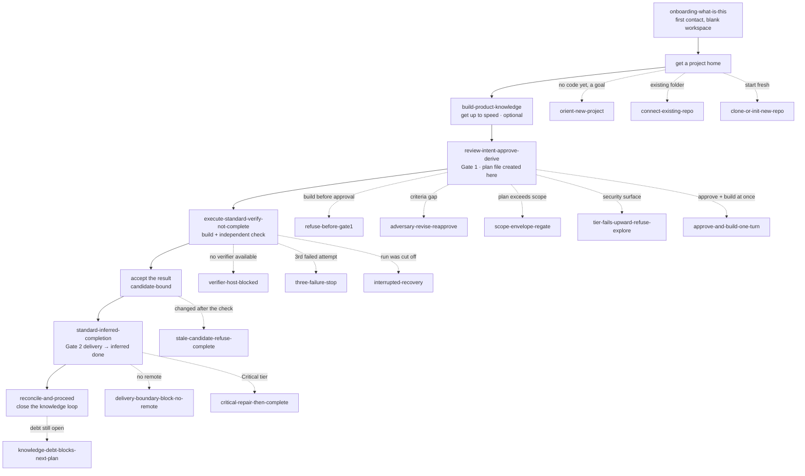

# Reading the library in flow order

The catalog in [README.md](README.md) groups plots by phase for **coverage**. This
guide instead lays them on the **lifecycle spine in the order a real project moves**,
so you can read the golden path top-to-bottom and see exactly where each branch,
guardrail, and refusal hangs off it.

Two kinds of plot:

- **spine** — the happy path, one beat after another. Read these in order first.
- **branch** — what happens when a decision goes the other way, something is refused,
  or a variation applies. Each branch notes the spine beat it hangs off.

## The spine at a glance

`standard-feature-whole-flow` walks this entire spine as **one** continuous lay-user
conversation — read it to see the golden path end to end before the piece-by-piece
plots below.

## The golden path, in order

Read these top to bottom; each is one beat of a project's life.

| # | plot | the beat |
| --- | --- | --- |
| 1 | [onboarding-what-is-this](plots/onboarding-what-is-this.md) | first contact — what is this, what can it do, how to start |
| 2 | [orient-new-project](plots/orient-new-project.md) | a goal but no project yet — orient, don't fabricate |
| 3 | [build-product-knowledge](plots/build-product-knowledge.md) | get up to speed on a connected project *(optional)* |
| 4 | [review-intent-approve-derive](plots/review-intent-approve-derive.md) | **Gate 1** — review, settle the open question, approve → **the plan file is created here** |
| 5 | [execute-standard-verify-not-complete](plots/execute-standard-verify-not-complete.md) | build it, check it independently — verified ≠ complete |
| 6 | [standard-inferred-completion](plots/standard-inferred-completion.md) | accept the result, then **Gate 2** delivery → completion is inferred |
| 7 | [reconcile-and-proceed](plots/reconcile-and-proceed.md) | fold the delivered work into what the project knows |
| ★ | [standard-feature-whole-flow](plots/standard-feature-whole-flow.md) | all of 1→7 as one conversation |

## Branches & guardrails, by where they hang off the spine

### Getting a project home (beat 2)
- [connect-existing-repo](plots/connect-existing-repo.md) — bind an existing folder in place, on the human's branch
- [clone-or-init-new-repo](plots/clone-or-init-new-repo.md) — start a fresh repository under the project area

### Product Knowledge (beat 3)
- [query-product-knowledge](plots/query-product-knowledge.md) — ask what the project already knows (retrieval, read-only)
- [accept-or-defer-context-proposal](plots/accept-or-defer-context-proposal.md) — the consent gate on a pending proposal

### The intent gate (beat 4)
- [refuse-before-gate1](plots/refuse-before-gate1.md) — fail closed: no build before approval
- [adversary-revise-reapprove](plots/adversary-revise-reapprove.md) — criteria gap → revise → re-challenge → approve
- [scope-envelope-regate](plots/scope-envelope-regate.md) — a plan exceeding scope is held & re-gated *(crown jewel 1)*
- [tier-fails-upward-refuse-explore](plots/tier-fails-upward-refuse-explore.md) — refuse to drop the check on a risk surface *(crown jewel 2)*
- [approve-and-build-one-turn](plots/approve-and-build-one-turn.md) — approve + build in one turn, no confirmation card

### The Explore lane (a lighter path off beat 4)
- [direct-collaboration-explore](plots/direct-collaboration-explore.md) — live, human-supervised, no plan, no verifier
- [explore-promote-to-standard](plots/explore-promote-to-standard.md) — promote in place → a plan file is created, the check appears

### Execute & verify (beat 5)
- [repository-grounding](plots/repository-grounding.md) — the worker honors the repo's own guidance
- [run-stack-single-repo](plots/run-stack-single-repo.md) — a dependency-ordered batch in one repo
- [run-stack-multi-repo](plots/run-stack-multi-repo.md) — a batch across two repos
- [execution-tiering-hidden](plots/execution-tiering-hidden.md) — per-role model/effort recorded, never shown
- [verifier-host-blocked](plots/verifier-host-blocked.md) — no independent check available → blocked, never self-verify
- [three-failure-stop](plots/three-failure-stop.md) — third failed attempt → stop honestly, evidence preserved
- [interrupted-recovery](plots/interrupted-recovery.md) — a cut-off run resumes or holds read-only, nothing lost
- [lease-ownership-conflict](plots/lease-ownership-conflict.md) — in-progress work is held read-only, never stolen

### Candidate, completion & delivery (beats 6)
- [stale-candidate-refuse-complete](plots/stale-candidate-refuse-complete.md) — a change after the check voids the evidence
- [critical-repair-then-complete](plots/critical-repair-then-complete.md) — Critical tier needs an explicit completion
- [delivery-boundary-block-no-remote](plots/delivery-boundary-block-no-remote.md) — Gate 2 blocks with no remote, never a silent push
- [change-set-one-verification](plots/change-set-one-verification.md) — two changes, one combined delivery, both complete
- [change-set-base-unbuildable](plots/change-set-base-unbuildable.md) — they don't combine cleanly → honest block

### Closing the knowledge loop (beat 7)
- [knowledge-debt-blocks-next-plan](plots/knowledge-debt-blocks-next-plan.md) — an open follow-up blocks the next overlapping plan
- (its happy complement is [reconcile-and-proceed](plots/reconcile-and-proceed.md), on the spine)

## Off to the side — anytime, not part of the spine

These don't sit on the lifecycle; they're organization and export actions that can
happen at any point and change no workflow state.

- **Organization:** [archive-plan](plots/archive-plan.md) · [restore-archived-plan](plots/restore-archived-plan.md) · [archive-restore-intent](plots/archive-restore-intent.md)
- **Publish outward (orthogonal, export-only):** [publish-plan-to-external](plots/publish-plan-to-external.md) · [publish-open-questions-thread](plots/publish-open-questions-thread.md)
- **Design a larger change first:** [author-system-design-spawns-intents](plots/author-system-design-spawns-intents.md) — writes source, spawns one intent per concern (each then enters the spine at beat 4)

## The two gates and the birth of a plan (the load-bearing beats)

If you read nothing else in order, read these three, which carry the whole v1.0 shape:

1. **Gate 1 is the only upstream decision.** `review-intent-approve-derive` — approving
   the *intent* is where a plan file is born; there is no separate plan approval.
2. **The middle is mechanical and honest.** `execute-standard-verify-not-complete` —
   built and independently checked, but *verified is not complete*.
3. **Gate 2 is delivery, and completion follows.** `standard-inferred-completion` —
   accept + deliver, and Standard completion is inferred, then the knowledge loop closes.
