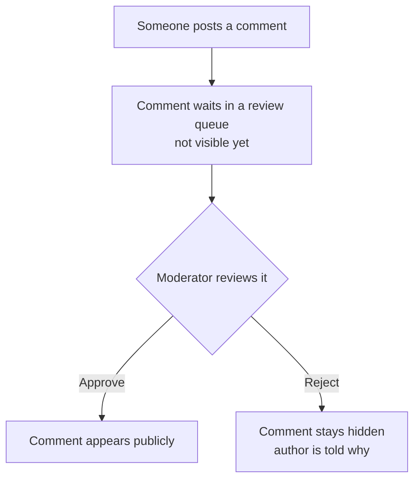

<!--
  Illustrative example, not a rule. This is a filled-in INTENT.md that shows the
  plain, reassuring, no-jargon voice the blank template (docs/templates/intent.md)
  asks for, including a small mermaid graph where the intention is a flow. Copy the
  shape and the tone, not this feature. The scenario is generic on purpose.
-->

# Intention — i007

_Status: draft, waiting for your approval._

## Intention

What you want: **new comments checked by a moderator before they show up
publicly**, so nothing inappropriate appears on the site without a person seeing
it first.

A comment doesn't go live on its own — it moves through review:

- **Waits first:** a new comment lands in a review queue, not on the page.
- **A moderator decides:** they approve it or reject it.
- **Then it resolves:** approved comments appear publicly; rejected ones stay
  hidden and the author is told why.

Either way, nothing reaches the public page until a person has looked at it.

## Expectations

- New comments don't appear until a moderator approves them.
- Moderators have one place to see everything waiting for review.
- Approving makes a comment public right away; rejecting keeps it hidden and tells
  the author.
- Comments already published are untouched.

## The plans

1. **Hold new comments for review.**
   _After this:_ a new comment goes to a review queue instead of appearing on the
   site.
2. **Give moderators a review queue with approve and reject.**
   _After this:_ a moderator can approve or reject each waiting comment from one
   place.
3. **Tell the author when a decision is made.**
   _After this:_ when a comment is approved or rejected, its author is notified.

## How carefully this is checked

**`Standard`**

Explanations:
- **Explore:** you check it yourself as you work alongside the agent — no separate
  verification. Meant for trying things out.
- **Standard:** a second, independent agent verifies the finished work against your
  definition of done before it's called done.
- **Critical:** the strictest — independent verification plus a repair-and-recheck
  loop. For anything risky or impossible to undo (money, security, production, data
  you can't get back).

## Open questions

**Should a trusted, long-time member's comments skip review, or does everyone go
through the queue?**
_Answer: Everyone goes through the queue for now — one simple rule, no exceptions
to keep track of._
