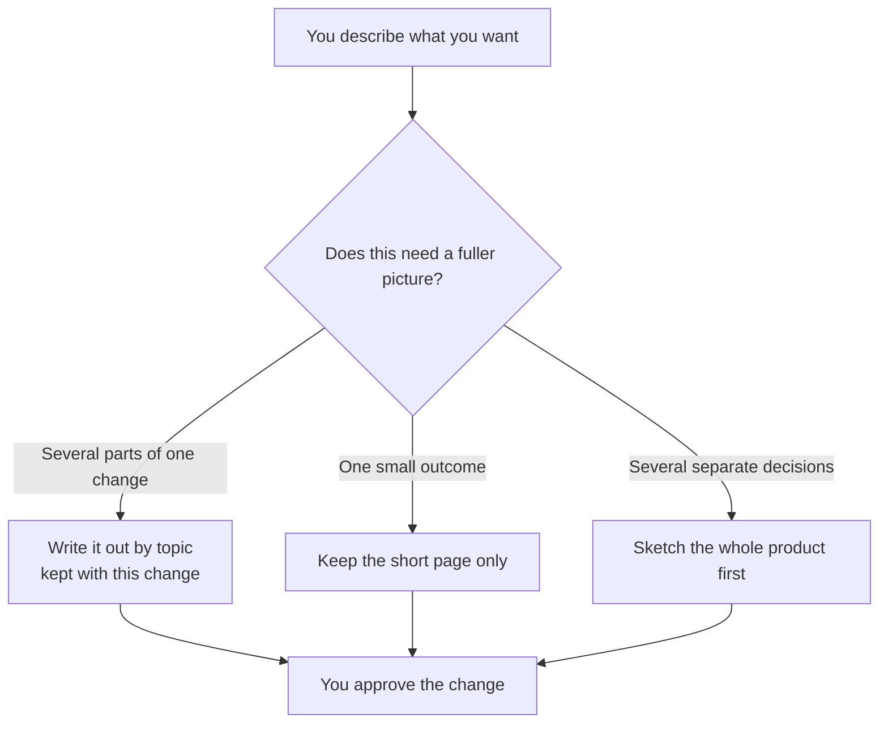

# Intention — i004

_Status: approved.

## Intention

What you want: **when someone is about to agree to a change, they can see it written out in full, split by topic, kept with that change** — not as a separate big-picture design sitting somewhere else.

The short page you approve stays the short page. For a richer change, the same helper that already writes a structured design should also write that fuller picture *with the change itself*. You see what you are agreeing to. Later, the work is sliced along the topics you already confirmed.

A small change stays short. A change with several parts can be offered the fuller write-up, or you can ask for it. You still approve once. The big-picture design for a whole product or version stays where it is; this does not add another one of those for this feature.

## Expectations

- You can ask for a detailed write-up of a change, or be offered one, before you approve.
- That write-up lives with the change, split by topic, using the same kind of structure as a system design.
- The short page you approve stays short; there is no second approval.
- The existing "design the system" helper is extended to do this — no extra helper, and no extra product-level design written just to specify this feature.
- Small changes can skip the fuller write-up; it is never required.
- When a fuller write-up exists, later planning uses it so the work follows the topics you already saw.

## The plans

1. **Teach the design helper both homes.**
   _After this:_ the same helper can write a product-level design as today, or write a change out by topic next to that change.
2. **Offer it while preparing a change, and use it when planning.**
   _After this:_ you are offered the fuller picture when it would help, and work is later sliced using those topics.
3. **Prove the two paths.**
   _After this:_ checks cover a short change that stays short and a richer change that gets the fuller write-up, without a second approval.

## How carefully this is checked

**`Standard`**

This changes how people prepare and understand a change before they approve it, so an independent check should confirm both paths and that no extra approval was added.

Explanations:
- **Explore:** you check it yourself as you work alongside the agent — no separate
  verification. Meant for trying things out.
- **Standard:** a second, independent agent verifies the finished work against your
  definition of done before it's called done.
- **Critical:** the strictest — independent verification plus a repair-and-recheck
  loop. For anything risky or impossible to undo (money, security, production, data
  you can't get back).

## Open questions

**Should the fuller write-up sit in a folder named design or detail?**
_Answer: detail — so it is not confused with a product-level system design._

**Should this be a new helper, or the existing design helper?**
_Answer: Extend the existing design helper. Do not add another product-level design just to specify this._
