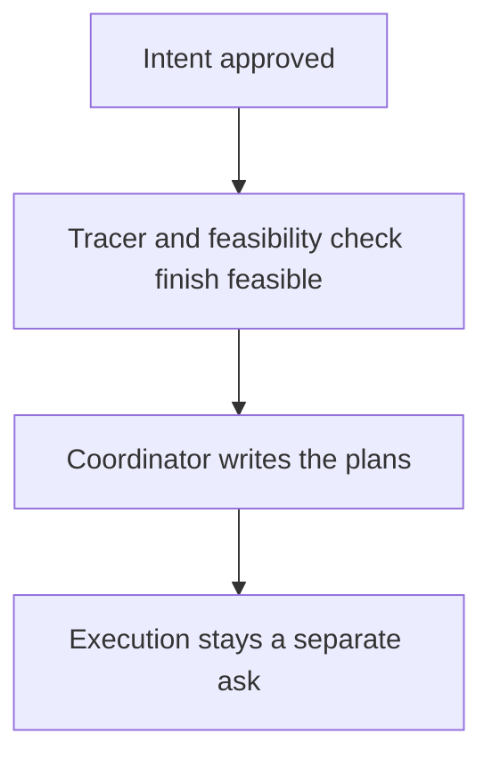

# Intention — i008

_Status: approved._

## Intention

What you want: **once the intent is approved and the tracer plus feasibility check find it feasible, the coordinator writes the plans in that same turn — not later, when you ask again.**

Approval plus a feasible tracer with no follow-up questions is enough. The next thing you see is the plans, derived from the trace manifest.

## Expectations

- After approval and a feasible tracer with no follow-up questions, the coordinator writes the plans without you asking again.
- If the tracer surfaces an intent-level question or the feasibility check is not feasible, no plans are written.
- Writing the plans does not start execution, and it does not add a second approval.
- Execution stays a separate ask.

## The plans

1. **Write the plans as soon as the tracer is feasible.**
   _After this:_ approval plus a feasible tracer produces the plans in that same turn.
2. **Prove the handoff.**
   _After this:_ checks fail if a feasible tracer leaves the intent with no plans, and fail if plans appear when the tracer still has questions.

## How carefully this is checked

**`Standard`**

This is the handoff after every approval, so an independent verifier should confirm the plans appear only after a feasible tracer, and always then.

Explanations:
- **Explore:** you check it yourself as you work alongside the agent — no separate
  verification. Meant for trying things out.
- **Standard:** a second, independent agent verifies the finished work against your
  definition of done before it's called done.
- **Critical:** the strictest — independent verification plus a repair-and-recheck
  loop. For anything risky or impossible to undo (money, security, production, data
  you can't get back).

## Open questions

No known unresolved human decisions at draft time.
