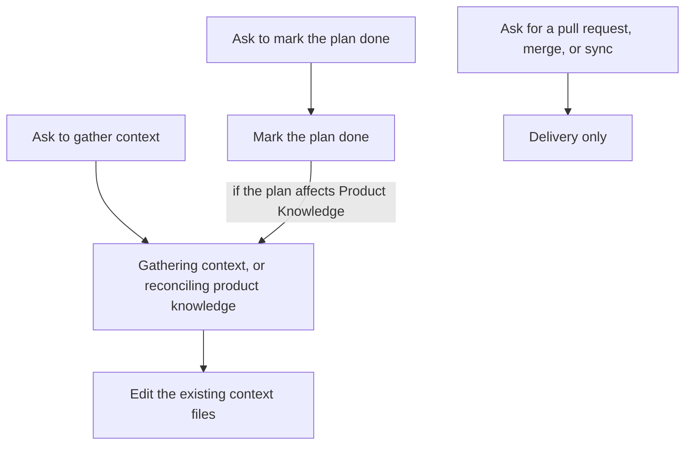

# Intention — i014

_Status: approved, look complete, feasible.

## Intention

What you want: **Product Knowledge is updated by changing the real `context/` files, not by writing a proposal to approve later.** Gathering context still does that in place. A plan becomes done only when you ask to mark it done. That ask closes the work and, when the plan affected Product Knowledge, writes those files from what the plan changed. Asking for a pull request, merge, or “sync the local repo” stays delivery only — it does not start a knowledge update, and it does not mark the plan done. The next plan can start without waiting for that knowledge update.

Today knowledge paths stage a document under `context/proposals/` and wait for a separate “accept the context update” decision. The proposal sidecar goes away, including dropping pending proposal `0034`. The auto-run lives on **mark the plan done**: read the plan, mark it done, then update live context files only if the plan affected Product Knowledge.

## Expectations

- Gathering context edits the real context files. It does not create a proposal document.
- A plan becomes done only when you ask to mark it done. Explore has no intent and no plan, so it is unchanged.
- Asking to mark a plan done marks it done. If that plan affected Product Knowledge, the live context files are updated from what changed — in place, no proposal, no extra accept.
- If the plan did not affect Product Knowledge, marking it done does not change context files.
- Asking for a pull request, merge, or “MR merged, sync local repo” delivers only. It does not start a knowledge update and does not mark the plan done.
- The next plan can start even if that knowledge update has not landed.
- Pending proposal `0034` (conversation-spec-library) is dropped.
- Intent approval and delivery stay the two human gates they already are. Knowledge updates are not a third gate.

## The plans

1. **Write Product Knowledge in place.**
   _After this:_ gathering context and reconciling product knowledge change `context/` files directly; `context/proposals/` is no longer a staging path, pending proposal `0034` is dropped, and there is no separate “accept the context update” step.
2. **Start the in-place knowledge update from marking a plan done.**
   _After this:_ a plan becomes done only when you ask; that ask reads the plan, marks it done, then updates live context files when the plan affected Product Knowledge. Delivery does not mark it done and does not start that update. The next plan is not blocked waiting for the update.
3. **Prove the old path is gone.**
   _After this:_ checks fail if a proposal is staged, if a knowledge update waits for a separate accept, if delivery starts reconciliation or marks a plan done, or if the next plan is blocked waiting for Product Knowledge.

## How carefully this is checked

**`Standard`**

This changes how accepted knowledge is written, when a plan becomes done, and which lifecycle step starts a knowledge update, so an independent verifier should confirm those outcomes.

Explanations:
- **Explore:** you check it yourself as you work alongside the agent — no separate
  verification. Meant for trying things out.
- **Standard:** a second, independent agent verifies the finished work against your
  definition of done before it's called done.
- **Critical:** the strictest — independent verification plus a repair-and-recheck
  loop. For anything risky or impossible to undo (money, security, production, data
  you can't get back).

## Open questions

**Should asking for a pull request, merge, or “sync the local repo” start a knowledge update?**
_Answer: No. Delivery stays delivery only._

**When should the in-place knowledge update auto-run?**
_Answer: When you ask to mark a plan done. The coordinator reads the plan, marks it done, then if the plan affected Product Knowledge, updates the live context files from what changed. No proposal, no extra accept._

**Should a plan become done only when you ask to mark it done?**
_Answer: Yes. Every plan becomes done only when a human asks to mark it done. Explore has no intent and no plan._

**If that auto-update has not landed, should the next plan still wait until Product Knowledge has been updated?**
_Answer: No. The next plan can continue._

**There is one pending proposal (`0034`, conversation-spec-library). What should happen to it when proposals go away?**
_Answer: Drop it._
