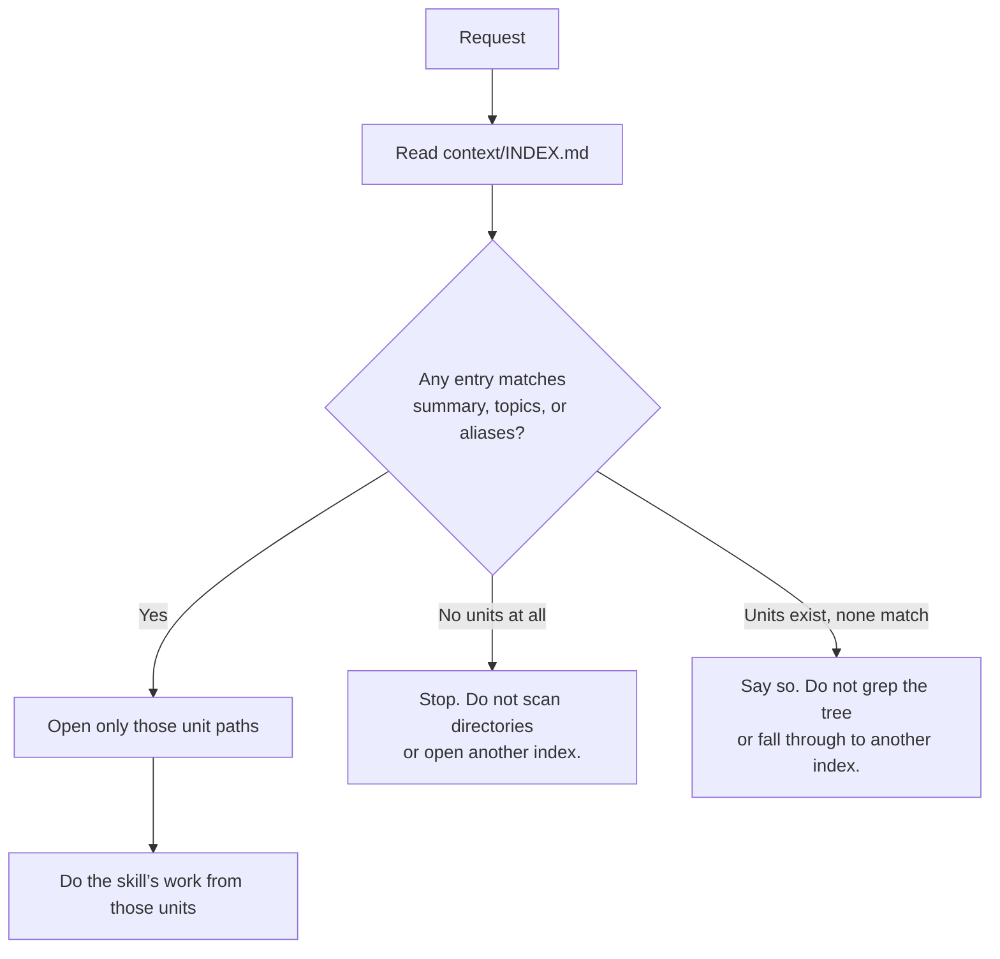

# Catalog that actually selects

Continues from [design.md](design.md). This is the grep win.

## What “select” means

An agent with a request (“shape this change”, “gather context about delivery”,
“what does this workspace know about pairing?”) looks at **`context/INDEX.md`**,
matches the request to **named units**, and opens **only those files**.

It does **not**:

- list `context/domains/` to see what exists
- grep `context/` for keywords
- open every domain page “just in case”
- open the catalog schema in order to learn how the catalog is supposed to look
- fall through to `context/domains/README.md` or any other index because
  `INDEX.md` was empty or lacked a match

A match is a catalog **entry** in `context/INDEX.md`, not a directory. The
entry already carries the path. That file is the only selector. A domain
README with one-line summaries is knowledge about domains, not the catalog.

The retrieval schema already names the fields, and durable-only writing
already forbids particular plan, intent-file, or sources-file cites in live
context — including catalog provenance. This intent does not change that
writing rule. It makes the file agents actually read carry the retrieval
fields, so the schema is not a second place the agent must visit.

## What the catalog must carry per unit

- stable id
- path of the unit
- one-line summary
- topics
- aliases (the words a human or agent might use instead of the title)
- status (`accepted` / `needs-review` / `stale`)
- optional: domains, repositories, decisions, constraints, freshness

The catalog remains a **catalog**. It does not paste page content. A one-line
summary plus topics and aliases is enough to decide “open this” vs “skip this.”

There is no proposal staging path. The catalog lists live `context/` files
only. Provenance pointers, when present, are durable retrieval facts only
(INV-KNOWLEDGE-03).

## Empty catalog (template seed)

A new workspace has no accepted units. That is a complete answer:

- the catalog says there are no units
- the agent stops
- it does not create a scan of empty `context/domains/` or `context/references/`
  to “make sure”
- it does not open `context/domains/README.md` to invent a match

The blank template catalog still shows the **entry shape**, so the first
knowledge unit added has a slot to fill. The procedure for adding a unit
already belongs to context gathering and to in-place knowledge updates on
mark-done: a new page without a catalog row is incomplete. This intent does
not invent a third knowledge workflow; it makes the existing catalog the
thing an agent can actually use.

## How a route uses it

Skills that today say “retrieve via INDEX, read only the selected units” keep
that sentence. They add the negative: **do not list or grep the knowledge tree
to discover units, and do not treat another file as the catalog.** If
`context/INDEX.md` cannot name it, it is not selected.

## What this is not

- Not a rewrite of domain pages. Selection gets better; page length stays.
- Not a second copy of Product Knowledge inside the catalog.
- Not treating `context/domains/README.md` or a directory listing as the
  catalog.
- Not filling this source checkout’s catalog as a product feature. This
  checkout may already have many accepted domain pages; filling their catalog
  rows may happen when knowledge is gathered here. The **shipped** change is
  the catalog shape in the template and the procedure that forbids a tree
  search.

## Edge cases

- **Stale** units remain selectable for orientation and must be marked stale
  on the entry; a consequential plan still surfaces staleness as today.
- **Request-named `sources/` files** stay outside the catalog. They are read
  only when the human named them. The catalog does not index `sources/`.
- **Several matching units:** open the smallest set that covers the request.
  Do not treat “several matches” as “read the directory.”
- **Needs-review** units remain listed so an agent can see them without
  scanning the tree; they are not accepted Product Knowledge.

## Interfaces

- Agent-facing catalog: `context/INDEX.md` (the file skills already name).
  No other file is the selector.
- Ownership of catalog *shape*: the existing retrieval schema. Agents do not
  read the schema to use the catalog.
- Writers of entries: context gathering, and in-place knowledge updates when
  a plan that affected Product Knowledge is marked done. A unit without an
  entry is not retrievable, so those writers must write the entry.
