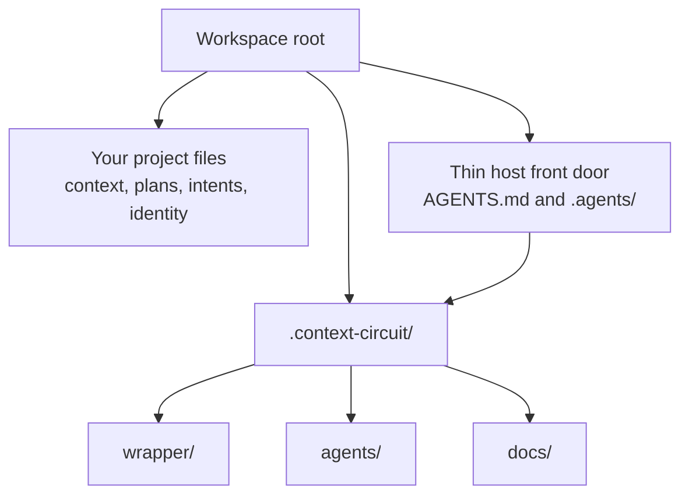

# Intention — i017

_Status: approved, look complete, feasible._

## Intention

What you want: **Context Circuit's own system files live under `.context-circuit/`**, so the workspace root is the project's, not the product's. Three product folders move there as they are: `wrapper/`, `agents/`, and `docs/`.

The product still does the same work. Only its home changes:

- **One nested home:** `.context-circuit/wrapper`, `.context-circuit/agents`, and `.context-circuit/docs` are where the shipped layer, role files, and product documentation live.
- **Hosts still find the front door:** `AGENTS.md` at the workspace root stays a thin pointer into `.context-circuit`. `.agents/` (skills) stays at the workspace root.
- **New and upgraded workspaces match:** the template seed and an upgrade both use the nested home. Your project files — identity, Product Knowledge, plans, intents, runtime evidence — stay where they are.

A fuller write-up by topic sits beside this page. You still approve once.

## Expectations

- `wrapper/`, `agents/`, and `docs/` live under `.context-circuit/`, not at the workspace root.
- The runtime, contracts, adapters, role files, and product docs still work from that nested home.
- Hosts still enter through the surfaces they already look at. `AGENTS.md` points into `.context-circuit`. `.agents/` stays at the workspace root.
- A newly instantiated workspace and an upgraded one both use this layout.
- Workspace-owned files stay at the workspace root. This does not move Product Knowledge, plans, intents, sources, or runtime evidence.
- Lifecycle, gates, one-owner-per-rule, and host-blocked fail-closed stay the same.

## The plans

One plan, **0003-nest-system-home**, with four ordered tasks in this project:

1. **Move wrapper, agents, and docs under `.context-circuit`.**
   _After this:_ those folders live at `.context-circuit/wrapper`, `.context-circuit/agents`, and `.context-circuit/docs`, and the runtime finds them there.
2. **Keep the host front door at the workspace root.**
   _After this:_ a host still finds `AGENTS.md` and `.agents/` where it looks today; `AGENTS.md` points at the nested home, and `.agents/` does not move.
3. **Ship the nested home in the template and in upgrades.**
   _After this:_ a new workspace is nested from the start; an existing one is upgraded without moving the user's project files.
4. **Retarget every product path that still names the old home.**
   _After this:_ instructions, tests, and knowledge name `.context-circuit/...`; a leftover root `wrapper/`, `agents/`, or `docs/` is gone.

## How carefully this is checked

**`Standard`**

This relocates the product's home and has to migrate existing workspaces onto that layout, so a second agent should confirm the nested home works and nothing at the old root was left behind. It is not money, secrets, or an irreversible user-data wipe — those would be Critical.

Explanations:
- **Explore:** you check it yourself as you work alongside the agent — no separate
  verification. Meant for trying things out.
- **Standard:** a second, independent agent verifies the finished work against your
  definition of done before it's called done.
- **Critical:** the strictest — independent verification plus a repair-and-recheck
  loop. For anything risky or impossible to undo (money, security, production, data
  you can't get back).

## Open questions

**Does `.agents/` (the skills folder hosts look for) also move under `.context-circuit`, or does it stay at the workspace root?**
_Answer: Keep `.agents/` at the workspace root._

**Does `docs/` also move under `.context-circuit`?**
_Answer: Yes — `docs/` moves to `.context-circuit/docs`._
