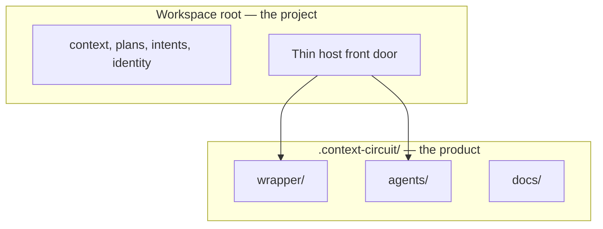

# Nest Context Circuit system files under `.context-circuit`

## Capability

A Context Circuit workspace still does the same work. After this change, the
**shipped product** lives under one nested home — `.context-circuit/` — and the
workspace root is the project's. Three product folders move there as
folders: `wrapper/`, `agents/`, and `docs/`.

Hosts still enter the same coordinator, the same runtime, and the same gates.
They find the product through thin root surfaces that point into the nested
home, not through a second copy of wrapper or agents at the top level.

## Problem

Today the shipped layer sits at the workspace root: `wrapper/` beside the
user's `context/`, `plans/`, and identity. `agents/` (role files) and
`docs/` (product documentation and templates) sit there too. That makes
Context Circuit look like the project, and it collides with anything the
user would rather keep at root — including a project `docs/`.

The 2026-08-21 wrapper/template split still holds: shipped ownership stays in
the wrapper directory, and the blank seed stays `template/` in the source
checkout. This intent only **nests** that shipped layer. It does not merge
source identity with an instantiated workspace, and it does not flatten
wrapper into `.context-circuit/` itself.

## Principles

1. **Nest, don't flatten.** `.context-circuit/wrapper`,
   `.context-circuit/agents`, and `.context-circuit/docs` remain those
   folders. Contents do not spill into `.context-circuit/` as a bag of files.
2. **Project root stays the project's.** Workspace-owned files (identity,
   Product Knowledge, sources, plans, intents, runtime evidence, bindings,
   connected repositories) do not move.
3. **One product home.** After the move, a leftover root `wrapper/`,
   `agents/`, or `docs/` is a bug. Pointers retarget; they do not keep a
   shadow tree.
4. **Hosts look where they already look.** Root `AGENTS.md` / `WORKFLOW.md`
   remain the shared instruction surface. `.agents/` stays at the workspace
   root. See [host-surfaces.md](host-surfaces.md).
5. **Same layout everywhere.** Source checkout, assembled template, new
   workspace, upgraded workspace: one nested home. See [upgrade.md](upgrade.md).
6. **Behavior unchanged.** Gates, tracer, verifier floor, one-owner-per-rule,
   invoke-not-read, host-blocked stay. This is a home change, not a lifecycle
   change.

## Fixed decisions

- Destination is `.context-circuit/`. The product folders become
  `.context-circuit/wrapper`, `.context-circuit/agents`, and
  `.context-circuit/docs`.
- Do not move workspace-owned files into that home.
- Do not rename "wrapper" or drop the wrapper/template split.
- Root host adapters stay thin pointers into the nested home.
- `.agents/` stays at the workspace root. It does not move under
  `.context-circuit`.
- Ship in the source checkout, the template seed, and upgrades — an
  instantiated workspace, not a source-only convenience.
- Use Standard assurance: an independent check that the nested home works,
  the host front door still enters, and the old root folders are gone.

## Shape of the whole

| Topic | What it settles | Detail |
| --- | --- | --- |
| Host surfaces | What must stay at root so Codex, Claude, and Cursor still enter | [host-surfaces.md](host-surfaces.md) |
| Upgrade | How the template and existing workspaces reach the same nested home | [upgrade.md](upgrade.md) |

Plans follow these topics: move wrapper, agents, and docs and retarget the
runtime; keep the host front door; ship and upgrade; then retarget leftover
path names and prove the old root homes are gone.

## Out of scope here

A new host, a new router, flattening wrapper, moving Product Knowledge or
runtime evidence, and delivering or publishing the change. `sources/` stays
passive. The fuller picture of *this* intent is this folder; it is not a
product-level system design.
