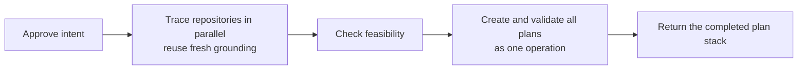

# Intention — i018

_Status: approved, look complete, feasible.

_Status: approved.

_Status: draft, waiting for your approval._

## Intention

What you want: **make intent approval finish with grounded, validated plans in
about 90 seconds in the normal case**, instead of taking nearly eight minutes.

Approval remains the one human action. It still performs the complete workflow;
the improvement comes from reusing fresh repository knowledge, producing
plan-ready trace results, and materializing the resulting plan stack without
repeated command and validation loops.

## Expectations

- A normal warm approval reaches created and validated plans in roughly 90
  seconds, with a two-minute upper target for typical work.
- A cold approval that must inspect repositories fully targets three to four
  minutes rather than nearly eight.
- Approval still includes repository tracing, feasibility, plan derivation, and
  validation in the same turn; there is no additional command or human gate.
- Reused repository knowledge is tied to the code revision and refreshed when
  relevant code has changed.
- Tracer-reported files and call sites guide the plan but do not become a hard
  worker allowlist; the worker reads the assigned repository and may follow the
  implementation into additional necessary paths.
- Additional paths discovered by the worker are recorded and independently
  checked; only a new repository or a change to the approved decision requires
  coordinator escalation.
- Multi-plan creation does not produce duplicate IDs, partial indexes, or
  repeated validation retries.
- Timing evidence shows where approval time is spent and when the performance
  target is missed.

## The plans

1. **Make repository grounding safely reusable.**
   _After this:_ tracers can start from revision-bound repository knowledge and
   inspect only relevant drift instead of repeating a full survey.
2. **Make trace results ready for plan derivation.**
   _After this:_ each tracer returns grounded tasks, evidence anchors,
   dependencies, risks, and checks without constraining the worker to an
   incomplete list of paths.
3. **Materialize and measure the plan stack as one operation.**
   _After this:_ all plan IDs, files, dependency checks, authorization checks,
   indexes, and timing evidence are completed together without retry loops.

## How carefully this is checked

**`Standard`**

Explanations:
- **Explore:** you check it yourself as you work alongside the agent — no separate
  verification. Meant for trying things out.
- **Standard:** a second, independent agent verifies the finished work against your
  definition of done before it's called done.
- **Critical:** the strictest — independent verification plus a repair-and-recheck
  loop. For anything risky or impossible to undo (money, security, production, data
  you can't get back).

## Open questions

_At draft time: no known unresolved human decisions._
