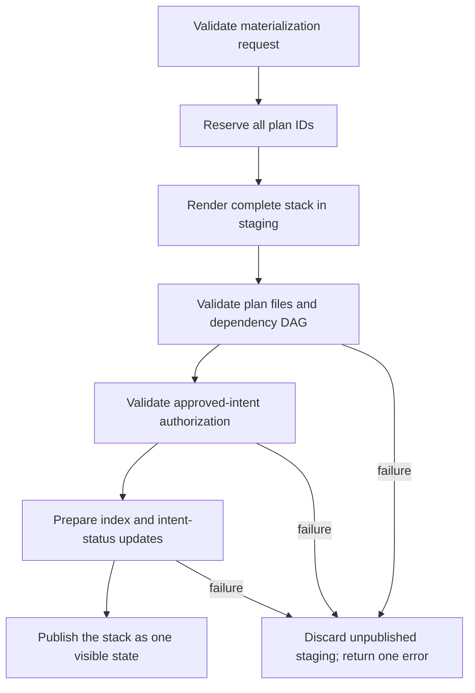

# Atomic plan-stack materialization

## Purpose

Replace separate ID allocation, file writing, index mutation, authorization, and
validation calls with one deterministic operation over the complete ratified plan
stack.

The operation does not perform planning judgment. It receives structured,
coordinator-ratified input and mechanically creates canonical plan artifacts.

## Materialization request

The request contains:

- approved intent identity and frozen contract identity;
- final tier and its evidence;
- ordered plan fragments and their stable keys;
- resolved logical dependencies between fragments;
- coordinator decisions and question dispositions;
- the trace manifests that ground each fragment;
- evidence anchors and investigation leads as advisory plan grounding, never as
  inferred path allowlists;
- a unique invocation identity for safe retry or recovery.

The operation rejects an incomplete request before allocating or publishing any
plan.

## Batch allocation

All plan IDs are allocated together from one snapshot of active and archived plan
identifiers. Allocation follows dependency order with a deterministic tie-breaker,
then reserves the complete range for this invocation.

This prevents the failure mode where several calls calculate the same next ID
before any corresponding plan directory exists. A retry with the same invocation
identity returns the same allocation instead of consuming new IDs or creating
duplicates.

## Staging and publication

Plan directories, plan files, index changes, and the feasible human-status update
are first rendered into unpublished staging. Structural validation runs against
the staged tree with the same paths and dependency relationships it will have
after publication.

Only a fully valid and authorized stack becomes canonical. The implementation may
use atomic renames, a short publication lock, a journal, or an equivalent
host-neutral mechanism; the derived plan chooses the mechanism after tracing the
runtime. The externally visible guarantee is all-or-nothing consistency.

## Validation contract

One invocation validates:

- unique and correctly formed plan IDs;
- required readable and canonical files for every plan;
- exactly one repository per plan and per task;
- repository-level execution boundaries plus advisory grounding anchors, without
  treating those anchors as an exhaustive worker write scope;
- task dependency validity;
- inter-plan dependency validity and acyclicity;
- coverage of the approved intent criteria;
- current intent authorization and unchanged frozen criteria;
- active-index rows matching the staged plans;
- final human-facing intent status matching feasible plan creation.

A validation error identifies the failed stage, plan/fragment key, stable error
code, and corrective input. The coordinator does not guess alternate command
signatures or repeat variants until one happens to exit successfully.

## Retry and recovery

Before publication, retries are side-effect free apart from discardable staging.
After publication, a retry with the same invocation identity reports the existing
successful result. A different request for the same approved intent detects the
existing stack and requires an explicit lifecycle reason rather than overwriting
it.

If the host stops between staging and publication, recovery inspects the journal
or staged marker and either finishes the already-validated publication or removes
the unpublished candidate. It never infers success from a partially written index.

## Timing evidence

The approval pipeline records monotonic elapsed durations for:

- contract approval and freeze;
- tracer dispatch;
- each repository trace, including `cold`, `exact`, `delta`, or `fallback` mode;
- feasibility and question disposition;
- coordinator ratification;
- batch allocation and rendering;
- structural/dependency validation;
- authorization and publication;
- total approval-to-validated-plans time.

Timing evidence also records outcome, repository count, tier, cache mode, plan
count, and stable error/fallback codes. It excludes source content, secrets,
provider payloads, and hidden model reasoning.

The final human response remains concise. It reports the total and whether the
warm or cold target was met; detailed timing stays available for diagnostics.

## Benchmark scenarios

Performance verification uses repeatable scenarios that measure the whole interval,
not isolated shell speed:

1. one-repository Standard approval with an exact warm map;
2. two-repository Critical approval with exact warm maps;
3. two-repository approval with bounded relevant drift;
4. cold two-repository approval;
5. cache incompatibility that safely falls back to cold tracing;
6. multiple dependent plans requiring unique batch allocation;
7. invalid plan-shaped input that publishes nothing and returns one diagnostic.

Warm benchmarks target approximately 90 seconds and a typical ceiling of two
minutes. Cold benchmarks target three to four minutes under normal host
conditions. Benchmarks retain trace and plan-quality assertions so a faster but
less grounded result cannot pass.

## Required outcomes

- A feasible approval exposes either the complete validated plan stack or none of
  it.
- Multi-plan allocation cannot return duplicate IDs.
- Materialization cannot turn tracer evidence anchors into a hard path allowlist.
- A command-contract mistake cannot trigger an unbounded validation retry loop.
- Repeating the same successful invocation is idempotent.
- Phase timing makes regressions attributable without exposing sensitive content.
