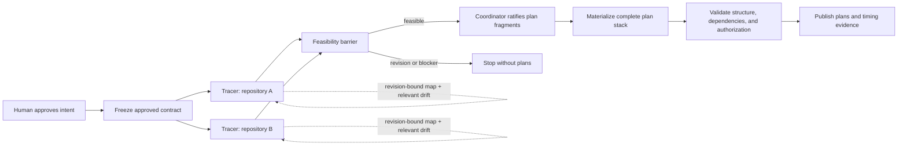

# Fast approval-to-plan pipeline

## Capability

An explicit intent approval completes the whole pre-execution workflow in one
turn: freeze the intent, trace every repository in parallel, judge feasibility,
derive every plan, validate the plan stack, and report the result. The normal
warm path should center on roughly 90 seconds and stay within two minutes for
typical work. A cold path that must rebuild grounding should normally complete
within three to four minutes.

The speedup must come from eliminating repeated discovery, interpretation, and
command loops. It must not come from skipping the tracer, weakening feasibility,
lowering assurance, or moving part of the workflow behind another human action.

## Problem

The observed two-repository Critical approval took 7 minutes 58 seconds:

- about 56 seconds loaded workflow material and recorded approval;
- about 3 minutes 13 seconds followed the slower of two parallel repository
  tracers;
- about 3 minutes 49 seconds interpreted the trace results, created plans, and
  recovered from repeated allocation and validation command mistakes.

The shell operations themselves were mostly short. The delay was dominated by
repeated model/tool turns, full repository rediscovery, a second interpretation
pass after tracing, and trial-and-error plan finalization.

## Fixed decisions

1. **Approval remains the only upstream human action.** A feasible approval does
   not return until all derived plans exist and validate. There is no separate
   trace, derive, or plan-approval command for the human.
2. **The tracer remains independent and repository-scoped.** Standard and
   Critical intents still spawn one read-only tracer child per repository in
   parallel. A cache is evidence for that tracer, never a substitute actor.
3. **Grounding reuse is revision-bound.** Reusable repository knowledge is tied
   to repository identity and code revision. Relevant drift is read before reuse;
   uncertain or invalid evidence falls back to a cold trace.
4. **Trace output becomes plan-shaped without becoming a path fence.** A tracer
   reports grounding and feasibility evidence plus a structured plan fragment.
   Its paths, symbols, and call sites are advisory evidence anchors and
   investigation leads, not an exhaustive worker write allowlist.
5. **The worker owns the exact implementation surface.** The worker reads its
   assigned repository first-hand and may modify additional necessary paths in
   that isolated worktree when they remain within the approved intent. Every
   expansion is recorded for independent verification. This intentionally
   replaces the current interpretation that tracer-derived plan paths are
   authoritative on where the worker may write: the approved intent and task
   outcomes remain authoritative on **what**, while the assigned repository and
   explicit protected constraints are authoritative on **where**.
6. **The coordinator retains judgment.** It resolves feasibility, question
   dispositions, tier changes, and plan boundaries. The tracer proposes; it does
   not write or approve plans.
7. **Plan-stack publication is one mechanical operation.** IDs are allocated as
   a batch and the complete stack is staged, validated, authorized, indexed, and
   exposed together. A failure leaves no partially finalized stack.
8. **Latency is observable, not a reason to skip correctness.** Every approval
   records phase durations and cache mode. A missed time target is visible as a
   performance failure; it never converts stale or incomplete evidence into an
   acceptable plan.

## Whole-system shape

All repository tracers begin together. The coordinator may consume completed
results while slower tracers are still running, but it does not publish any plan
before the feasibility barrier has all required findings.

## Performance envelope

The measured interval begins when the explicit approval request starts and ends
when every feasible derived plan has been published and validated.

| Path | Definition | Target |
| --- | --- | --- |
| Warm normal | Reusable grounding exists and relevant drift is small or absent | Approximately 90 seconds; typical ceiling 2 minutes |
| Warm with drift | Reusable grounding exists but relevant areas require bounded rereading | 2–3 minutes |
| Cold | No usable grounding exists, so repositories receive a full trace | 3–4 minutes under normal conditions |
| Exceptional | Very large, cross-cutting, blocked, or degraded host work | No false guarantee; report the cause and phase timing |

Targets apply to representative benchmark scenarios, not to every possible
repository size or host condition. A timeout does not discard correct work or
cause blind retries. It marks the slow phase and allows optimization against
evidence.

## Integrity boundaries

- The approved contract remains the decision authority.
- Current repository state remains the grounding authority.
- Cached maps are derived and disposable; a cache hit does not establish
  freshness by itself.
- The trace manifest remains the durable evidence passed into planning.
- The coordinator owns feasibility and plan-boundary judgment.
- Trace anchors describe why a plan is grounded; they do not cap the worker's
  repository-local implementation discovery.
- The approved intent and repository boundary govern what the worker may change.
  The verifier evaluates every changed path, including worker-discovered paths,
  against that intent.
- Repository guidance remains authoritative on how work is performed and may
  declare protected or generated areas. It cannot turn advisory tracer anchors
  back into an inferred allowlist.
- The runtime remains model-blind and performs only deterministic allocation,
  rendering, validation, authorization, indexing, and state publication.
- Plan creation still does not start execution, delivery, completion, or
  publication outside the workspace.

## Failure behavior

- If cache identity or freshness cannot be proven, run the cold trace.
- If any required tracer is unavailable or blocked, publish no plans and preserve
  the existing host-blocked behavior.
- If tracing surfaces an unresolved intent-level question, publish no plans and
  return to Gate 1 only when the approved decision changes.
- If a worker discovers another necessary path inside the assigned repository,
  it continues and records the path, reason, and criterion served. This is normal
  implementation discovery, not a plan failure.
- If a worker needs another repository or discovers that the approved behavior,
  authority, or lifecycle must change, it stops and returns the finding to the
  coordinator. A new human decision is required only when the intent itself must
  change.
- If plan materialization fails, expose one structured failure with its stage and
  keep the previously visible plan/index state unchanged.
- If a process stops during staging, the next invocation can discard or resume
  the unpublished staging record without guessing which plans became canonical.

## Detailed concerns

- [Incremental grounding](incremental-grounding.md) defines what may be reused,
  how drift is bounded, and when a cold trace is mandatory.
- [Plan-shaped trace](plan-shaped-trace.md) defines the extra structured output
  that eliminates most coordinator reinterpretation.
- [Atomic materialization](atomic-materialization.md) defines batch allocation,
  all-or-nothing publication, validation, and phase timing.
