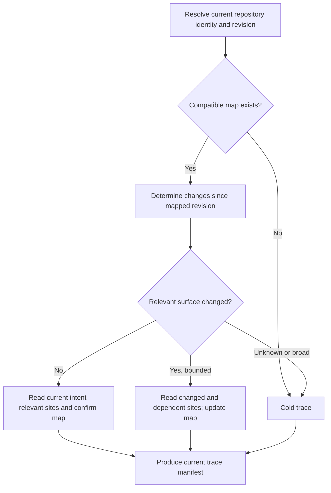

# Incremental grounding

## Purpose

Reduce repository tracing time without weakening the rule that each repository
is inspected by its own independent read-only tracer after intent approval.

The optimization is a reusable structural repository map. It helps the tracer
locate current evidence quickly; it never decides feasibility and never becomes
authoritative merely because it exists.

## Repository-map identity

A reusable map is content-addressed by at least:

- workspace and registered repository identity;
- canonical repository location or binding identity;
- base revision;
- map/schema version;
- the discovery rules used to build it.

The cache is local, gitignored, derived, and safe to delete. Its exact host-local
storage path is an implementation decision for the derived plan, but it must not
be committed as Product Knowledge or treated as a lifecycle record.

## Map contents

The reusable portion should contain structural facts that are expensive to
rediscover but cheap to invalidate:

- tracked paths and language/build boundaries;
- repository guidance locations;
- symbol, route, command, schema, and test inventories where available;
- imports, dependencies, and likely integration edges;
- commands that identify or verify those surfaces;
- the revision and timestamps used to build the map.

It must not store credentials, secret values, provider payloads, ignored files,
or unrestricted copies of source content. It is an index into the repository,
not a second repository.

## Warm trace

Even on an exact-revision hit, the tracer reads the current sites implicated by
the approved intent. The map selects those sites; it does not replace the
first-hand read.

When the repository has moved from the mapped revision, the tracer examines the
diff and the map's dependency edges. It rereads changed files plus relevant
dependents. If it cannot bound the affected surface confidently, it abandons the
warm path and performs a full trace.

## Cold trace and cache write

A cold trace performs the existing tier-proportionate repository survey. After
it has produced a valid trace manifest, it may publish a new repository map for
the observed revision. Cache publication is atomic: an incomplete map is never
selectable by a later tracer.

The cold path is not failure. It is the correctness-preserving fallback for a
first run, incompatible schema, rewritten history, missing VCS evidence, broad
drift, or any freshness uncertainty.

## Freshness outcomes

Every trace records one of these modes:

- `cold` — no reusable map supported the trace;
- `exact` — map revision equals the current revision;
- `delta` — bounded drift was read and incorporated;
- `fallback` — reuse was attempted but uncertainty required a full trace.

It also records the base revision, current revision, paths reread, and the reason
for fallback when applicable. These are evidence for performance diagnosis and
future bounded freshness checks, not human approval tokens.

## Concurrency and isolation

Parallel tracers may read the same cache but do not mutate one shared artifact in
place. Each produces a complete candidate map and publishes it by identity after
successful validation. Concurrent equivalent publications may converge on the
same content; conflicting or incomplete candidates remain unselected.

One session must not edit another session's trace or runtime record. Shared cache
entries are immutable by key, while intent-specific manifests remain owned by
their approval workflow.

## Required outcomes

- A cache hit never hides relevant code drift.
- A missing or invalid cache only costs time; it never blocks a trace that can run
  cold.
- Warm tracing retains the same manifest fields and assurance depth as cold
  tracing.
- A tracer can state exactly which cached revision and current paths grounded its
  result.
- Deleting the cache changes performance, not correctness or lifecycle state.
