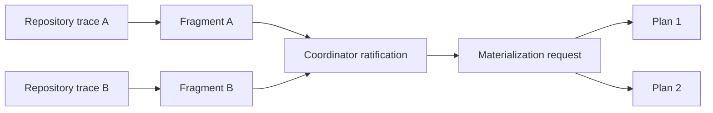

# Plan-shaped trace

## Purpose

Remove the slow second interpretation pass between repository tracing and plan
creation. Each tracer should report grounded evidence in a structured form that
the coordinator can ratify and a deterministic materializer can consume.

The tracer still writes only its trace manifest. It does not allocate a plan ID,
publish plan files, decide final plan boundaries, or authorize execution.

## Existing evidence remains

The manifest continues to carry:

- grounded file, symbol, interface, command, and call-site anchors;
- task partition evidence;
- concrete risks;
- runnable done checks mapped to outcome criteria;
- tier signals;
- feasibility and out-of-scope reach;
- question dispositions;
- completeness proofs where the intent requires every matching site.

Plan-shaped output supplements these fields rather than replacing them.

An anchor proves that the tracer inspected the current repository and explains
why a task is plausible. It is not a promise that the tracer found every file the
implementation will touch.

## Plan fragment

Each repository manifest proposes one or more fragments with stable local keys.
A fragment contains enough normalized data to become part of one plan:

- a concise title and objective;
- the repository identity;
- tasks with local keys, changes, and task dependencies;
- typed evidence anchors with their relevance and confidence;
- investigation leads the worker should confirm during implementation;
- mappings from tasks to intent acceptance criteria;
- verification commands and expected passing outcomes;
- assumptions and risks grounded by the trace;
- Product Knowledge references already selected for this intent, if any;
- dependency hints that reference another repository or fragment key rather than
  a plan ID that does not exist yet;
- an explanation of whether the repository supports one execution/verification
  boundary or requires multiple independent fragments.

The fragment must not contain a final plan ID, approval claim, execution state,
delivery target, exhaustive path allowlist, or invented answer to an intent-level
question.

## Fragment shape

```yaml
schema_version: 2
intent: <intent-id>
repository: <repository-id>
observed_revision: <revision>
grounding_mode: exact # exact | delta | cold | fallback

feasibility:
  outcome: feasible # feasible | intent-revision | blocked
  rationale: []
  intent_questions: []

fragments:
  - key: <stable-local-key>
    title: <short title>
    objective: <repository-local outcome>
    criterion_coverage:
      - criterion: <intent-criterion-id>
        tasks: [<task-key>]
    tasks:
      - key: <task-key>
        outcome: <what this task establishes>
        depends_on: []
        anchors:
          - kind: file # file | symbol | interface | command | test
            locator: <current repository locator>
            relevance: <why this is an implementation anchor>
            confidence: high # high | medium | low
        investigation_leads:
          - <what the worker should confirm or follow>
    dependency_hints: []
    risks: []
    expected_checks:
      - criterion: <intent-criterion-id>
        outcome: <passing behavior>
```

Anchors may be absent for a genuinely greenfield area when the tracer instead
provides a repository-level integration point and explicit investigation leads.
Low-confidence anchors remain useful as leads but cannot be presented as proven
scope.

## Coordinator ratification

The coordinator consumes results as tracers finish, allowing interpretation of a
fast repository to overlap the remaining trace time. Publication still waits for
all required manifests.

At the feasibility barrier the coordinator:

1. confirms every repository finding is present and current;
2. classifies each question as intent revision, plan resolution, or already
   answered;
3. confirms or raises the consequence tier;
4. ratifies or adjusts fragment boundaries;
5. resolves cross-fragment dependency hints into an acyclic logical graph;
6. produces one materialization request for the entire plan stack.

If the coordinator adjusts a proposed fragment, it records the reason. It does
not reread the repository simply to restate evidence already present in a valid
manifest.

The resulting plan preserves anchors as grounding evidence. It does not convert
them into an execution allowlist. Repository identity, the approved intent,
explicit protected constraints, and the worker-adaptation protocol govern
execution.

## Relationship to plans



One repository still maps to each final plan. A tracer may propose multiple
fragments for one repository only when they have genuinely independent execution
or verification boundaries. The coordinator can combine such fragments into one
plan with tasks or preserve them as stacked plans according to the established
plan-boundary rules.

## Validation at the boundary

Before materialization, the structured request must establish:

- every intent criterion is covered by at least one task and verification outcome;
- every task refers to exactly one registered repository;
- task and fragment dependencies reference known local keys;
- dependency graphs are acyclic;
- no unresolved intent-level question remains;
- every required manifest is tied to the current repository evidence;
- the requested plan tier does not fall below the approved or traced tier.

These checks make malformed input fail once with an actionable reason instead of
inviting repeated variations of runtime commands.

## Worker adaptation protocol

The worker receives the plan fragment as a starting map and then reads the
assigned repository first-hand. It may change an additional path without a plan
rewrite when all of the following are true:

- the path is inside the assigned repository;
- the change is necessary to satisfy an approved intent criterion;
- it does not contradict an explicit constraint, non-goal, or protected boundary;
- it does not change product behavior, authority, or lifecycle semantics beyond
  the approved intent;
- the handoff records the locator, reason, and criterion served.

The worker stops and returns a structured expansion finding when another
repository is required or when the discovery changes the approved decision. The
coordinator may derive another plan from the same intent when the existing goal
and criteria already cover the newly discovered repository; it re-enters Gate 1
only when the intent itself must change.

The verifier inspects the complete candidate diff, not only tracer anchors. It
confirms that every worker-discovered path is necessary, intent-consistent, and
accounted for in the worker handoff.

## Contract consequence

The plan, worker brief, worker handoff, and verifier evidence must distinguish
three concepts that were previously easy to conflate:

- **evidence anchors** — advisory locators showing where tracing found relevant
  implementation evidence;
- **repository boundary** — the one assigned repository/worktree within which the
  worker may adapt;
- **protected constraints** — explicit human, safety, or repository rules that the
  worker may not cross.

Any existing plan-path field may be migrated to an advisory-anchor meaning or
replaced by a typed anchor field. It must not remain an implicit execution
allowlist. The worker handoff records additional discovered locators, and the
verifier evaluates the entire changed set against the intent and protected
constraints.

## Schema evolution

Existing manifests without plan fragments are not silently treated as plan-ready.
They receive a bounded freshness trace that emits the new shape, or they use an
explicit legacy fallback until the migration is complete. The plan fragment is
derived evidence and remains outside the frozen intent contract digest.

## Required outcomes

- The coordinator can derive the full plan stack without scanning repositories a
  second time.
- Trace quality and feasibility evidence remain independently inspectable.
- Tracer anchors guide the worker without limiting repository-local discovery.
- Every additional worker-discovered path is visible to the verifier.
- The tracer cannot publish, approve, or execute a plan.
- Cross-repository dependencies can be expressed before numerical plan IDs exist.
- A malformed or incomplete fragment fails before any plan becomes visible.
