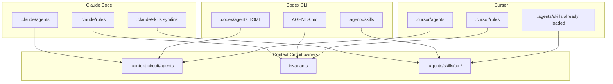

# Integrate Context Circuit through each host's native conventions

## Capability

Claude Code, Codex CLI, and Cursor Agent CLI still run the same Context Circuit
workflow. After this change, each host also finds that workflow through **the
folders and files it already knows** — agents, rules, skills, and instruction
files — as thin routes into the single-owned Context Circuit files
(`.context-circuit/agents`, invariants, skills at `.agents/skills/cc-*`).

A new workspace gets the same native-host integration as the maintained source.
Root instruction files stay. They are no longer the only front door.

## Problem

Context Circuit already ships shared `AGENTS.md`, `CLAUDE.md`, `CURSOR.md`, and
`.agents/skills/cc-*`. That is discovery through instruction files. Each host
also has a **project config tree** it is built to read:

- Claude Code reads `.claude/` (agents, rules, skills, committed settings).
- Codex CLI reads `.codex/` (project config and custom agent TOML) plus
  `.agents/skills`.
- Cursor reads `.cursor/` (rules, agents, skills, hooks) and, for
  compatibility, Claude and Codex agent/skill folders too.

Those trees were treated as private or optional. The result: Context Circuit
does not actually *use* what each host supports. Child roles, spawn rules, and
commit convention live only in our files, so a host that prefers its own agents
or rules folder never sees them as first-class native config.

## Principles

1. **Use the host's layout, not ours dressed as theirs.** Claude-shaped files
   under `.claude/`, Codex-shaped files under `.codex/`, Cursor-shaped files
   under `.cursor/`. Do not invent a folder a host does not document.
2. **Route, don't copy.** Host files point at the owner
   (`.context-circuit/agents`, the invariant that owns a rule, `.agents/skills`).
   They do not become a second policy.
3. **One workflow.** Native folders are how the host finds Context Circuit.
   They do not add a second router, lifecycle, or authorization policy.
4. **Project-scoped, committed.** Integration lives in the repo's host folders
   so a team shares it. Home-directory config, transcripts, credentials, and
   `*.local` overrides stay personal.
5. **Same surface in source and template.** A newly created workspace receives
   the same native routes. See [ship-and-seed.md](ship-and-seed.md).

## Fixed decisions

- Integrate through each host's **documented project surfaces**, listed in
  [hosts/](hosts/README.md). Codex has no native `rules/` tree — do not create
  `.codex/rules`.
- Worker, independent verifier, and planner are native child definitions in
  each host's **agents** folder, in that host's file format, routing to
  `.context-circuit/agents`.
- Standing rules (role-tiering spawn, commit convention, and similar) live in
  the host's **rules** surface when it has one (Claude `.claude/rules`, Cursor
  `.cursor/rules`). On Codex they live in `AGENTS.md` (and agent TOML where a
  child needs them), still routing to the invariant owner.
- Skills stay owned at `.agents/skills/cc-*`. A host that will not see that
  folder gets a **symlink or stub** in its own skills path, not a second copy.
- Root `AGENTS.md` / `CLAUDE.md` / `CURSOR.md` remain. Native folders add to
  them; they do not replace them.
- `host-blocked` still applies when a required native child cannot be created.
- Do not store credentials, transcripts, provider payloads, or authentication
  state in shipped host folders.
- Standard assurance: an independent check that each host's native tree routes
  to the owner, source and template match, and fail-closed still holds.

## Shape of the whole

| Topic | What it settles | Detail |
| --- | --- | --- |
| Per-host surfaces | What Claude, Codex, and Cursor actually read, and what we put there | [hosts/](hosts/README.md) |
| Routing | How a host file stays a pointer, not a second owner | [routing.md](routing.md) |
| Ship and seed | What is committed vs personal, and how template/source stay aligned | [ship-and-seed.md](ship-and-seed.md) |

Plans follow these topics: wire each host's native tree as routes; keep those
routes in source and template; prove they stay routes and fail-closed still
holds.

## Out of scope here

Embedding a host CLI or SDK, a fourth host, a second lifecycle, flattening
wrapper, storing session data, and delivering or publishing the change.
`sources/` stays passive. This folder is the fuller picture of *this* intent,
not a product-level system design.
