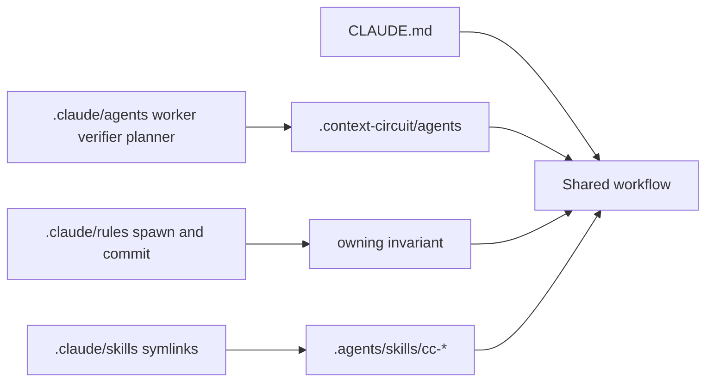

# Claude Code

Claude Code's project tree is `.claude/`, plus root `CLAUDE.md`. Personal and
runtime files live under `~/.claude/` and are out of this intent.

## What Claude actually reads (project)

Committed, team-shared:

| Surface | Path | Role |
| --- | --- | --- |
| Instructions | `CLAUDE.md` (root, or `.claude/CLAUDE.md`) | Loaded every session |
| Subagents | `.claude/agents/*.md` | Specialized children with their own prompt and tools |
| Rules | `.claude/rules/*.md` | Topic-scoped guidance; optional `paths:` globs |
| Skills | `.claude/skills/<name>/SKILL.md` | `/name` or auto-invoked workflows |
| Settings | `.claude/settings.json` | Permissions, hooks, env, model defaults — enforced, not just guidance |

Not shipped by this intent:

| Surface | Path | Why |
| --- | --- | --- |
| Local overrides | `.claude/settings.local.json` | Personal; gitignored |
| User config / transcripts | `~/.claude/` | Machine-local; includes credentials and session logs |
| MCP servers | `.mcp.json` | Separate concern; not host-role mapping |

Commands under `.claude/commands/` are the older single-file form of skills.
New workflows use `skills/`.

## What Context Circuit puts there

- **Agents.** Thin markdown subagent files for worker, independent verifier, and
  planner. Each file uses Claude's frontmatter and points the child at the
  matching role under `.context-circuit/agents`. They do not restate the role.
- **Rules.** Thin `.claude/rules/` files for standing constraints Claude should
  see as Claude rules — at least role-tiering on child spawn, and commit
  convention — each routing to the invariant that owns the rule.
- **Skills.** Do not copy `cc-*` into `.claude/skills/`. Keep the owner at
  `.agents/skills/cc-*` and use Claude's documented project skills path as
  **symlinks** (or equivalent stubs) so `/cc-execute` and friends resolve.
- **Settings.** Only if a committed team setting is required for the native
  child mapping to work. No credentials, no transcript paths, no
  `settings.local.json`.
- **Root `CLAUDE.md`.** Stays. It remains the Claude instruction adapter; the
  `.claude/` tree is the native config Claude also searches.

## Child mapping

Claude's native child is Task/subagent. The coordinator still launches worker,
verifier, and planner that way. The `.claude/agents/` files are how Claude
*discovers* those roles as Claude subagents; they do not replace the spawn
rule in `CLAUDE.md`. If Task/subagent cannot be created, the route stays
read-only and reports `host-blocked`.

## Edge cases

- `~/.claude/` application data (transcripts, history, credentials) must never
  be copied into the repo or the template.
- A source-only Claude file (for example a test-harness subagent) is not the
  product worker/verifier/planner set and must not be treated as shipped
  workspace integration.
- Root `CLAUDE.md` in this maintainer checkout keeps `@AGENTS.md` so it does
  not import the nested product adapter.
