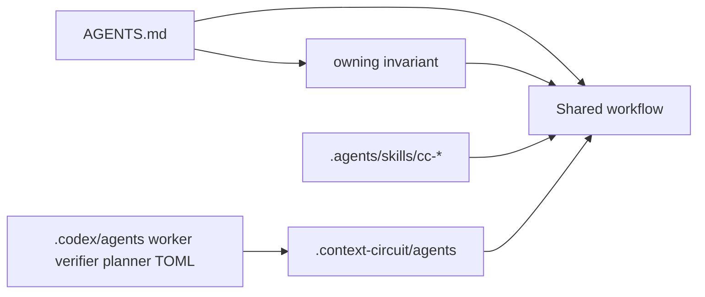

# Codex CLI

Codex's project instruction file is root `AGENTS.md`. Its project config tree
is `.codex/`. Skills are **not** owned under `.codex/`; Codex scans
`.agents/skills`. Personal files live under `~/.codex/` and `~/.agents/` and
are out of this intent.

## What Codex actually reads (project)

Committed, team-shared:

| Surface | Path | Role |
| --- | --- | --- |
| Instructions | `AGENTS.md` (root, then nested directories toward cwd) | Concatenated guidance; `AGENTS.override.md` replaces at the same directory |
| Custom agents | `.codex/agents/*.toml` | One TOML file per named agent; loaded as a config layer for `spawn_agent` |
| Agent/config knobs | `.codex/config.toml` | Project-scoped Codex config, including `[agents]` metadata; trusted projects only |
| Skills | `.agents/skills/<name>/SKILL.md` | Repo skills; Codex follows symlinks |

Not a Codex convention — **do not invent:**

| Surface | Why not |
| --- | --- |
| `.codex/rules/` | Codex has no documented project rules tree. Standing rules belong in `AGENTS.md` (and in agent TOML when a child needs them). |
| `.codex/skills/` as the owner | Official skill discovery is `.agents/skills`. Cursor may *also* look in `.codex/skills` for compatibility; that is Cursor's reader, not Codex's owner. |

Not shipped by this intent:

| Surface | Path | Why |
| --- | --- | --- |
| User Codex home | `~/.codex/` (`AGENTS.md`, `config.toml`, personal agents) | Machine-local |
| User skills | `~/.agents/skills` | Personal |
| Credential and provider keys | ignored in project `.codex/config.toml` by Codex itself | Must not appear in shipped files |

## What Context Circuit puts there

- **Agents.** Thin `.codex/agents/*.toml` definitions for worker, independent
  verifier, and planner. `name` is what `spawn_agent` matches. Instructions in
  the TOML route to `.context-circuit/agents/<role>.md`; they do not paste the
  role body.
- **Instructions.** Root `AGENTS.md` stays the Codex front door. Add only the
  pointers Codex needs as *instructions* (commit convention, spawn/role-tiering
  routing) when those have no other Codex-native home. Still one owner per rule.
- **Skills.** Already at `.agents/skills/cc-*`. Codex already scans that path.
  Do not duplicate skills under `.codex/`.
- **`.codex/config.toml`.** Only if Codex requires a project file to discover
  or cap the custom agents (for example `[agents]` entries). Never credentials,
  provider URLs, notify hooks, profiles, or telemetry.

## Child mapping

Codex's native child is `spawn_agent`. The coordinator still launches worker,
verifier, and planner that way, with `task_name` ending `_worker`, `_verifier`,
or `_planner` as the adapter already requires. The `.codex/agents/` TOML files
are how Codex *registers* those roles as Codex custom agents. If `spawn_agent`
cannot be created, the route stays read-only and reports `host-blocked`.

A separate top-level Codex thread is not a child and does not satisfy the
role.

## Edge cases

- Project `.codex/` layers load only for a **trusted** project. The integration
  is still shipped; an untrusted clone simply will not apply it until trusted.
- `AGENTS.override.md` is a local override, not a shipped product file.
- Do not add `CODEX.md`. Codex's instruction surface is `AGENTS.md`.
