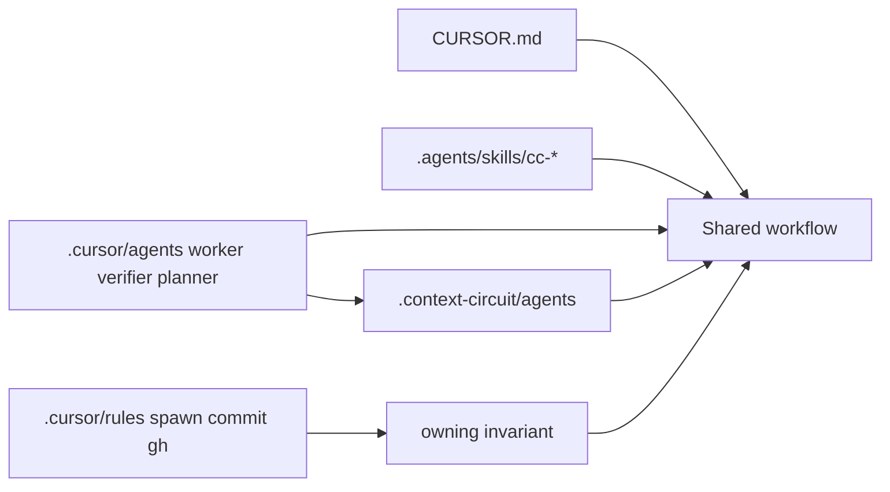

# Cursor Agent CLI

Cursor's project tree is `.cursor/`, plus root `CURSOR.md` and `AGENTS.md`.
Cursor also reads Claude and Codex agent/skill folders for compatibility.
Personal files live under `~/.cursor/` and are out of this intent.

## What Cursor actually reads (project)

Committed, team-shared:

| Surface | Path | Role |
| --- | --- | --- |
| Instructions | `CURSOR.md`, `AGENTS.md` | Adapter and shared guidance |
| Rules | `.cursor/rules/*.mdc` | Persistent instructions; always / glob / intelligent / manual |
| Subagents | `.cursor/agents/*.md` | Custom Task `subagent_type`s (YAML frontmatter + prompt) |
| Skills | `.cursor/skills/`, and also `.agents/skills/`, `.claude/skills/`, `.codex/skills/` | On-demand workflows |
| Hooks | `.cursor/hooks.json` and `.cursor/hooks/` | Programmatic agent-loop hooks |

Compatibility readers (Cursor will also load these if present):

| Surface | Path |
| --- | --- |
| Agents | `.claude/agents/`, `.codex/agents/` |
| Skills | `.claude/skills/`, `.codex/skills/` |

When names collide, `.cursor/` wins over `.claude/` or `.codex/`.

Not shipped by this intent:

| Surface | Path | Why |
| --- | --- | --- |
| User rules / agents / skills / hooks | `~/.cursor/` | Personal; Cursor CLI historically sees project-level agents more reliably than user-level |
| Editor settings | user `settings.json` | Host-local editor, not workspace workflow |

## What Context Circuit puts there

- **Agents.** Thin `.cursor/agents/*.md` files for worker, independent verifier,
  and planner, using Cursor's markdown + YAML frontmatter. Each routes to
  `.context-circuit/agents`. Because Cursor also reads `.claude/agents` and
  `.codex/agents`, **own the Cursor copies under `.cursor/agents/`** so the
  Cursor name wins, and keep Claude/Codex files in *their* formats rather than
  relying on Cursor's compatibility loader as the Cursor source of truth.
- **Rules.** Thin `.cursor/rules/*.mdc` files — the existing pattern (read root
  `CURSOR.md` for spawn; do not import the nested adapter in this source
  checkout). Add or keep rules that route role-tiering spawn, GitHub
  unsandboxed `gh`, commit convention, and similar to the owning invariant.
  Cursor does not *require* `.cursor/rules` to boot, but this intent **uses**
  that convention so Cursor sees those constraints as Cursor rules.
- **Skills.** Cursor already loads `.agents/skills/`. Do not duplicate `cc-*`
  under `.cursor/skills/` unless a Cursor-only skill cannot live in
  `.agents/skills`. Prefer the shared owner.
- **Hooks.** Only if a committed hook is required to preserve a Context Circuit
  safety rule that rules cannot enforce. Hooks must not become a second
  authorization policy and must not capture secrets.
- **Root `CURSOR.md`.** Stays. It still owns how this host sets `Task.model`.

## Child mapping

Cursor's native child is Task/subagent. The coordinator still launches worker,
verifier, and planner that way, with the model taken from
`role-tiering.local.yaml` `hosts.cursor-agent`. The `.cursor/agents/` files are
how Cursor *registers* those roles as Cursor subagents. If Task/subagent cannot
be created, the route stays read-only and reports `host-blocked`.

A separate top-level chat is not a child and does not satisfy the role.

## Edge cases

- Source-checkout `.cursor/rules` must keep pointing at workspace-root
  `CURSOR.md`, not `.context-circuit/wrapper/adapters/CURSOR.md`.
- User-level `~/.cursor/agents/` is not a substitute for project files: the
  product ships project-level agents so CLI and IDE both see them.
- Do not treat Cursor's ability to read `.claude/` and `.codex/` as a reason to
  skip `.cursor/` files. Each host still gets its own native tree.
