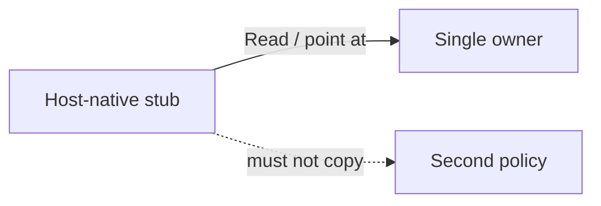

# Routing — host files stay pointers

How a file under `.claude/`, `.codex/`, or `.cursor/` is allowed to exist
without becoming a second owner of a Context Circuit rule.

## Mechanism

Every host-native file this intent adds has one job: **tell that host where the
owner is**, in a form the host will actually load.

The owner stays:

- Role packets: `.context-circuit/agents/coordinator.md`, `worker.md`,
  `verifier.md`, `planner.md`
- Skills: `.agents/skills/cc-*/SKILL.md`
- Standing rules: the invariant (and the adapter section) that already owns
  them — commit convention, spawn/role-tiering, `host-blocked`, invoke-not-read

A host file may name the role, name the path to Read, and state the host-only
fact the host requires (frontmatter, TOML `name`, Cursor `alwaysApply`, Claude
`paths:`). It may not restate the role body, invent a host-specific
authorization rule, or fork lifecycle language.

## Interfaces

- **Agents.** Claude and Cursor: markdown stubs. Codex: TOML stubs. Same three
  roles, three formats.
- **Rules.** Claude `.md` and Cursor `.mdc` stubs. Codex: no rules tree; the
  equivalent pointer lives in `AGENTS.md`.
- **Skills.** One tree at `.agents/skills/cc-*`. Claude gets symlinks under
  `.claude/skills/`. Codex and Cursor already scan `.agents/skills`.
- **Root adapters.** `AGENTS.md` / `CLAUDE.md` / `CURSOR.md` remain the shared
  instruction surface. Native folders do not replace them.

## Edge cases

- If a host cannot include or symlink and must contain *some* body, keep it to
  the minimum the host parser requires, plus an explicit "the owner is path X;
  do not elaborate here."
- Compatibility loaders (Cursor reading `.claude/agents`) must not be used as
  an excuse to skip the host's own folder, and must not create three copies of
  the role text.
- A source-checkout extra (maintainer-only Cursor rule, test-only Claude
  agent) is labeled as such and is not the template's product set.

## Out of this file

What is committed versus personal: [ship-and-seed.md](ship-and-seed.md).
Per-host paths: [hosts/](hosts/README.md).
