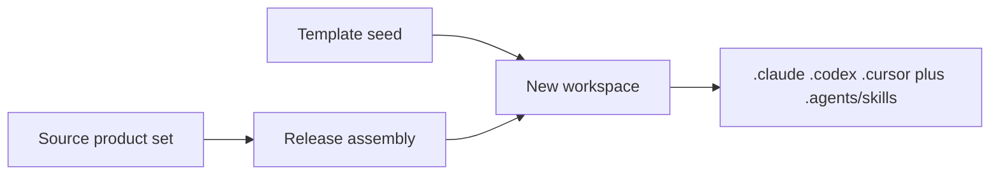

# Source, template, and what never ships

Where the native-host routes live so a new workspace matches the maintained
source, and what must stay off that surface.

## Mechanism

The integration is **project-scoped and committed**. Release assembly and the
blank template receive the same host-native stubs and skill links as the
product intends an instantiated workspace to have.

The maintainer source checkout may keep extra files that only this repo needs
(test-only Claude agents, source-only Cursor rules). Those extras are not the
template set. Product adapters still copy to workspace root; they still must
not overwrite this checkout's maintainer `AGENTS.md`.

## What is in the shipped set

- Claude: `.claude/agents/` role stubs, `.claude/rules/` stubs, `.claude/skills/`
  symlinks to `cc-*`, existing `CLAUDE.md`.
- Codex: `.codex/agents/` role TOML, only the `.codex/config.toml` keys the
  host requires for those agents, existing `AGENTS.md`, `.agents/skills/cc-*`.
- Cursor: `.cursor/agents/` role stubs, `.cursor/rules/` stubs, existing
  `CURSOR.md`. Skills via `.agents/skills` unless a Cursor-only skill exists.

Template seed does not grow a second copy of `.context-circuit/agents` or of
invariants. It grows the **host folders that point at them**, once those owners
are present in an instantiated workspace.

## What never ships

- `~/.claude/`, `~/.codex/`, `~/.cursor/`, `~/.agents/`
- Transcripts, prompt history, file snapshots, session logs
- `.claude/settings.local.json`, `AGENTS.override.md`, other personal overrides
- Credentials, tokens, provider payloads, authentication state
- Host permission mode or model ids as workspace authority

`.claude/settings.json` ships only if a committed team setting is required for
the mapping; it still stores no secrets.

## Edge cases

- Symlinks in the template must survive assembly and clone on the platforms
  Context Circuit supports; if a platform cannot ship a symlink, use the
  thinnest stub that host accepts, still pointing at the owner.
- Source-checkout `@AGENTS.md` on `CLAUDE.md` / `CURSOR.md` stays. Instantiated
  workspaces get the product adapter copies, as today.
- Proving alignment means: the three host trees in a new workspace expose the
  same roles and the same routes as the product set — not byte-identical
  maintainer extras.

## Out of this file

How a stub is allowed to exist: [routing.md](routing.md).
Per-host file maps: [hosts/](hosts/README.md).
