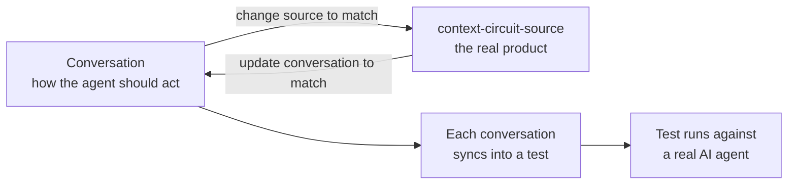

# Intention — i001

_Status: draft, waiting for your approval._

## Intention

What you want: **a library of conversations that is the one source of how an AI
agent should act inside a context-circuit workspace.**

The conversation and the real product stay in agreement, and work can start from
either side:

- **Conversation first:** write (or have an agent write) the conversation showing
  how the agent should act, then change context-circuit-source until the real
  agent matches it and its test passes.
- **Source first:** change context-circuit-source — a new feature or behavior —
  then update the conversation to match the new expectation.

Either way, each conversation syncs into a test that runs against a real AI agent.
So how the agent should act never lives only in your head or only in a test — it
lives in the conversations, and the test proves the real agent agrees.

## Expectations

- One written conversation for every kind of thing a person does with
  context-circuit, all in one place.
- A tool that turns each conversation into a test automatically — no test is
  hand-written.
- Those tests actually running against the real agent, and passing.
- A safety catch: if someone edits a test by hand, or updates a conversation but
  forgets to rebuild its test, the suite fails and says so.
- The 22 tests you already have, rebuilt from their conversations, with nothing
  about them quietly changed.

## The plans

Done in steps. The first is already finished.

1. **Write all the conversations** — _done._
   _After this:_ the full library exists and is committed.
2. **Build the tool that turns a conversation into a test.**
   _After this:_ every test is generated from its conversation, not hand-written.
3. **Teach the test harness the things these conversations need** (mainly: not
   caring about the exact generated id, plus a few new starting situations).
   _After this:_ the flagship whole-conversation tests can actually run.
4. **Rebuild the 22 existing tests from their conversations.**
   _After this:_ every existing test comes from a conversation, with its tuning
   untouched.
5. **Run the new conversations for real and add the safety catch.**
   _After this:_ the new tests pass against the real agent, and nothing can drift
   out of sync.

## How carefully this is checked

**`Standard`**

Explanations:
- **Explore:** you check it yourself as you work alongside the agent — no separate
  verification. Meant for trying things out.
- **Standard:** a second, independent agent verifies the finished work against your
  definition of done before it's called done.
- **Critical:** the strictest — independent verification plus a repair-and-recheck
  loop. For anything risky or impossible to undo (money, security, production, data
  you can't get back).

## Open questions

None.
