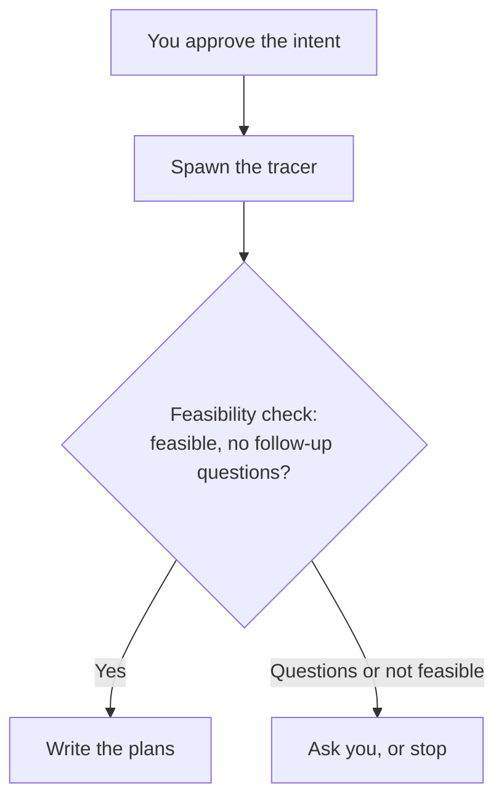

# Intention — i006

_Status: draft, waiting for your approval._

## Intention

What you want: **intent approval must not skip the tracer and the feasibility check.**

Today `contract.yaml` can move to approved before the tracer is spawned, so the feasibility check never runs and the order is wrong.

After you approve an intent, the next step is always: spawn the tracer, then run the feasibility check. Only then may plans be written. `contract.yaml` status must not skip those steps or treat them as done when they have not started.

## Expectations

- After approval, the tracer always runs next, one child per repository in scope.
- The feasibility check always runs after the tracer and before any plan is written.
- `contract.yaml` status cannot skip those steps or make them look finished when they have not started.
- You still approve the intent once; this does not add a second approval of the plans.

## The plans

1. **Put the steps in the right order.**
   _After this:_ approval always spawns the tracer and runs the feasibility check before any plan is written, and `contract.yaml` status cannot skip that.
2. **Prove the sequence.**
   _After this:_ checks fail if approval writes plans, or treats the intent as ready to plan, without the tracer and feasibility check.

## How carefully this is checked

**`Standard`**

This is the front door of every intent, so an independent verifier should confirm the order cannot be skipped.

Explanations:
- **Explore:** you check it yourself as you work alongside the agent — no separate
  verification. Meant for trying things out.
- **Standard:** a second, independent agent verifies the finished work against your
  definition of done before it's called done.
- **Critical:** the strictest — independent verification plus a repair-and-recheck
  loop. For anything risky or impossible to undo (money, security, production, data
  you can't get back).

## Open questions

**Should intent approval still set `contract.yaml` to approved immediately, with the tracer required as the next step? Or should `contract.yaml` stay draft until the tracer and feasibility check have finished and found the intent feasible?**
