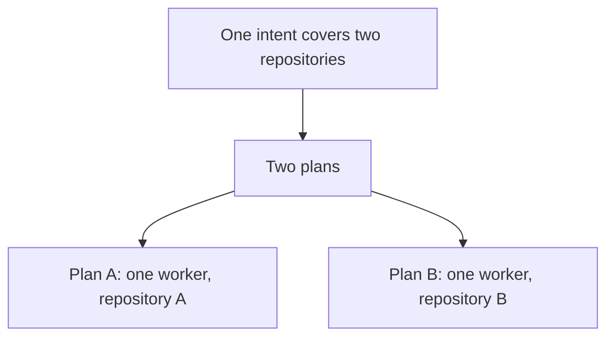

# Intention — i009

_Status: draft, waiting for your approval._

## Intention

What you want: **one plan is work in one repository, done by one worker who only works in that repository.**

One intent can still cover two repositories. That intent must become two plans — one per repository — each with its own worker. It must not become one plan that expects one worker to change both.

Today a large intent whose scope is two repositories can collapse into one plan. That is the defect.

## Expectations

- Every plan names exactly one repository.
- The worker for that plan changes only that repository.
- An intent whose scope covers two repositories produces at least two plans, one for each.
- You still approve the intent once; the split is not a second approval.
- Combining finished plans at delivery stays a later, separate step.

## The plans

1. **Make the one-repository rule the rule.**
   _After this:_ a plan cannot cover two repositories, and a worker cannot be asked to change two.
2. **Split a two-repository intent into two plans.**
   _After this:_ the tracer for a two-repository intent produces one plan per repository, with plan dependencies when one depends on the other.
3. **Prove the split.**
   _After this:_ checks fail if one plan or one worker is asked to change two repositories.

## How carefully this is checked

**`Standard`**

This changes how work is sliced across repositories, so an independent verifier should confirm a two-repository intent cannot collapse into one worker.

Explanations:
- **Explore:** you check it yourself as you work alongside the agent — no separate
  verification. Meant for trying things out.
- **Standard:** a second, independent agent verifies the finished work against your
  definition of done before it's called done.
- **Critical:** the strictest — independent verification plus a repair-and-recheck
  loop. For anything risky or impossible to undo (money, security, production, data
  you can't get back).

## Open questions

No known unresolved human decisions at draft time.
