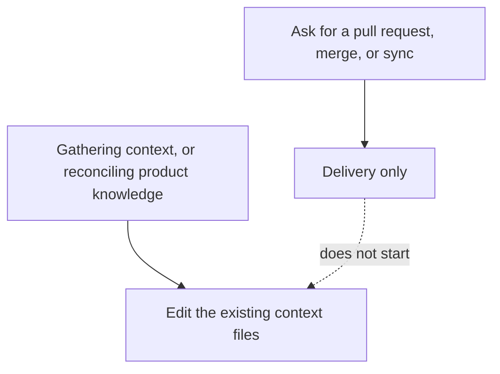

# Intention — i014

_Status: draft, waiting for your approval._

## Intention

What you want: **Product Knowledge is updated by changing the real `context/` files, not by writing a proposal to approve later.** Gathering context and reconciling product knowledge both do that in place. Delivery stays delivery — asking for a pull request, merge, or “sync the local repo” must not start a knowledge update.

Today those two knowledge paths stage a document under `context/proposals/` and wait for a separate “accept the context update” decision. Completion is also designed to start reconciliation after delivery (even though that auto-run is currently not firing when you ask for an MR or after “MR merged, sync local repo”). That sidecar and that auto-run both go away.

## Expectations

- Gathering context edits the real context files. It does not create a proposal document.
- Reconciling product knowledge does the same: in-place edits, no proposal, no extra accept step.
- Asking for a pull request, merge, or “MR merged, sync local repo” does not start reconciliation.
- Intent approval and delivery stay the two human gates they already are. Knowledge updates are not a third gate.

## The plans

1. **Write Product Knowledge in place.**
   _After this:_ gathering context and reconciling product knowledge change `context/` files directly; `context/proposals/` is no longer a staging path, and there is no separate “accept the context update” step.
2. **Keep delivery from starting reconcile.**
   _After this:_ a delivery request records and performs delivery only; it does not start a knowledge update, including via inferred completion.
3. **Prove the old path is gone.**
   _After this:_ checks fail if a proposal is staged, if a knowledge update waits for a separate accept, or if delivery starts reconciliation.

## How carefully this is checked

**`Standard`**

This changes how accepted knowledge is written and whether a lifecycle step starts it, so an independent verifier should confirm the old proposal path and the delivery auto-reconcile are gone.

Explanations:
- **Explore:** you check it yourself as you work alongside the agent — no separate
  verification. Meant for trying things out.
- **Standard:** a second, independent agent verifies the finished work against your
  definition of done before it's called done.
- **Critical:** the strictest — independent verification plus a repair-and-recheck
  loop. For anything risky or impossible to undo (money, security, production, data
  you can't get back).

## Open questions

**After a change is delivered, should the next plan still wait until Product Knowledge has been updated?**
Today that wait (“reconciliation debt”) exists so reconcile cannot be skipped. You asked that delivery itself must not start reconcile. If the wait stays, the next plan would still force a knowledge update before it can start. If the wait goes, the next plan can proceed and knowledge is updated whenever gathering or an explicit reconcile happens.

**There is one pending proposal (`0034`, conversation-spec-library). What should happen to it when proposals go away?**
Apply it as a real context page in this work, leave it for a later knowledge update, or drop it.
