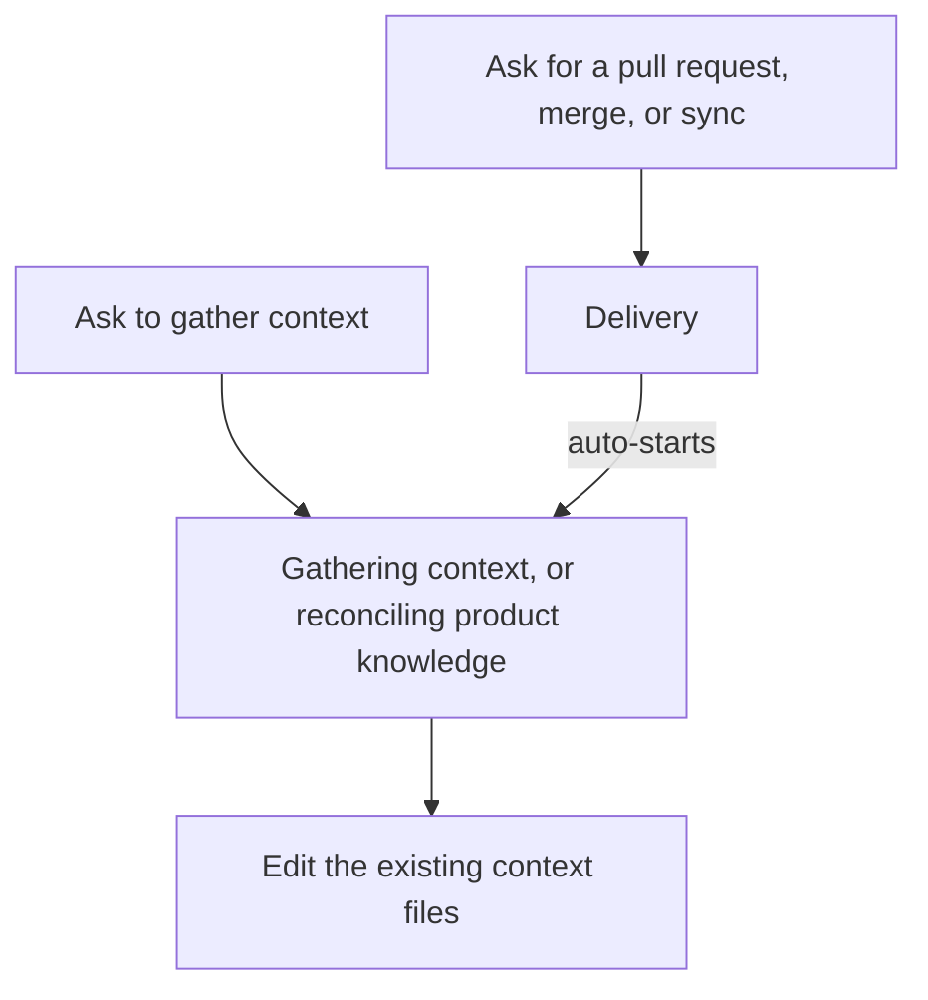

# Intention — i014

_Status: draft, waiting for your approval._

## Intention

What you want: **Product Knowledge is updated by changing the real `context/` files, not by writing a proposal to approve later.** Gathering context and reconciling product knowledge both do that in place. Asking for a pull request, merge, or “sync the local repo” is still delivery — and that delivery **starts** the same in-place knowledge update.

Today those knowledge paths stage a document under `context/proposals/` and wait for a separate “accept the context update” decision. That sidecar goes away. Delivery is supposed to start reconciliation today (it currently often does not fire); that auto-run stays, and it writes the live files instead of a proposal.

## Expectations

- Gathering context edits the real context files. It does not create a proposal document.
- Reconciling product knowledge does the same: in-place edits, no proposal, no extra accept step.
- Asking for a pull request, merge, or “MR merged, sync local repo” still delivers — and then starts that same in-place knowledge update.
- Intent approval and delivery stay the two human gates they already are. Knowledge updates are not a third gate.

## The plans

1. **Write Product Knowledge in place.**
   _After this:_ gathering context and reconciling product knowledge change `context/` files directly; `context/proposals/` is no longer a staging path, and there is no separate “accept the context update” step.
2. **Start the in-place knowledge update from delivery.**
   _After this:_ a delivery request records and performs delivery, then starts gathering context / reconciling product knowledge against the live files — including when completion is inferred after delivery.
3. **Prove the old path is gone.**
   _After this:_ checks fail if a proposal is staged, if a knowledge update waits for a separate accept, or if delivery finishes without starting the in-place knowledge update.

## How carefully this is checked

**`Standard`**

This changes how accepted knowledge is written and whether delivery starts it, so an independent verifier should confirm the proposal path is gone and the delivery auto-update writes live files.

Explanations:
- **Explore:** you check it yourself as you work alongside the agent — no separate
  verification. Meant for trying things out.
- **Standard:** a second, independent agent verifies the finished work against your
  definition of done before it's called done.
- **Critical:** the strictest — independent verification plus a repair-and-recheck
  loop. For anything risky or impossible to undo (money, security, production, data
  you can't get back).

## Open questions

**Should asking for a pull request, merge, or “sync the local repo” start a knowledge update?**
_Answer: Yes. Delivery starts gathering context / reconciling Product Knowledge, and those acts write the live context files. No proposal, no extra accept._

**If that auto-update has not landed, should the next plan still wait until Product Knowledge has been updated?**
Today that wait (“reconciliation debt”) exists so reconcile cannot be skipped. You now want delivery itself to start the update. If the wait stays, a missed auto-run still blocks the next plan. If the wait goes, the next plan can proceed even if the auto-update did not land.

**There is one pending proposal (`0034`, conversation-spec-library). What should happen to it when proposals go away?**
Apply it as a real context page in this work, leave it for a later knowledge update, or drop it.
