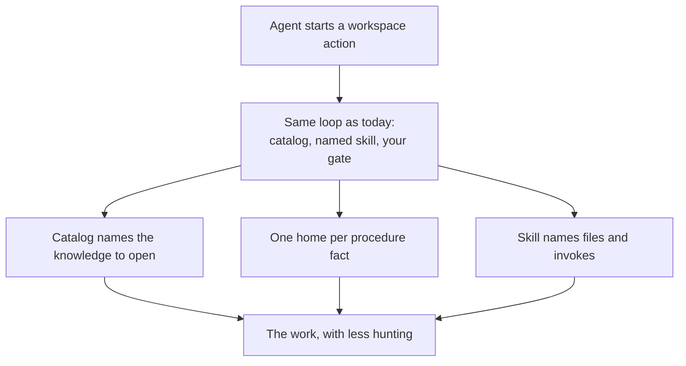

# Intention — i015

_Status: draft, waiting for your approval._

## Intention

What you want: **keep the current Context Circuit agent loop — it is already about right — and remove the waste around it**, so a workspace agent spends context on the work, not on hunting and rereading.

The gates, the skill-as-procedure path, and “read the catalog then only the matching knowledge” stay. What changes is the waste that does not change correctness:

- **The catalog actually selects.** An agent matches the request to named knowledge units from `context/INDEX.md`. It does not grep, list the knowledge tree, or fall through to another index to discover them.
- **Each procedure fact has one home.** Shared instructions, workflow, coordinator, and skills stop retelling the same lifecycle. They point at the owner.
- **A skill names files and invokes.** It does not restate the contract or treat the schema as a procedure. Invoke lines must still match the runtime so that cannot regress.

A fuller write-up by topic sits beside this page. You still approve once.

## Expectations

- Ordinary workspace work still follows today’s loop: catalog, skill, tracer after approval, independent check on Standard and Critical.
- An agent can pick the right knowledge from the catalog without searching the knowledge tree.
- The same lifecycle fact is not retold in shared instructions, workflow, coordinator, and every skill.
- Each skill names the next files and the runtime action; it does not restate a contract schema. An invoke line that no longer matches the runtime is not something the agent has to discover.
- Safety spine, human gates, and one-owner-per-rule are not dropped or copied into skills to save a read.
- Knowledge pages are not rewritten, whether a typical route opens them or not.
- This is what an instantiated Context Circuit workspace gets, against the nested home under `.context-circuit/`.

## The plans

1. **Make the catalog actually select.**
   _After this:_ the catalog carries per-unit summaries, topics, and aliases; a typical route opens the named units and does not grep, list the knowledge tree, or use another index to find them.
2. **Give each procedure fact one home.**
   _After this:_ shared instructions, workflow, coordinator, and skills point at the owner of a fact instead of restating it.
3. **Make skills name files and invokes.**
   _After this:_ a skill is a short procedure with the files to open and runtime actions that match the runtime; it does not restate a contract or treat the schema as a procedure.
4. **Prove it is an improvement, not a thinner wrong loop.**
   _After this:_ checks fail if the catalog still requires a knowledge-tree search, if a skill restates a contract or documents a wrong invoke, or if a gate or independent check was dropped.

## How carefully this is checked

**`Standard`**

This changes the instruction surface every workspace agent reads. The point is to keep today’s correct loop, so a second agent should confirm the waste is gone and the gates are not.

Explanations:
- **Explore:** you check it yourself as you work alongside the agent — no separate
  verification. Meant for trying things out.
- **Standard:** a second, independent agent verifies the finished work against your
  definition of done before it's called done.
- **Critical:** the strictest — independent verification plus a repair-and-recheck
  loop. For anything risky or impossible to undo (money, security, production, data
  you can't get back).

## Open questions

**Should Product Knowledge pages themselves be shortened, or is the win mainly cutting always-on instructions, naming files instead of grepping, and dropping extra hops?**
_Answer: Do not rewrite knowledge pages. The win is a catalog that selects, one home per procedure fact, and skills that name files and invokes. A page a typical route still has to open may be left as it is._

**Should this source checkout’s catalog be filled as part of this change?**
_Answer: No. Filling this project’s catalog may happen when knowledge is gathered here. The shipped win is the catalog shape in the template and the procedure that forbids a tree search._

**Does this change also move system files, or wait on that layout?**
_Answer: It assumes the nested home already in place (`wrapper/`, `agents/`, and `docs/` under `.context-circuit/`). It does not redo that move._
