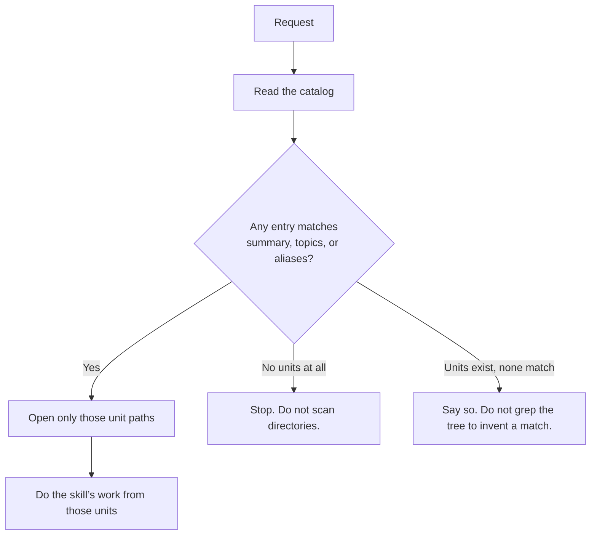

# Catalog that actually selects

Continues from [design.md](design.md). This is the grep win.

## What “select” means

An agent with a request (“shape this change”, “gather context about delivery”,
“what does this workspace know about pairing?”) looks at the catalog, matches
the request to **named units**, and opens **only those files**.

It does **not**:

- list `context/domains/` to see what exists
- grep `context/` for keywords
- open every domain page “just in case”
- open the catalog schema in order to learn how the catalog is supposed to look

A match is a catalog **entry**, not a directory. The entry already carries the
path.

## What the catalog must carry per unit

The retrieval schema already names the fields. This intent makes the file
agents actually read carry them, so the schema is not a second place the agent
must visit:

- stable id
- path of the unit
- one-line summary
- topics
- aliases (the words a human or agent might use instead of the title)
- status (accepted / proposed / needs-review / stale)
- optional: domains, repositories, decisions, constraints, freshness

The catalog remains a **catalog**. It does not paste page content. A one-line
summary plus topics and aliases is enough to decide “open this” vs “skip this.”

## Empty catalog (template seed)

A new workspace has no accepted units. That is a complete answer:

- the catalog says there are no units
- the agent stops
- it does not create a scan of empty `context/domains/` or `context/references/`
  to “make sure”

The blank template catalog still shows the **entry shape**, so the first
knowledge unit added has a slot to fill. The procedure for adding a unit
already belongs to context gathering: a new page without a catalog row is
incomplete. This intent does not invent a third knowledge workflow; it makes
the existing catalog the thing an agent can actually use.

## How a route uses it

Skills that today say “retrieve via INDEX, read only the selected units” keep
that sentence. They add the negative: **do not list or grep the knowledge tree
to discover units.** If the catalog cannot name it, it is not selected.

## What this is not

- Not a rewrite of domain pages. Selection gets better; page length stays.
- Not a second copy of Product Knowledge inside the catalog.
- Not a requirement to fill this source checkout’s catalog as a product
  feature. Filling *this* project’s catalog may happen when knowledge is
  gathered here; the **shipped** change is the catalog shape in the template
  and the procedure that forbids a tree search.

## Edge cases

- **Pending proposals** stay listed in the catalog (they already are in
  principle) so a later intent does not scan `context/proposals/` to find them.
- **Stale** units remain selectable for orientation and must be marked stale
  on the entry; a consequential plan still surfaces staleness as today.
- **Request-named `sources/` files** stay outside the catalog. They are read
  only when the human named them. The catalog does not index `sources/`.
- **Several matching units:** open the smallest set that covers the request.
  Do not treat “several matches” as “read the directory.”

## Interfaces

- Agent-facing catalog: `context/INDEX.md` (the file skills already name).
- Ownership of catalog *shape*: the existing retrieval schema. Agents do not
  read the schema to use the catalog.
- Writers of entries: context gathering / in-place knowledge updates (whatever
  the live knowledge workflow is at implementation time). This intent does not
  change that workflow except: a unit without an entry is not retrievable, so
  writers must write the entry.
