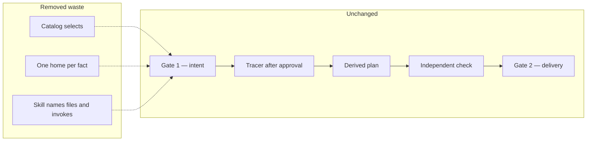

# Keep the workspace agent loop; remove discovery waste

## Capability

An instantiated Context Circuit workspace already has a correct agent loop.
After this change, that same loop costs less context and less time because the
agent **stops discovering** what the loop already named: which knowledge to
open, which file owns a procedure fact, and which runtime action to invoke.

The human still approves an intent (Gate 1) and still authorizes delivery
(Gate 2). The tracer still reads code only after approval. Standard and
Critical still have an independent verifier. Skills stay thin procedures, not
a second rulebook.

## Problem

The loop is about right. The waste is around it.

Today a typical workspace turn still:

- Treats the knowledge catalog as a **directory list**, then greps or lists
  the knowledge tree to find matching pages — even though the catalog’s job is
  to make that search unnecessary.
- Rereads the **same lifecycle** in shared instructions, workflow, coordinator,
  and the skill — four tellings of gates, tracer, and one-owner-per-rule.
- Opens a **schema** or **searches tests** because the skill restates the
  contract in prose and the documented invoke line does not match the runtime.

That is not a missing design. It is extra reads the current design already
forbids in principle (smallest route-selected context; catalog as retrieval
index; invoke the runtime, do not read it).

A fresh template workspace has almost no Product Knowledge. There the cost is
almost entirely always-on instructions plus the route skill, plus any search
those files provoke. As a workspace grows knowledge, a catalog that cannot
select becomes the dominant extra cost. Both are the same product.

## Principles

1. **Improvement, not downgrade.** Do not change what the agent is supposed to
   do. Remove only reads that do not change correctness.
2. **Name, don’t hunt.** If the next file is known, write the path. If the next
   runtime action is known, write the invoke line that actually works.
3. **One home per fact.** The owner holds the prose. Everyone else points.
   Pointing is not copying.
4. **The catalog is the index, not the book.** Entries are short (id, summary,
   topics, aliases). Page content stays on the page.
5. **Empty must work.** Zero knowledge units is a valid catalog. It is not a
   prompt to scan empty directories.
6. **Always-on stays a spine, not a novel.** Shared instructions stay. They
   get shorter only by dropping restated facts, never by dropping the spine.

## Fixed decisions

- Keep the current loop. Do not collapse phases to save steps.
- Do not gut always-on files to hit a line-count target.
- Do not rewrite Product Knowledge pages in this intent.
- Do not copy rules into skills so the agent “need not open the owner.”
- Ship in wrapper adapters, skills, and the template seed — the instantiated
  workspace, not a source-checkout-only convenience.
- Use Standard assurance: an independent check that the loop is still the
  loop, and that the three wastes are gone.

## Shape of the whole

Three product changes, then proof they did not thin the loop:

| Topic | What it settles | Detail |
| --- | --- | --- |
| Catalog | How an agent picks knowledge without a tree search | [catalog.md](catalog.md) |
| One home | Which file owns each procedure fact, and what a pointer looks like | [one-home.md](one-home.md) |
| Skills | What a skill still contains, and what it must stop containing | [skills.md](skills.md) |
| Proof | What “improvement not downgrade” looks like when checked | [proof.md](proof.md) |

Plans follow these topics: catalog, one home, skills, then proof.

## Out of scope here

Harness measurement features, runtime evidence redesign, new hosts, and
rewriting domain pages. `sources/` stays passive. The fuller picture of
*this* intent is this folder; it is not a product-level system design.
