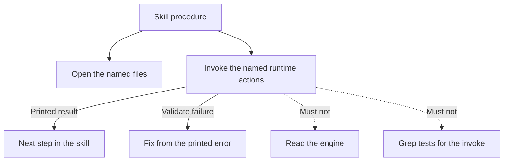

# Skills name files and invokes

Continues from [design.md](design.md). This is the extra-hop win.

## What a skill is

A product skill is a **read-as-procedure packet**. It is not an owner of
product rules. It tells the coordinator:

1. when this route applies
2. which files to open (templates, catalog, the owner of any fact this route
   needs)
3. which runtime actions to invoke, with the **actual** argument shape
4. what to write, and what not to write
5. how to report to the human (plain language; no engine dump)

It does not:

- restate a contract schema field-by-field
- retell Gate 1 / tracer / Gate 2 for a route that is not that
- document an invoke line that the runtime does not accept
- say “see the schema” as a substitute for “copy the template, then validate”

## Named files beat “read the schema”

If the human-facing file is a template, the skill names the template and the
example. If the machine file must validate, the skill says **validate** (the
runtime action), not “open the schema and transcribe the fields.”

The schema remains the owner of machine shape. The agent should not have to
read it to author a draft that `validate` will accept. A worked example plus
validate is the path. Failure output from validate is the correction loop —
not a grep of tests.

## Invoke lines must match the runtime

A skill that drives the runtime lists the actions this route uses, each with
the argument shape that **succeeds**.

If the documented line and the runtime disagree, the agent will search tests
or open the engine. Both are failures of this intent:

- searching tests is discovery waste
- reading the engine is already forbidden (invoke-not-read)

Fixing a wrong line in the skill is in scope. Teaching the agent to discover
the runtime is not.

## What stays long on purpose

A skill may stay as long as the **procedure** is. Intent authoring has several
phases (draft, optional detail, approval, handoff to tracer). That sequence
belongs in the intent skill. What does not belong is a pasted copy of the
intent contract, the tracer skill, and the plan skill.

Publish and run-stack are large because those routes are large. This intent
does not target them for a line-count cut. It targets **restatement and wrong
invokes** wherever they appear. If a large skill is large only because it
retells neighbors, that restatement goes; the route-specific procedure stays.

## Catalog sentence every retrieval skill needs

Any skill that today says “retrieve via the catalog, read only selected
units” also says the negative in [catalog.md](catalog.md): do not list or grep
the knowledge tree to discover units.

## What this is not

- Not merging skills.
- Not adding a router file.
- Not making skills the owner of invariants.
- Not shortening verify/archive by deleting their actual procedure — those
  are already short.

## Edge cases

- **Optional fuller write-up:** the intent skill still recommends or honors
  it and points at the system-design skill. It does not paste the three-tier
  rubric.
- **Compound “approve and build”:** still intent approval then the existing
  mechanical follow-on. This intent does not add or remove that compound; it
  just must not grow a second copy of execute inside intent.
- **Host-blocked:** the skill points at the shared-instructions / coordinator
  rule; it does not invent a local fallback.
