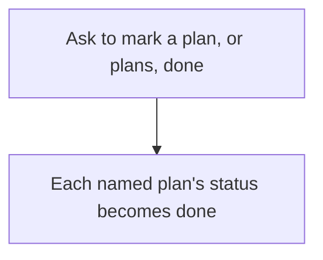

# Intention — i016

_Status: approved, look complete, feasible._

## Intention

What you want: **when you ask to mark a plan done, the agent changes that plan's status to done.** Same if you name several plans. There is no check.

No look at the work. No look at evidence. No refusal because the plan was never built, failed a check, or was not "ready". Asking is enough. The status flips.

## Expectations

- Asking to mark a plan done changes its status to done. Asking for several plans does that for each named plan.
- Nothing inspects work or evidence first, and nothing refuses the flip for unreadiness.
- A plan still becomes done only when you ask. Verification, candidate acceptance, and delivery do not mark it done.
- Knowledge update after mark-done, when the plan affected Product Knowledge, stays as it is.

## The plans

1. **Flip plan status on ask, with no check.** (`0002-mark-done-no-precheck`)
   _After this:_ asking to mark a plan or several plans done changes each named plan's status to done. There is no look and no unreadiness refusal.

## How carefully this is checked

**`Standard`**

This changes the completion path every workspace agent follows, including dropping the unreadiness refusal, so a second agent should confirm the status flips on ask with no check.

Explanations:
- **Explore:** you check it yourself as you work alongside the agent — no separate
  verification. Meant for trying things out.
- **Standard:** a second, independent agent verifies the finished work against your
  definition of done before it's called done.
- **Critical:** the strictest — independent verification plus a repair-and-recheck
  loop. For anything risky or impossible to undo (money, security, production, data
  you can't get back).

## Open questions

**If a plan was never built, failed its check, or has no evidence, should asking to mark it done still flip it to done?**
_Answer: Yes. No check. Asking to mark it done changes the plan status. The agent does not look, and nothing else refuses for unreadiness._
