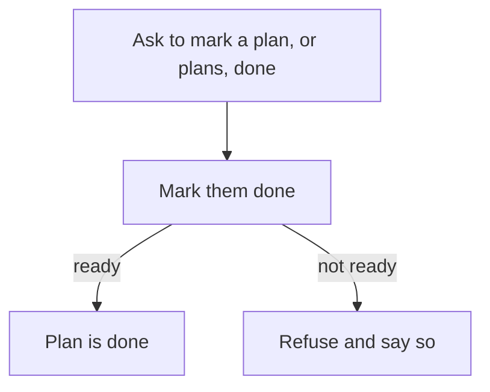

# Intention — i016

_Status: draft, waiting for your approval._

## Intention

What you want: **when you ask to mark a plan done, the agent marks it done.** Same if you name several plans. It does not first inspect whether the work and evidence exist.

That extra look is wasted agent work. Readiness stays a runtime check: if the plan is not ready to be done, mark-done refuses and that is reported plainly. There is no separate “I’ll check the work first” step.

## Expectations

- Asking to mark a plan done marks it done. Asking for several plans marks each of them done.
- The agent does not inspect work or evidence before that flip.
- If a plan is not ready to be done, mark-done refuses and that is reported plainly.
- A plan still becomes done only when you ask. Verification, candidate acceptance, and delivery do not mark it done.
- Knowledge update after mark-done, when the plan affected Product Knowledge, stays as it is.

## The plans

1. **Mark done without a pre-check.**
   _After this:_ asking to mark a plan or plans done marks them done; the agent does not first inspect whether work and evidence exist.
2. **Prove the pre-check is gone.**
   _After this:_ checks fail if mark-done still inspects work or evidence before flipping status, or if a refused mark-done is not reported plainly.

## How carefully this is checked

**`Standard`**

This changes the completion path every workspace agent follows, so an independent verifier should confirm the extra look is gone and that a not-ready plan still refuses.

Explanations:
- **Explore:** you check it yourself as you work alongside the agent — no separate
  verification. Meant for trying things out.
- **Standard:** a second, independent agent verifies the finished work against your
  definition of done before it's called done.
- **Critical:** the strictest — independent verification plus a repair-and-recheck
  loop. For anything risky or impossible to undo (money, security, production, data
  you can't get back).

## Open questions

_At draft time: no known unresolved human decisions._
