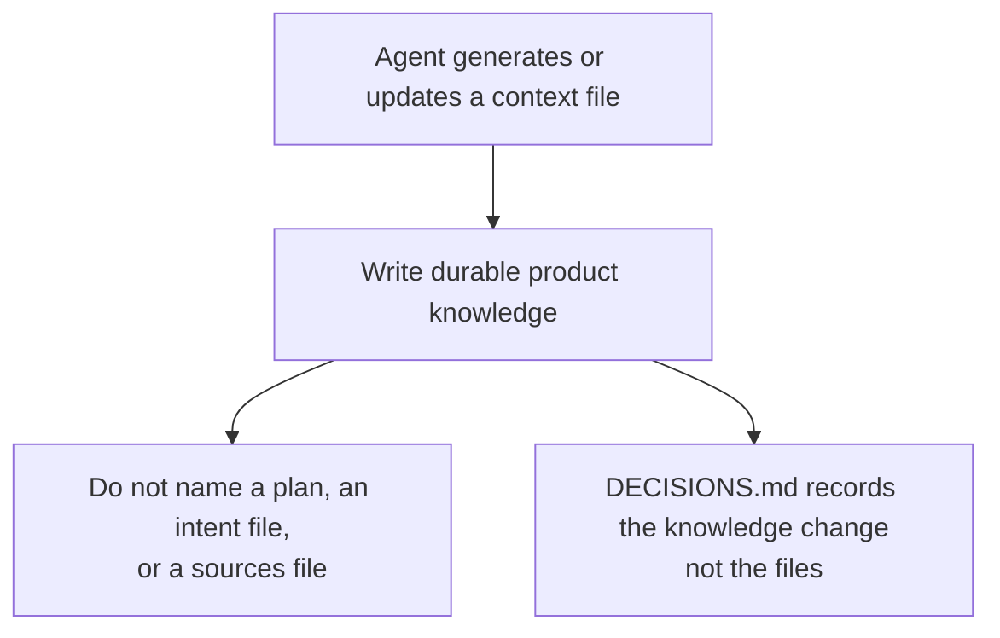

# Intention — i019

_Status: approved, look complete, feasible._

## Intention

What you want: **when an agent creates or updates Product Knowledge, those files hold only durable knowledge about the product.** They must not name a plan, an intent file, or a sources file. Those artifacts are meant to be archived or deleted someday; a context page that points at them goes stale.

`DECISIONS.md` is included. It records the knowledge change itself — what is now true about the product — not which files were touched and not the ephemeral artifact the change came from.

Talking about the product concepts “plan”, “intent”, and “sources” stays allowed. Naming a particular plan, intent file, or sources file does not.

## Expectations

- Generating or updating a context file writes durable product knowledge only.
- Existing live context is rewritten so it does not name a plan, an intent file, or a sources file.
- No live context file names a `sources/` path — including `context/sources.yaml` and provenance footnotes.
- `DECISIONS.md` records what was decided about the product, not file paths and not the plan, intent, or sources artifact behind the change.
- Architecture, terminology, and domain pages may still explain what a plan, an intent, or sources *are*.
- When knowledge is written (gathering context, or reconciling after mark-done) does not change.

## The plans

1. **Make context hold only durable product knowledge.** (`0005-durable-context-knowledge`)
   _After this:_ the writing rule, live context, and the blank seed never name a plan, an intent file, or a sources file; `DECISIONS.md` records the knowledge change, not files; checks prove it.

## How carefully this is checked

**`Standard`**

This changes how every workspace agent writes Product Knowledge, including `DECISIONS.md`, so a second agent should confirm the writing rule and the checks.

Explanations:
- **Explore:** you check it yourself as you work alongside the agent — no separate
  verification. Meant for trying things out.
- **Standard:** a second, independent agent verifies the finished work against your
  definition of done before it's called done.
- **Critical:** the strictest — independent verification plus a repair-and-recheck
  loop. For anything risky or impossible to undo (money, security, production, data
  you can't get back).

## Open questions

**Should existing live context pages that already name a plan, an intent file, or a sources file be rewritten now, or does this only change new writes from here on?**
_Answer: Rewrite live context now._

**Should `context/sources.yaml` (and provenance footnotes that say a sources file was or was not read) remain the one place that may name a `sources/` path, or should no live context file name one?**
_Answer: No live context file names a sources path._
