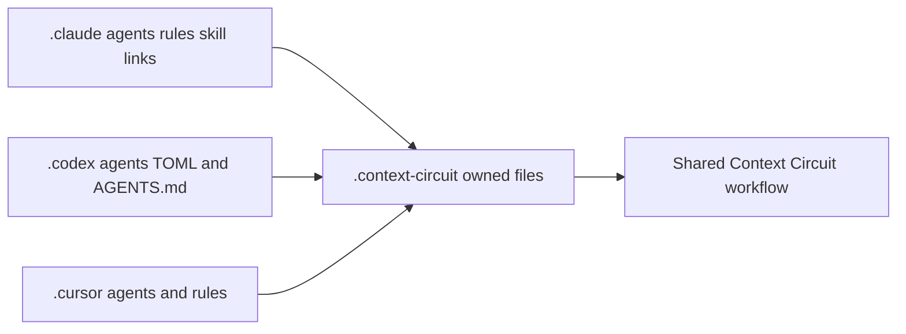

# Intention — i020-host-conventions-preserved

_Status: draft, waiting for your approval..

_Status: draft, waiting for your approval._

## Intention

What you want: **Context Circuit to use each host's own conventions** — Claude
Code, Codex CLI, and Cursor Agent CLI — and plug into them, instead of only
shipping root instruction files and treating `.claude/`, `.codex/`, and
`.cursor/` as private config to ignore.

Each host folder carries thin routes into what Context Circuit already owns.
Claude gets Claude-shaped agents, rules, and skill links. Codex gets Codex
agent TOML plus `AGENTS.md` (it has no rules tree). Cursor gets Cursor rules
and agents. Skills stay at `.agents/skills/cc-*`. The shared workflow stays
one workflow; the host folders are how that host finds it.

A fuller write-up by topic sits beside this page.

## Expectations

- Claude Code, Codex CLI, and Cursor Agent CLI each integrate through that host's native folders, using only conventions that host actually supports.
- Those folders contain routes into `.context-circuit/agents` and the invariant that owns each rule — not a second copy of the policy.
- Native worker, verifier, and planner children still map through each host's child-agent conventions (`Task` / `spawn_agent`).
- Missing required native child support remains read-only and reports `host-blocked`.
- The maintained source and blank template carry the same host-native integration, so a new workspace gets it too.
- Credentials, transcripts, provider payloads, and authentication state are not stored.

## The plans

1. **Wire each host's native folders as routes into Context Circuit.**
   _After this:_ `.claude/`, `.codex/`, and `.cursor/` (as each host supports) point at the owned agent files and rules instead of duplicating them.
2. **Keep those routes aligned in source and template.**
   _After this:_ release assembly and new workspaces receive the same native-host integration as the maintained source.
3. **Prove the routes stay routes, and fail-closed still holds.**
   _After this:_ host folders do not invent policy, and missing child support still reports `host-blocked`.

## How carefully this is checked

**`Standard`**

## Open questions

**Should `.claude/`, `.codex/`, and `.cursor/` stay host-local and unshipped, or become the native integration surface?**
_Answer: They become the native integration surface — thin routes into Context Circuit's owned files, using each host's own conventions. Source and template both carry them._
