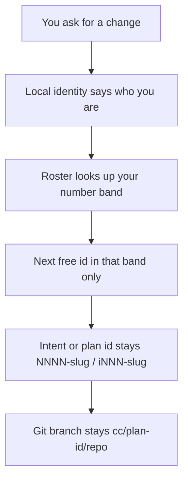

# Intention — i021-id-number-blocks

_Status: draft, waiting for your approval._

## Intention

What you want: **teams sharing one workspace can create intents and plans in
parallel without waiting for someone else to push**, while keeping short
sequential ids you can say out loud — and without typing a block number into
the chat.

Each person gets a fixed number range. Alice’s intents and plans stay in her
band; Bobby’s stay in his. The machine knows who you are from a one-time local
setting — the same idea as connecting repositories — not from the prompt.

Archived ids are never reused. A block is how numbers are chosen, not who
“owns” the work later. Handing a plan to someone else does not rename it.

## Expectations

- Two people can create intents and plans without waiting on each other’s push.
- Ids stay the familiar short form; you can still say ranges inside one person’s band.
- Nobody types a block number in the prompt; identity is set once on the machine.
- The person is not baked into the id or the execution branch name.
- Archived numbers are never given out again.
- Existing intents and plans keep their current ids; only new allocation uses bands.
- A stack of plans from one intent still gets consecutive ids inside that person’s band.

## The plans

1. **Record who may use which number band, and who this machine is.**
   _After this:_ the shared workspace has a committed member roster, and each
   machine has a gitignored local identity that points at one member — set once,
   never per prompt.
2. **Allocate intents and plans only inside the current member’s band.**
   _After this:_ next id is the next free number in that band (including archived),
   a multi-plan stack reserves consecutive ids in-band, and allocation fails
   clearly when the band is full.
3. **Keep contracts, docs, and checks aligned with band allocation.**
   _After this:_ the product rules match the new behavior, branches still use
   `cc/<plan-id>/<repo>`, and duplicate prefixes or overlapping bands fail closed.

## How carefully this is checked

**`Standard`**

Explanations:
- **Explore:** you check it yourself as you work alongside the agent — no separate
  verification. Meant for trying things out.
- **Standard:** a second, independent agent verifies the finished work against your
  definition of done before it's called done.
- **Critical:** the strictest — independent verification plus a repair-and-recheck
  loop. For anything risky or impossible to undo (money, security, production, data
  you can't get back).

## Open questions

**Should archived numbers become free again inside a person’s band?**
_Answer: No. Never reuse, including after archive — same stability rule as today,
just scoped per band._

**Should the person’s name appear in the plan id or the git branch?**
_Answer: No. Bands are only for allocation. Ids stay `NNNN-slug` / `iNNN-slug`;
branches stay `cc/<plan-id>/<repo>`._

**Does the user choose a block number in the prompt?**
_Answer: No. A committed roster defines bands; a gitignored local identity names
the member once. Missing identity is asked once and written locally — never as a
number in chat._

**Default band size when adding a new member?**
_Answer: 99 intents and 999 plans per member (e.g. kao `i001–i099` / `0001–0999`,
next member `i100–i199` / `1000–1999`), until the roster is extended with another
band. Exhaustion assigns a new band; it does not wrap or recycle._
