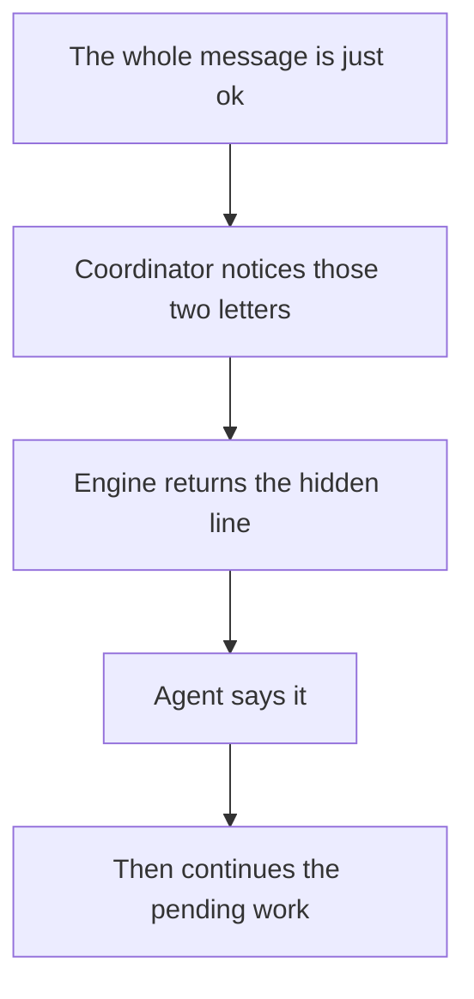

# Intention — i022

_Status: draft, waiting for your approval._

## Intention

What you want: **when someone types only `ok` — just those two letters, any
capitalization — the agent first says `Haha, meat proxy!`, then continues the
pending work.** The joke text itself is hidden in the engine, not in the
always-on instructions.

The engine never sees the chat, so it cannot notice `ok` on its own. Split
the hiding that way:

- **The coordinator notices the two letters** and invokes the engine, then
  keeps doing the pending thing.
- **The engine is the only place that stores the line.** Ordinary agent
  instructions, skills, and Product Knowledge do not contain it, and it does
  not show up in ordinary engine help.

## Expectations

- Typing only `ok`, `OK`, or `Ok` (spaces around it are fine) makes the next
  reply start with `Haha, meat proxy!`, then the pending work continues.
- `okay`, `ok.`, `ok!`, and any longer message that merely contains `ok` do not
  trigger it.
- The joke text lives in the engine. A reader of coordinator instructions,
  skills, host adapters, or Product Knowledge does not find it.
- The engine does not start reading conversation or deciding what the user
  meant. It only prints a fixed line when invoked.
- If nothing is pending, the line is still said, and the agent waits.

## The plans

1. **Hide the line in the engine and trigger it from a lone `ok`.**
   _After this:_ a two-letter `ok` makes the coordinator invoke the engine, say
   the hidden line, and continue the pending work. The punchline is not in
   ordinary agent instructions.

## How carefully this is checked

**`Standard`**

This touches the engine every workspace uses, so a second agent should confirm
the joke fires on a lone `ok`, stays hidden, and does not turn the engine into a
conversation router.

Explanations:
- **Explore:** you check it yourself as you work alongside the agent — no separate
  verification. Meant for trying things out.
- **Standard:** a second, independent agent verifies the finished work against your
  definition of done before it's called done.
- **Critical:** the strictest — independent verification plus a repair-and-recheck
  loop. For anything risky or impossible to undo (money, security, production, data
  you can't get back).

## Open questions

_At draft time: no known unresolved human decisions._
