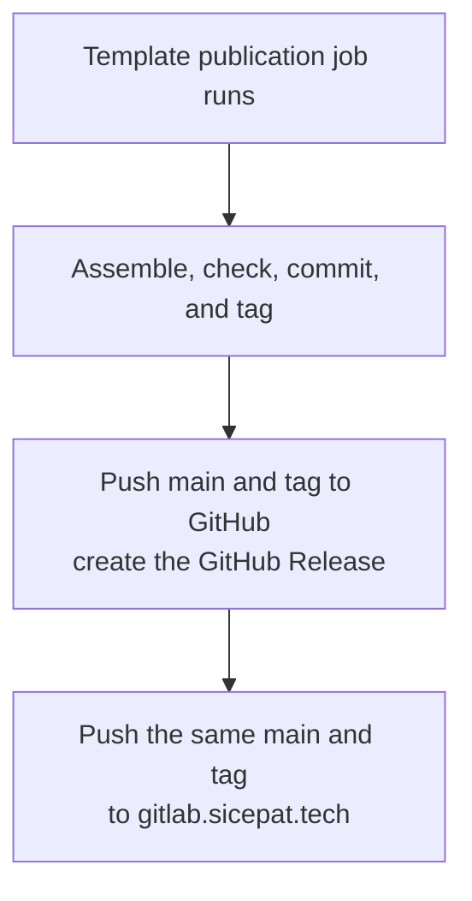

# Intention — i023

_Status: approved, look complete, feasible._

## Intention

What you want: **when the template is published on GitHub, the same GitHub
Action also pushes that same commit and version tag to `gitlab.sicepat.tech`.**
GitHub stays the canonical published template. GitLab gets a copy of that
release, not a second assembly.

The publication job already builds, checks, commits, and tags the template,
then pushes to GitHub and creates a GitHub Release. Add one more push of that
same `main` and `v*` tag to SiCepat GitLab. A GitLab Release is not part of
this.

## Expectations

- A successful template publish still lands on GitHub as it does today: `main`,
  the version tag, and the GitHub Release.
- The same commit and version tag are also pushed to `gitlab.sicepat.tech`.
- GitHub remains the canonical destination; GitLab is an additional copy of
  that tree.
- The GitLab credential stays a GitHub Actions secret. It never enters a
  workspace file.
- If the GitLab push cannot complete, the job fails rather than reporting
  success.

## The plans

1. **Push the published template to GitLab from the GitHub Action.** (`0032-gitlab-template-push`)
   _After this:_ a template publication that succeeds on GitHub also pushes the
   same commit and tag to `gitlab.sicepat.tech`.

## How carefully this is checked

**`Standard`**

This is the product-template publication path and it handles a GitLab
credential, so a second agent should confirm GitHub is unchanged, the same
tree is pushed to GitLab, and no token lands in the repo.

Explanations:
- **Explore:** you check it yourself as you work alongside the agent — no separate
  verification. Meant for trying things out.
- **Standard:** a second, independent agent verifies the finished work against your
  definition of done before it's called done.
- **Critical:** the strictest — independent verification plus a repair-and-recheck
  loop. For anything risky or impossible to undo (money, security, production, data
  you can't get back).

## Open questions

**What is the GitLab project path on `gitlab.sicepat.tech` (group/project)?**
_Answer: Do not hardcode it in the repo. Before the first publish after this
lands, set GitHub Actions `GITLAB_TEMPLATE_PROJECT` (`group/project`) and
`GITLAB_TEMPLATE_TOKEN`. The GitLab project must already exist._
