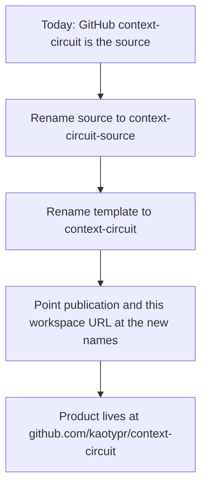

# Intention — i024

_Status: draft, waiting for your approval._

## Intention

What you want: **the GitHub name `context-circuit` should be the product
template people use, and this maintainer source should be
`context-circuit-source`.** Today those GitHub names are reversed: the short
name is the factory, and the product sits under `-template`.

GitHub names should match the three identities. Rename the source first so the
short name is free, then give that name to the template. Point this source's
publication target and this workspace's GitHub URL at the new names. Do not
publish a new template version just because the GitHub names changed.

## Expectations

- `github.com/kaotypr/context-circuit` is the published template.
- `github.com/kaotypr/context-circuit-source` is this maintainer source.
- The next template publication writes into the renamed template repository.
- Existing template tags and GitHub Releases move with that repository.
- No new template version is published solely for this rename.
- Already-created workspaces and the assembled product stay the same.
- The GitLab mirror project path is not renamed as part of this.
- This workspace's canonical GitHub URL names the renamed source.
- Source-side records that currently mean this repo's GitHub issues still mean
  this source after the short name is taken by the template.

## The plans

1. **Give the product the GitHub name `context-circuit`, and this source
   `context-circuit-source`.**
   _After this:_ GitHub names match source vs product; publication and this
   workspace's URL follow the new names; no template release is cut for the
   rename.

## How carefully this is checked

**`Standard`**

The GitHub short name will mean a different repository after the swap, and
publication has to hit the new template slug, so a second agent should confirm
the names, the publish target, and that the product artifact was not bumped.

Explanations:
- **Explore:** you check it yourself as you work alongside the agent — no separate
  verification. Meant for trying things out.
- **Standard:** a second, independent agent verifies the finished work against your
  definition of done before it's called done.
- **Critical:** the strictest — independent verification plus a repair-and-recheck
  loop. For anything risky or impossible to undo (money, security, production, data
  you can't get back).

## Open questions

**Should the GitLab mirror project be renamed to match GitHub?**
_Answer: No. GitHub names change; GitLab stays as configured in
`GITLAB_TEMPLATE_PROJECT`._

**Should this rename publish a new template version?**
_Answer: No. Do not cut a template release just for the GitHub rename. Do not
change shipped files in a way that would force a content bump unless a later
real product change needs it._
