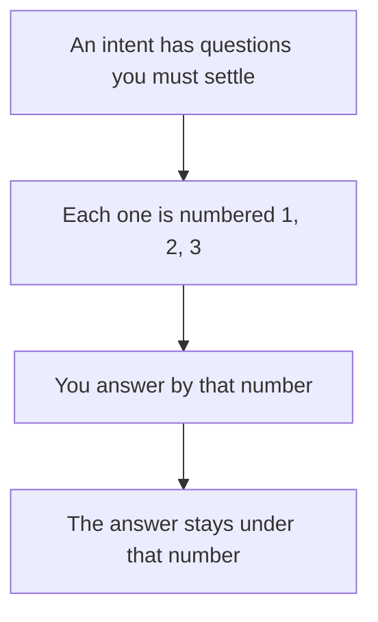

# Intention — i025

_Status: draft, waiting for your approval._

## Intention

What you want: **open questions on an intent should be numbered**, so you can
answer by number instead of repeating the whole question.

The **Open questions** section already keeps each question in bold and puts the
answer under it. Number those items the same way **The plans** is numbered — 1,
2, 3. Keep the number when the question is answered. A question added later gets
the next number. If there are none, keep the empty line; do not invent a fake
"1."

## Expectations

- Every open question on a new intent has a number you can point at.
- Answering a question does not change its number.
- A question added later gets the next unused number.
- When there are no questions, the empty line stays — no dummy numbered item.
- The numbered form is what you see when asked to approve, and what the template
  and example teach.
- Intents already written are left as they are.

## The plans

1. **Number open questions on the intent page.**
   _After this:_ new intents number their open questions; you can answer by
   number; already-written intents are untouched.

## How carefully this is checked

**`Standard`**

This is how every future intent asks you questions before approval, so a second
agent should confirm the numbering is there, stays stable, and does not change
what a question means.

Explanations:
- **Explore:** you check it yourself as you work alongside the agent — no separate
  verification. Meant for trying things out.
- **Standard:** a second, independent agent verifies the finished work against your
  definition of done before it's called done.
- **Critical:** the strictest — independent verification plus a repair-and-recheck
  loop. For anything risky or impossible to undo (money, security, production, data
  you can't get back).

## Open questions

_At draft time: no known unresolved human decisions._
