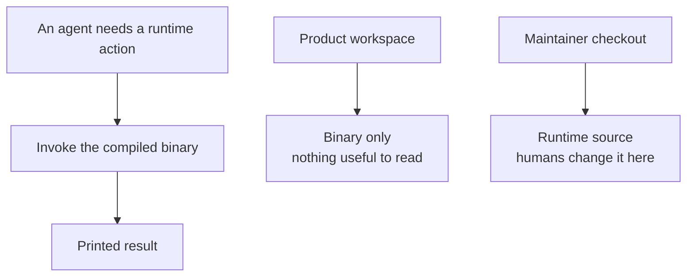

# Intention — i026

_Status: draft, waiting for your approval._

## Intention

What you want: **the runtime agents call is a compiled binary**, so a product
workspace has nothing useful to read and you can drop the repeated "must not
read `engine.sh`" rule.

Today that rule is a warning on a readable bash script. After this, the thing
agents invoke is opaque in the product they work in:

- **They call a binary.** Same lifecycle actions as today; not a script they
  can open and interpret.
- **The product does not ship a readable implementation.** Runtime source
  stays in this maintainer checkout, where people who change the engine work.
- **Instructions just say invoke it.** Skills, adapters, and the coordinator
  stop restating a "don't read the engine" prohibition.

A fuller write-up by topic sits beside this page. You still approve once.

## Expectations

- Agents in a product workspace invoke a compiled runtime binary, not a bash
  script.
- That workspace does not contain a readable runtime implementation, so there
  is nothing to substitute for a skill or brief.
- The repeated "must not read `engine.sh`" instruction is gone, not retargeted
  at a new source file in the product.
- Lifecycle behavior is unchanged: same actions, same gates, still model-blind
  and host-neutral.
- Runtime source remains here so the engine can still be changed on purpose.
- Existing workspaces pick this up through the normal template upgrade, not a
  silent rewrite of their project files.

## The plans

1. **Replace the bash engine with a compiled binary.**
   _After this:_ the runtime agents call is a binary with the same actions.
2. **Ship the binary in the product, keep source in this checkout.**
   _After this:_ an instantiated workspace has the binary, not a readable
   implementation.
3. **Drop the "must not read the engine" instructions.**
   _After this:_ adapters, skills, coordinator, and harness tell agents to
   invoke the binary; they do not repeat a read prohibition.
4. **Prove the same lifecycle through the binary.**
   _After this:_ semantic tests and harness still pass against the compiled
   runtime.

## How carefully this is checked

**`Critical`**

This rewrites the library that enforces every gate, then ships it to every
workspace. A mistake could skip approval or verification. Independent
verification plus the repair-and-recheck loop is the right floor. You can
lower it.

Explanations:
- **Explore:** you check it yourself as you work alongside the agent — no separate
  verification. Meant for trying things out.
- **Standard:** a second, independent agent verifies the finished work against your
  definition of done before it's called done.
- **Critical:** the strictest — independent verification plus a repair-and-recheck
  loop. For anything risky or impossible to undo (money, security, production, data
  you can't get back).

## Open questions

**Which compiled language should the runtime be rewritten in?**
_Recommendation: Go — one static binary, straightforward cross-compile for the
POSIX hosts the product already targets._
