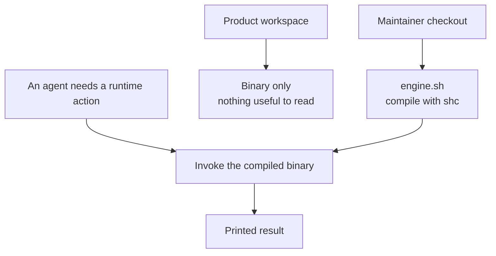

# Intention — i026

_Status: draft, waiting for your approval._

## Intention

What you want: **the runtime agents call is a compiled binary**, so a product
workspace has nothing useful to read and you can drop the repeated "must not
read `engine.sh`" rule.

Keep the current bash engine. Compile it with a shell compiler (`shc`). Ship
the binary in the product; keep `engine.sh` in this maintainer checkout:

- **They call a binary.** Same lifecycle actions as today; not a script they
  can open and interpret.
- **The product does not ship `engine.sh`.** Runtime source stays here, where
  people who change the engine work.
- **Instructions just say invoke it.** Skills, adapters, and the coordinator
  stop restating a "don't read the engine" prohibition.

A fuller write-up by topic sits beside this page. You still approve once.

## Expectations

- Agents in a product workspace invoke a compiled runtime binary, not
  `engine.sh`.
- The bash engine is unchanged as source; it is compiled, not rewritten in
  another language.
- That workspace does not contain `engine.sh`, so there is nothing to
  substitute for a skill or brief.
- The repeated "must not read `engine.sh`" instruction is gone, not retargeted
  at a new source file in the product.
- Lifecycle behavior is unchanged: same actions, same gates, still model-blind
  and host-neutral.
- Runtime source remains here so the engine can still be changed on purpose.
- Existing workspaces pick this up through the normal template upgrade, not a
  silent rewrite of their project files.

## The plans

1. **Compile the bash engine into a binary.**
   _After this:_ the runtime agents call is an `shc`-compiled binary with the
   same actions.
2. **Ship the binary in the product, keep `engine.sh` in this checkout.**
   _After this:_ an instantiated workspace has the binary, not the script.
3. **Drop the "must not read the engine" instructions.**
   _After this:_ adapters, skills, coordinator, and harness tell agents to
   invoke the binary; they do not repeat a read prohibition.
4. **Prove the same lifecycle through the binary.**
   _After this:_ semantic tests and harness still pass against the compiled
   runtime.

## How carefully this is checked

**`Standard`**

This is the same bash engine in a new form, then shipped to every workspace.
A second agent should confirm the binary is what product workspaces invoke and
that `engine.sh` is no longer in that tree. It is not a rewrite of the gates
themselves.

Explanations:
- **Explore:** you check it yourself as you work alongside the agent — no separate
  verification. Meant for trying things out.
- **Standard:** a second, independent agent verifies the finished work against your
  definition of done before it's called done.
- **Critical:** the strictest — independent verification plus a repair-and-recheck
  loop. For anything risky or impossible to undo (money, security, production, data
  you can't get back).

## Open questions

**Which compiled language should the runtime be rewritten in?**
_Answer: None — keep bash and compile it with a shell compiler (`shc`). No
rewrite into another language._
