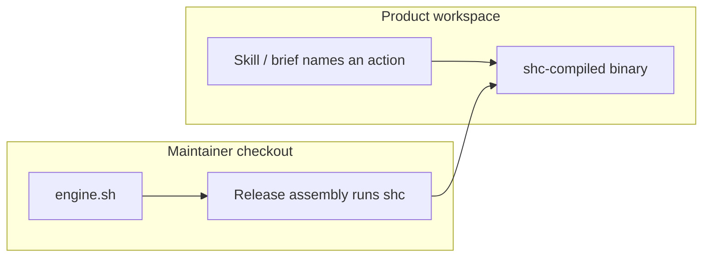

# Ship the runtime as a compiled binary

## Capability

Agents in a Context Circuit product workspace invoke a **compiled binary** for
every runtime action they already call today. The workspace they are working
in does not contain `engine.sh`, so there is nothing to open instead of a
skill or brief, and product instructions no longer repeat "must not read
`engine.sh`".

The engine stays bash. A shell compiler (`shc`) produces the binary from
`engine.sh`. The runtime's job is unchanged: a small host-neutral
deterministic library (INV-RUNTIME-01) that writes atomic records
(INV-RUNTIME-02). This intent changes the **form** of that library in the
product, not the language it is written in and not what it is allowed to
decide.

`engine.sh` remains in this maintainer checkout. Changing the engine is still
ordinary source work here.

## Problem

The product tells every role the same thing: invoke
`.context-circuit/wrapper/runtime/engine.sh`, and **do not read it**. That
prohibition is restated in the coordinator, in adapters, in skills, and in
harness forbidden lists. It exists because the engine is a readable bash
script sitting in the tree the agent can open.

A warning is not opacity. An agent that reads the script can treat it as a
substitute for a skill, a brief, or a gate. The repeated rule is load, drift,
and still fail-open if a role ignores it.

Shipping a binary **next to** `engine.sh` would not solve that. The script
would still be in the product, and the prohibition would just sit beside it.

## Principles

1. **Opacity is absence, not a warning.** The product an agent works in has
   no `engine.sh` to read. See [shipping.md](shipping.md).
2. **Keep bash.** Compile the current engine; do not rewrite it in another
   language.
3. **Invoke, don't interpret.** Skills and briefs still name actions; the
   agent calls the binary and reads printed results. See [invoke.md](invoke.md).
4. **Same library, new form.** Model-blind, credential-free, no provider or
   routing inside the runtime. Gates and host-blocked stay.
5. **Source has a home.** People who change the engine read `engine.sh` in
   this checkout. Product workspaces do not.
6. **One owner per rule.** Drop the scattered "must not read" copies; do not
   retarget them at a new filename.

## Fixed decisions

- Keep the current bash engine. Compile it with `shc`. Do not rewrite it.
- The thing agents invoke in a product workspace is that compiled binary
  under `.context-circuit/wrapper/runtime/`.
- The shipped template and an instantiated workspace contain the binary, not
  `engine.sh`.
- `engine.sh` stays in the maintainer source checkout and is not a
  ships-with-template file.
- CLI verbs (the actions skills already name) and printed results remain the
  agent-facing contract.
- INV-RUNTIME-01/02, Gate 1, Gate 2, planner, verifier floor, and
  host-blocked are unchanged.
- Assurance is **Standard**: same engine, new form, shipped to every
  workspace. A human may raise the tier.
- `shc` is obfuscation wrapping the script, not cryptographic protection.
  The product win is that agents have no `engine.sh` to open.

## Shape of the whole

| Topic | What it settles | Detail |
| --- | --- | --- |
| What ships | Binary in the product; `engine.sh` only here; upgrade | [shipping.md](shipping.md) |
| How agents call it | Invoke path, drop the read prohibition | [invoke.md](invoke.md) |
