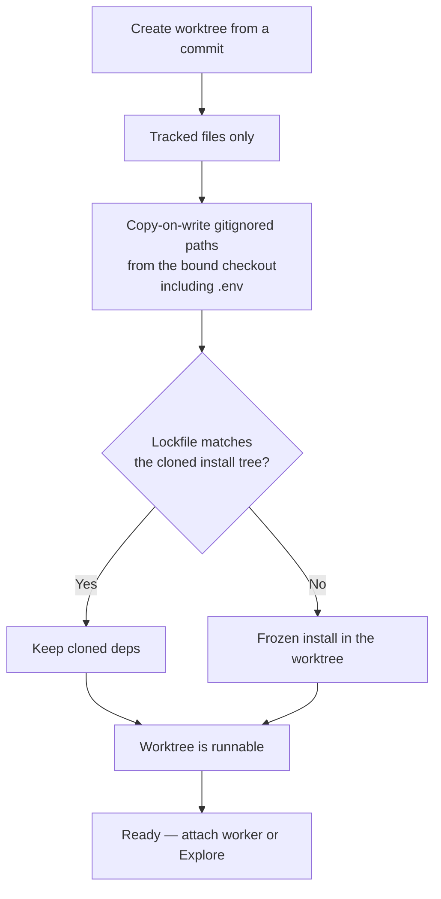

# Intention — i027

_Status: draft, waiting for your approval._

## Intention

What you want: **a new worktree is already runnable when it is created** — the
gitignored files and folders from the bound checkout are there, including
`.env`, so the worker does not install dependencies or reconstruct local files
first.

Git still checks out only tracked files. After that, Context Circuit overlays
what the checkout already ignores, then makes sure the toolchain matches this
commit:

- **Overlay first:** every gitignored file and folder that exists on disk in the
  bound checkout is copy-on-write into the new worktree, including `.env`.
  Uncommitted source that is not gitignored stays out.
- **Then correct deps:** if the cloned install tree matches this worktree's
  lockfile, keep it; if not, install from the worktree lockfile. Never
  symlink into the checkout.
- **Only then is it ready:** a worker or Explore session is attached after the
  tree can run. Failure blocks setup.

## Expectations

- A newly created execution or Explore worktree already has the checkout's
  gitignored files and folders, including `.env`.
- When the repo has a toolchain, that worktree can run the repo's normal
  commands without an install step by the worker.
- Cloned install trees are kept only when they match this commit's lockfile;
  otherwise the worktree is installed from its own lockfile.
- Overlay uses copy-on-write (or a real copy), not a symlink into the bound
  checkout.
- `environment: ready` means the tree is actually prepared, not merely that a
  lockfile was detected.
- If overlay or provision fails, setup stops; a worker is not attached to a
  half-ready tree.

## The plans

1. **Overlay gitignored paths when a worktree is created.**
   _After this:_ execution and Explore worktrees receive a copy-on-write of the
   bound checkout's gitignored files and folders, including `.env`.
2. **Make the toolchain match this commit.**
   _After this:_ cloned deps are kept when the lockfile matches; otherwise the
   worktree is installed from its own lockfile so it can run.
3. **Tell the truth about ready, and prove it.**
   _After this:_ `environment: ready` is honest, the brief matches, Product
   Knowledge describes the overlay, and tests cover create-time runnable trees.

## How carefully this is checked

**`Standard`**

`.env` and other secrets in the checkout are cloned into the worktree, so this
is not Explore. The change is reversible and is not a production or auth
rewrite, so Standard (independent check) is the floor. You can raise it.

Explanations:
- **Explore:** you check it yourself as you work alongside the agent — no separate
  verification. Meant for trying things out.
- **Standard:** a second, independent agent verifies the finished work against your
  definition of done before it's called done.
- **Critical:** the strictest — independent verification plus a repair-and-recheck
  loop. For anything risky or impossible to undo (money, security, production, data
  you can't get back).

## Open questions

**Should untracked files that are not gitignored (uncommitted source on the
bound checkout) be copied into the worktree?**
_Answer: No. Only gitignored paths that exist on disk in the bound checkout.
Uncommitted source stays out._
