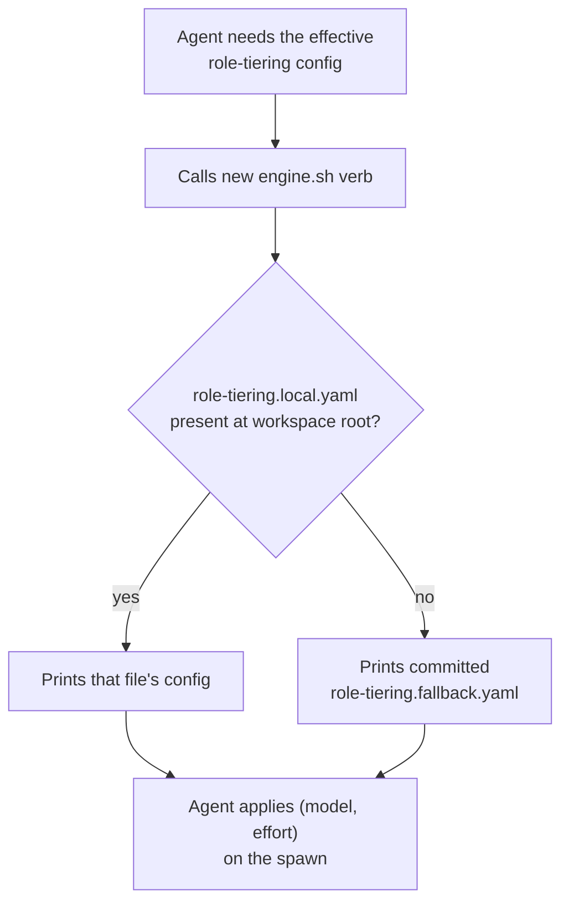

# Intention — i028

_Status: draft, waiting for your approval._

## Intention

What you want: **any agent — coordinator or a spawned child, on any host —
can reliably learn the model/effort config it should spawn with, even though
`role-tiering.local.yaml` is gitignored and invisible to `find`/`grep` on this
machine, and even on a fresh checkout where the file doesn't exist yet.**

The cause isn't a missing file or a permissions problem: a Claude Code
`PreToolUse` hook silently rewrites `find`/`grep` into RTK's token-optimized
proxy, which walks the filesystem with `git_ignore(true)` hardcoded — it
never emits a gitignored path as a result, no matter how it's asked. There is
today no RTK config knob, project-local or global, that exempts a specific
gitignored filename from that walk.

Since the fix can't live in RTK config, it lives in this workspace: a new
`engine.sh` command prints the *effective* role-tiering config directly —
`role-tiering.local.yaml` from the workspace root when it exists, or a new
committed fallback file, `.context-circuit/role-tiering.fallback.yaml`, when
it doesn't. Every agent calls that command instead of trying to `Read`,
`find`, or `grep` the file itself, so the RTK hook never gets a chance to hide
it. `.context-circuit/docs/role-tiering.md` becomes the one place that states
this rule and the fallback behavior in full; `AGENTS.md`, `CLAUDE.md`,
`CURSOR.md`, and every file under `.context-circuit/agents/` get a short
pointer to that doc, so the rule is discoverable everywhere an agent might
look, without four copies of it drifting apart.

## Expectations

- A new `engine.sh` command prints the effective role-tiering config: the
  workspace-root `role-tiering.local.yaml` when present, else a new committed
  `.context-circuit/role-tiering.fallback.yaml` (content you supplied).
- `.context-circuit/docs/role-tiering.md` documents the command and the
  fallback, and is the sole owner of the "call the command, never
  Read/find/grep the file" rule.
- `AGENTS.md`, `CLAUDE.md`, `CURSOR.md`, and each of
  `.context-circuit/agents/{coordinator,worker,verifier,planner}.md` carry a
  short pointer to that owner doc — not a restatement.
- No RTK configuration is touched, and no upstream `rtk-ai/rtk` feature
  request is drafted under this intent.

## The plans

1. **Add the engine verb, the fallback file, the owner doc, and the pointer
   stubs.**
   _After this:_ any agent can get the effective role-tiering config by
   calling one command, on a checkout with or without a local override file,
   and every host-facing instruction file points to where that rule lives.

## How carefully this is checked

**`Standard`**

This changes shared `engine.sh` runtime code that every skill's spawn path
depends on, not just instruction text, so a second, independent check runs
against it before it's called done.

Explanations:
- **Explore:** you check it yourself as you work alongside the agent — no separate
  verification. Meant for trying things out.
- **Standard:** a second, independent agent verifies the finished work against your
  definition of done before it's called done.
- **Critical:** the strictest — independent verification plus a repair-and-recheck
  loop. For anything risky or impossible to undo (money, security, production, data
  you can't get back).

## Open questions

_At draft time: no known unresolved human decisions._
