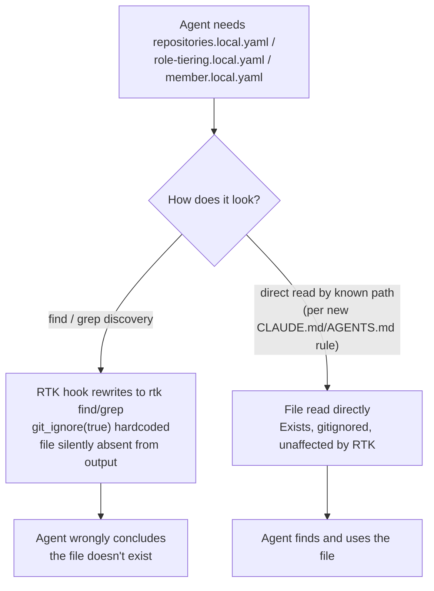

# Intention — i028

_Status: draft, waiting for your approval._

## Intention

What you want: **any agent working in this repo can always find and read
`repositories.local.yaml`, `role-tiering.local.yaml`, and `member.local.yaml`**
— the three host-local, gitignored files that carry workspace-root config
(`CLAUDE.md`'s role-tiering instructions, member identity, and repository
registration) — even though they're invisible to `find`/`grep` on this
machine.

The cause isn't a missing file or a permissions problem: a Claude Code
`PreToolUse` hook silently rewrites `find`/`grep` into RTK's token-optimized
proxy, which walks the filesystem with `git_ignore(true)` hardcoded — it never
emits a gitignored path as a result, no matter how it's asked. RTK's
project-local `.rtk/filters.toml` can't fix this: it only post-processes text
a command already produced, and by the time it would run, the gitignored
paths were never in that output to begin with.

Since the fix can't live in RTK config, it lives in this repo's own
instructions: `CLAUDE.md` / `AGENTS.md` are read by every agent working here
and already document these three filenames and where they live. Add one
explicit rule there — read these three files **directly by path** (a direct
file read, never `find`/`grep` discovery) whenever the workflow calls for
them — so no agent repeats the "file doesn't exist" mistake this session
just made.

## Expectations

- `CLAUDE.md` and/or `AGENTS.md` state plainly that `repositories.local.yaml`,
  `role-tiering.local.yaml`, and `member.local.yaml` are gitignored, host-local
  files that must be read directly by path, never located via `find`/`grep`.
- The instruction explains, briefly, why: those tools are silently rewritten
  by the RTK hook and will not surface gitignored paths, so an empty result
  from them is not evidence the file is missing.
- No RTK configuration (`.rtk/filters.toml`, `config.toml`) is introduced —
  this intent does not attempt an RTK-side fix.

## The plans

1. **Add the direct-read rule to this repo's instructions.**
   _After this:_ `CLAUDE.md`/`AGENTS.md` tells every agent to read these three
   named files directly by path, with the one-line reason why `find`/`grep`
   can't be trusted for them.

## How carefully this is checked

**`Explore`**

This only edits instruction text in `CLAUDE.md`/`AGENTS.md` — no code, no
secrets, no migration, fully reversible, and you're reviewing it with me
directly. You can raise it if you'd rather have an independent check.

Explanations:
- **Explore:** you check it yourself as you work alongside the agent — no separate
  verification. Meant for trying things out.
- **Standard:** a second, independent agent verifies the finished work against your
  definition of done before it's called done.
- **Critical:** the strictest — independent verification plus a repair-and-recheck
  loop. For anything risky or impossible to undo (money, security, production, data
  you can't get back).

## Open questions

_At draft time: no known unresolved human decisions._
