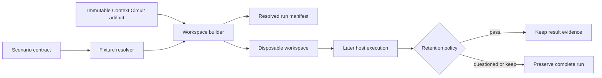

# Standalone Agent Harness foundation

## Capability

Agent Harness is an independently runnable product that converts a scenario
contract into a disposable test world. It consumes Context Circuit as an
immutable external artifact and never operates inside the Context Circuit
maintainer checkout.

## Fixed decisions

- The harness has its own repository, release identity, command surface, and run
  storage.
- One scenario run owns one unique run root and never shares mutable project or
  runtime state with another run.
- Scenario conditions are composed from small named fixtures rather than copied
  from opaque completed workspaces.
- Fixture resolution is frozen into the run manifest before a host starts.
- Workspace construction failure is a harness error, never an agent result.
- Passing runs may discard the disposable project; questioned runs preserve the
  complete test world.

## Product boundary

Context Circuit exposes only its normal released or assembled product surface.
It has no imports from Agent Harness, no harness-only lifecycle behavior, and no
awareness that a workspace is under test. Development may select a local
immutable build, but that build is materialized into the disposable project and
identified by digest.

The detailed workspace model is defined in
[workspace-and-fixtures.md](workspace-and-fixtures.md). Artifact selection,
retention, and reproduction are defined in
[artifact-and-reproduction.md](artifact-and-reproduction.md).

## Completion shape

A maintainer can select a scenario and Context Circuit artifact, build its test
world, inspect the resolved inputs, and either remove or preserve the run. Host
drivers and grading are deliberately supplied by later dependent intents.

