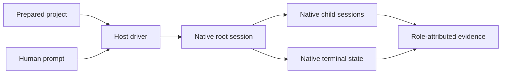

# Real-host session integration

## Capability

Agent Harness launches a new native coding-agent session rooted in a prepared
test project and follows it to a native terminal state. Codex, Claude Code, and
Cursor share one semantic driver contract while retaining their real capability
and evidence differences.

## Fixed decisions

- Replayed transcripts, mocked model output, and direct lifecycle calls cannot
  satisfy a real-host scenario.
- A required planner, worker, or verifier is a native child attached to the root
  session, not another top-level process created by the harness.
- Drivers expose unavailable capabilities honestly and never manufacture empty
  success evidence.
- Scenario prompts contain the human request, not hidden grading instructions.
- Authentication remains owned by the host and outside disposable workspaces.
- One scenario definition may run on one selected host or an explicit host
  matrix.

The shared lifecycle and honest treatment of host differences are defined in
[driver-lifecycle.md](driver-lifecycle.md). Evidence, authentication, and
redaction are defined in [session-evidence.md](session-evidence.md).

## Completion shape

The same positive scenario can be launched through every supported host. The
result proves which native session ran, which children it created, how it ended,
and which observations the host could or could not expose.

