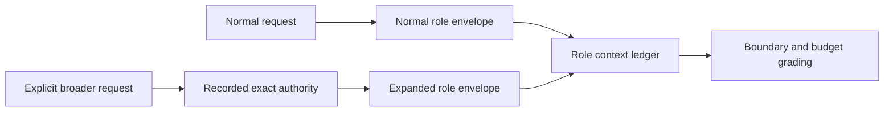

# Role-specific context boundaries

## Capability

Agent Harness treats efficient, role-correct context use as a required result of
every positive scenario. It proves what each role could access, received, actively
read, and was charged for without assuming those measurements are interchangeable.

## Fixed decisions

- Normal-request context is the default and is defined separately for
  coordinator, planner, worker, and verifier.
- A prompt can expand a role's envelope only by explicitly naming the additional
  target or behavior.
- Expansion is exact and does not spread to adjacent sources, repositories,
  histories, archives, diagnostics, or roles.
- Context packets and active reads are attributed to their originating role.
- Forbidden reads or undeclared delivered context fail a strict scenario.
- Missing or unattributable evidence produces an inconclusive measurement, never
  a zero-use assumption.
- File counts, bytes, and available input-token usage are budgeted per role and
  scenario.

The baseline content for each role is defined in
[normal-role-envelopes.md](normal-role-envelopes.md). Enforcement and honest
measurement are defined in
[enforcement-and-attribution.md](enforcement-and-attribution.md). Expansion and
usage controls are defined in [expansion-and-budgets.md](expansion-and-budgets.md).

## Completion shape

Every scenario result can show the role, resource, context kind, size, authority,
and evidence behind each delivered or active read. A successful journey passes
only when every created role remained inside its declared envelope and hard
budget.

