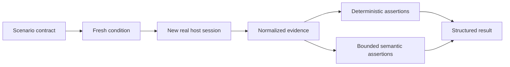

# Positive real-host scenario suite

## Capability

Agent Harness supplies nine independent positive scenarios across fresh-project,
context-gathering, and intent-to-verification journeys. Each starts a new real
host session in a newly materialized condition and produces an evidence-backed
result.

## Fixed decisions

- The foundation suite contains successful journeys only; negative and
  deliberately failing conditions are outside this intent.
- Every scenario declares its full starting condition and does not depend on a
  previous scenario run.
- Host brands and prompt wording variants are matrix dimensions, not duplicate
  scenario identities.
- Mechanical outcomes are graded deterministically before human-facing meaning.
- Semantic grading cannot override filesystem, Git, lifecycle, child-role, or
  context evidence.
- Every scenario applies the strict role-context policy and budget appropriate to
  its normal or explicitly expanded prompt.
- Questioned runs preserve their test world and resolved inputs for reproduction.

The declaration format is defined in
[scenario-contracts.md](scenario-contracts.md), the initial catalog in
[positive-journeys.md](positive-journeys.md), and the result semantics in
[grading-and-results.md](grading-and-results.md).

## Completion shape

Maintainers can run any scenario on a selected host, opt into a supported-host
matrix, inspect each assertion's evidence, compare revisions and usage, and
reproduce a questioned result without depending on another scenario.

